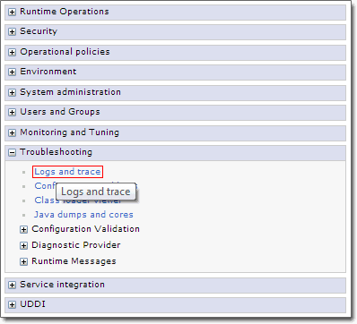
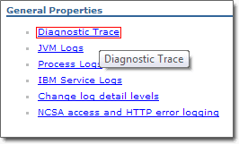

# Enable trace logs to analyze errors \(optional\) {#id_name .reference}

To analyze errors, enable trace logs on your server. These logs are not configured to the **Finest** level by default to increase the servers performance. Follow the instructions to enable trace logs at the finest level. These settings are discarded after the next cluster or AppServer restart automatically.

|Step|Instructions|
|----|------------|
|1

|Open the WebSphere Integrated Solutions Console \(ISC\) and log in as an administrative user.

|
|2

|Click **Troubleshooting** **\>** **Logs and trace**.

 

|
|3

|Click the Cluster/ AppServer, where you have mapped and installed the Connections Engagement Center application.

 

|
|4

|Click **Diagnostic Trace** under General Properties.

 

|
|5

|Click the **Runtime** Tab \(we do not recommend to use Connections Engagement Center in production with trace level set to FINEST, so make sure Connections Engagement Center WebSphere Application Server is restarted after you are done analyzing errors\).

 

|
|6

|In the **Additional Properties** section, click **Change log detail levels**.

 

|
|7

|On the next page, open the **Components and Groups** section.

 

|
|8

|In the list that appears, search the list section **de.timetoact.\***.

 

|
|9

|Click **de.timetoact.\*** and a pop-up menu menu appears. Sometimes it may happen that you have to scroll to the bottom of the page to see the pop-up window.

 Now click **Message and Trace Levels** and then select **finest**.

 

|
|10

|Click **Apply**.

 

|
|11

|Go to your Connections Engagement Center page and **try to reproduce the issue** to be traced. Make sure that the page is loaded completely once so that the trace logs are written. Then, open the log files from your Cluster / AppServer on your server.

 

|
|12|Either copy or include the files SystemOut.log, trace.log and SystemErr.log with the Problem Management Report \(PMR\) submitted with your Service Request. Go to the [HCL Connections Support Portal](https://www.ibm.com/support/home/product/Q989582Y27446H89/IBM_Connections)and click **Tickets \> Service Request** from the drop down menu to get started.

|

