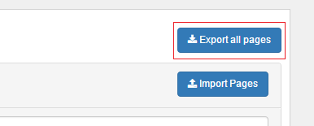

# Import and export of XML files {#id_name .reference}

It is possible to import and export Connections Engagement Center page configurations to and from XML files. This feature allows you to switch between different databases or to make a backup of your Connections Engagement Center database.

## Import of XML files { .section}

Open the Connections Engagement Center in your browser as an administrative user and click on **Customize**. Go to the Tab **Page Management.** Here you will find the **Import Pages** button. Click on this button and you will open a modal dialog. In this popup window you are able to upload single XML files or multiple xml files as zip file. After an upload they will be migrated into the Connections Engagement Center database.

## Export of XML files { .section}

**Single page**

Open Connections Engagement Center in your browser as an administrative user and click on **Customize**. Go to the tab **Page Management.** You will find the export link on the right side of each page in the list. With a click on the download icon you will download the page as XML file.

**All pages**

You can also export all Connections Engagement Center pages as a zip file. To do so, please open Connections Engagement Center in your browser as an administrative user and click on **Customize**. Go to the tab **Page Management**and click on**Export all pages.**

**Parent topic:**[Configuring](../../connectors/icec/cec-inst-configuring.md)

