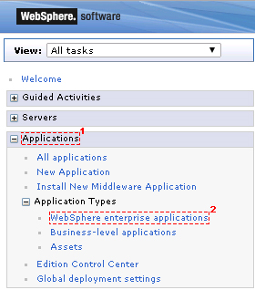

# Mapping security roles 

Map users to security roles.

|Step|Instructions|
|----|------------|
|1

|Open the Integrated Solutions Console \(ISC\) of your Deployment manager and perform the following steps.

|
|2

|Navigate to **Applications \> WebSphere enterprise applications**.

 

|
|3

|Click on **Connections Engagement Center**.

|
|4

|Click **Detail Properties \> Security role to user / group mapping**.

 

|
|5

|Map users to the Connections Engagement Center application. Please select the Role checkboxes for which you want to map users or groups. Then click on the **Map Users...** or **Map Groups...** Button.

 After this you can search for users / groups and select them by clicking the button . Finish this process by clicking **Ok**. Save your changes to the master configuration and wait until the Connections Engagement Center application has been restarted automatically.

 

|

**Parent topic:**[Installing](../../connectors/icec/cec-inst-installing.md)
