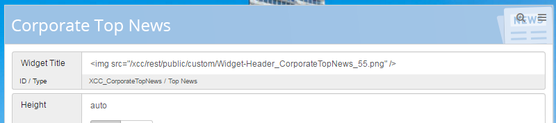

# Configure image for widget titles {#id_name .reference}

You can configure a widget to display an image as widget title by pasting an html img-tag into the input field for the title in the widget editor.

The image can easily be uploaded to the Connections Engagement Center customization files in the Admin Panel.

The path of the image is always the same if you uploaded it to the Connections Engagement Center. You only need to change the name of the file, e.g. **/http/rest/public/custom/filename.extension**

The image will by default be displayed in full-width without any padding.

If you want to position a text on the image, please use the following code in addition to the code example:

`Text`

