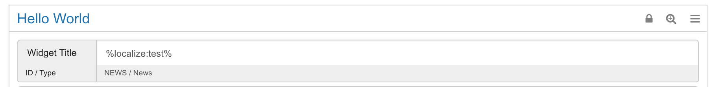
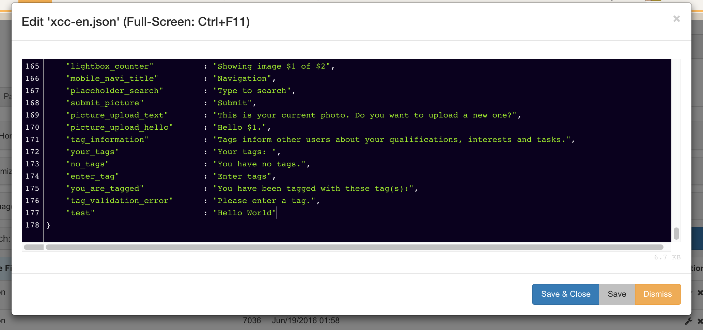

# Language-based widget title {#id_name .reference}

You can localize widget titles with the language files.

For titles that should be localized, please use the following syntax in the widget-titles: %localize:key%. You can use any word for key. Next you need to add the key with the language specific values to your language Files.

The key test is mapped to the value **Hello World** for English.

If there is no key found in the language-file, the key will just be displayed. E.g. if Russian language is active, but there is no Russian language file or translation for this key, the widget title will be **test** in this case.

