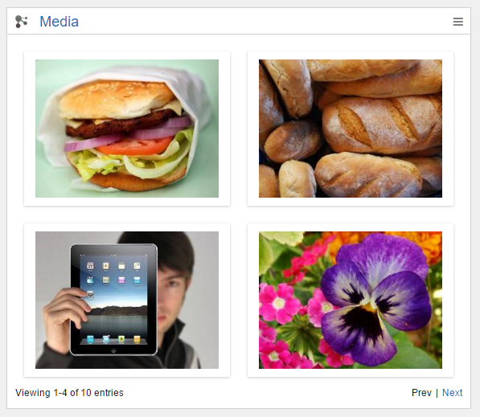

# Media Gallery {#id_name .reference}

The Media Gallery displays Images or videos from Community Files. They can be shown in a Grid or a Slider.

## Content source { .section}

A Connections Community or a Folder in a Connections Community is defined as content source for this widget. The source has to be an image with the file type:

png

jpg

jpeg

gif

svg

bmp

MP4

flv

## Expected format { .section}

The widget will show as many images or videos, as you defined in the Editor. They will be displayed in a x4 Grid, x9 Grid or Slider. If you click at an image, it will open in a lightbox. In the lightbox you can click through all the images of the widget in original size. You can also have a paging for Grids. So you could have 20 Pictures with a paging of 9 or 4 Pictures. With Version 11 the widget displays the description of the image, if Slider is selected. The Lightbox also features this enhancement.

## Configuration options for Admin/Page Editor { .section}

Personalization

Style: Grid or Slider

Number of Items

Community or Folder in Community

