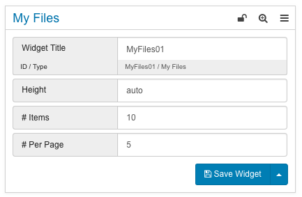

# My Files {#concept_o2n_413_qcb .concept}

This widget shows files that have been uploaded in HCL Connections by the currently logged in user. Files are shown in a list.

If a file is clicked, the file will be opened in a new browser tab in HCL Connections. It is possible to download the file by clicking the download icon. A page size can be set to define the amount of displayed files per page in the pagination and it is possible to define the total amount of displayed items.

