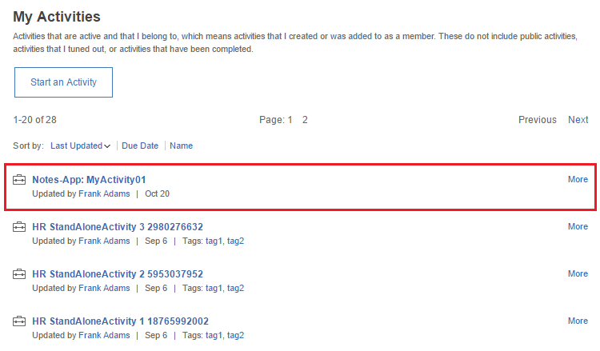
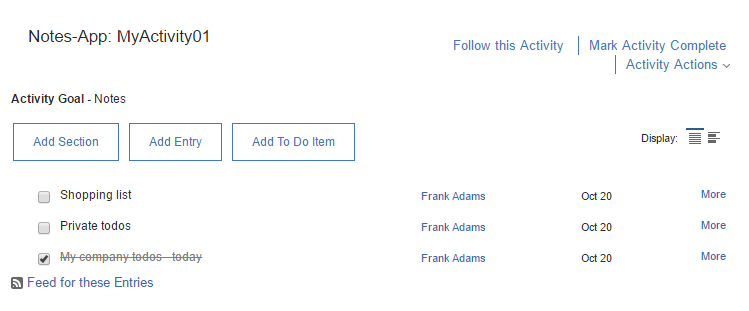
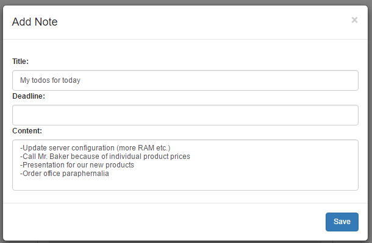

# My Notes {#id_name .reference}

Displays all to do?s/notes of a specific personal activity only visible to the current user.

Offers to create, edit or delete note directly from the widget.

Sort notes either by date of creation or deadline.

## Content source { .section}

When editing the widget, you will be asked to add an **Activityname**. By adding a name, an entry will be added in the IBM Activity application under **Notes App:Activityname**. This functions as the content source for the respective widget and enables the user to implement different personal to do?s/notes in multiple MyNotes widgets.

## Expected format { .section}

The widget offers an **Add New Notes**-Button at the top and lists all notes in ascending order either by date of creation or deadline. Hovering over a note, shows the edit- and delete-buttons for each individual note. Each note can easily be marked as completed by clicking the preceding circle-checkbox. Moreover, the MyNotes widget includes pagination, which can also be configured in the widget editor.

## Configuration options for Admin/Page Editor { .section}

Name/Identifier for the activity

Number of items per page

Number of items

