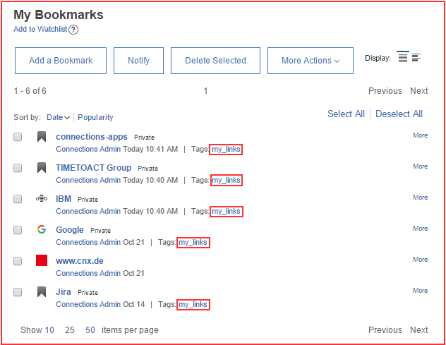

# My Quicklinks {#id_name .reference}

Displays all links of the My Bookmarks view tagged with **my\_links**.

Offers to create, edit or delete bookmarks.

Links will open in a new tab.

## Content source { .section}

The widget will display links that are created in the IBM Bookmark application inside of the My Bookmarks view tagged with **my\_links**. This way each user can have different personal links. This can be a link to a web page or a community.

## Expected format { .section}

The widget offers an **Add new Quicklink**-Button at the top and lists all the quicklinks in ascending alphabetical order below. On hover edit- and delete-buttons pop up on every quicklink. Moreover the widget includes pagination, which can be configured inside of the widget editor.

## Configuration options for Admin/Page Editor { .section}

Number of Items per page

