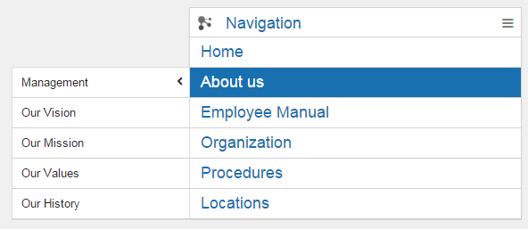
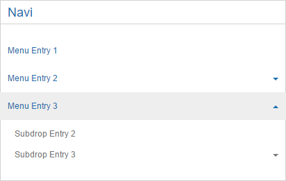

# Navigation {#id_name .reference}

The Navigation widget is working on the same way, like the normal Connections Engagement Center navigation is doing. You can specify to have a right or left alignment navigation. You can also select a specific page from a wiki, instead of showing the full wiki. The selected wiki page will be shown with all their child-pages. If just one single wiki page, which includes children, is selected, only these children will be displayed.

## Content source { .section}

For the channel a Connections Community is defined as content source for this widget. The source has to contain at least one wiki entry.

## Expected format { .section}

## Configuration options for Admin/Page Editor { .section}

Personalization

Orientation

Show Page \(All/Selected\)

