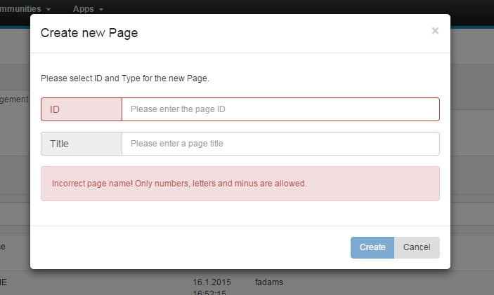

# Creating new or multiple pages {#id_name .reference}

You can create a new page in the **Page Management** tab of the admin panel. Click on **Create new page** to open the dialog. You have to enter a valid name and title and choose the type.

If there is already a page with the same name, a popup with an error will occur. Otherwise a popup with a link to the new page will inform you that the page was successfully created.

**Parent topic:**[Page Management](../../connectors/icec/cec-page_management.md)

