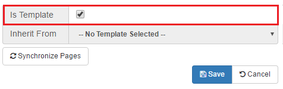

# Templating and inheritance {#id_name .reference}

You can mark an Connections Engagement Center page as template and use it to inherit from. If you are on an Connections Engagement Center page itself, open the admin panel, click on the **Page Settings** tab, then click on the **Show Advanced** button and you will see the advanced section. In this section you find a checkbox named **Is Template**. Check this box then click the save button on the bottom right and you will have this page as an Connections Engagement Center template.

You can do this in **Page Management** as well. Go to the Page Management and click on the wrench icon of the page to edit it. In the new opened modal window you can edit the page and on the bottom left you can find the checkbox **Is Template** as well.

After you have added content to your Connections Engagement Center template, you can select the Connections Engagement Center pages, which will inherit from your template. To do this, go to the Page Management and edit every page you want to let inherit from your template. In the edit page modal box of the Connections Engagement Center page that will inherit, you select your template in the dropdown with the label **Inherit from** and click on **Save**. You have to do it for every page that shall inherit.

Finally, if you have added content to your template and chose the pages that will inherit from your template, you start the transmission by clicking the **Full Resynchronize** button once.You can find this button below the **Inherit from** dropdown in your Connections Engagement Center template. The chosen pages should now have inherited.

**Note:** Only grid, layout, and widgets are inherited.

**Parent topic:**[Admin panel](../../connectors/icec/cec-admin_panel.md)

