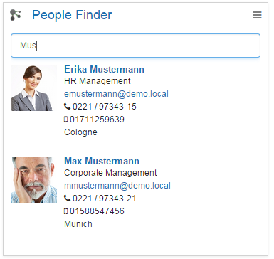

# People Finder {#id_name .reference}

With this Connections Engagement Center widget, you can search for persons within ConnectionsConnections Cloud.

The search will start as you type. If more than five people are found, a page navigation appears on the bottom of the widget. A maximum of 100 persons can be displayed. Search is performed with a **fuzzy** logic, that is, the search is performed on the following fields of a person:

-   Name
-   IP telephony number
-   Mobile number
-   Job title
-   Tags
-   Office

-   Name
-   Office number
-   Mobile number
-   Job title
-   Tags

As a side effect, you can find persons whose names include letters in tags.

## Expected format { .section}

People will be displayed with an image, phone number and email. If you click a person, you will be forwarded to the person's Connections profile. Hovering over the profile will open a Business Card that provides useful quick links for the person.

