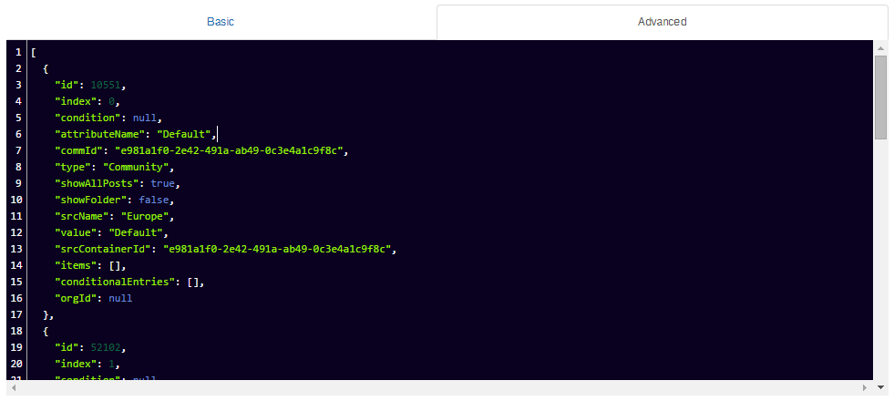

# Personalization {#id_name .reference}

Within the individual widgets, personalization can be activated. Upon activation there is the option to configure different channels for different values of a profile. Additionally it is possible to choose a default channel.

It is possible to select more than one Attribute<-\>Value Match for a source to be used. That way you can determine the sources for a widget very sophisticated. If you want to search for a non existent or empty attribute, just leave the value empty.

Additionally you may test the result of your personalization settings for a specific user. Simply type and select the user to test into the tester and see the result:

For profile extension values, you may check if the extension field has a value at all. This is done by leaving the Profile-Value input empty.

For advanced users, it is possible to describe complex personalization use cases using a JSON file in the advanced tab:

**Note:** Uusing the advanced option is very powerful. Using this option incorrectly may cause logical misconfigurations and even damage to the logical personalization data model. Handle with care.

## Content source { .section}

The respective format is chosen per channel, depending on the widget.

## Expected format { .section}

The user will be shown different content \(source\) depending on the value of the predefined profile field \(attribute name\).

## Configuration options for Admin/Page Editor { .section}

The configuration options depend on the particular widget. Principally, a profile field \(attribute name\) is defined, which serves as a basis for differentiation. First a content source is selected for the default-user, which is displayed to all users without predefined value. Next it's possible to link different values to different content \(source\).

**Parent topic:**[Overview](../../connectors/icec/cec-introduction_top.md)

