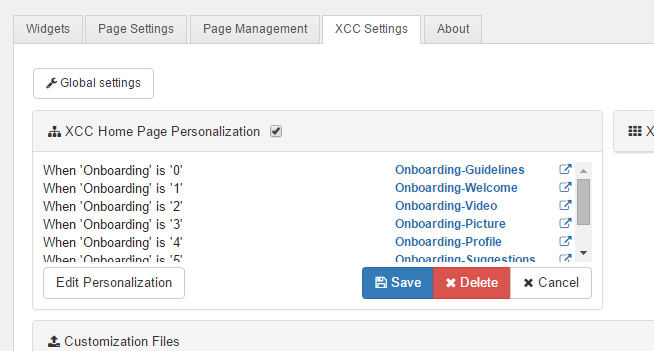

# Personalize homepage {#id_name .reference}

In the **Connections Engagement Center-Settings** tab in the admin panel you can personalize the homepage. The source must be an existing Connections Engagement Center page.

As **Default** the normal Connections Engagement Center-Page is configured. The Default is editable. If there is no **Default**-Attribute, you need to define one.

With the Checkbox you can enable or disable the personalized homepage.

Personalization can be defined on multiple attributes as described for widgets in Section 10:

**Parent topic:**[Overview](../../connectors/icec/cec-introduction_top.md)

