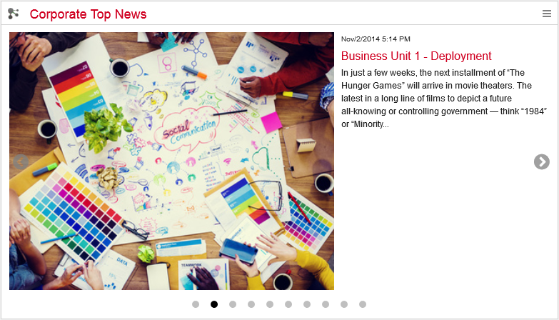
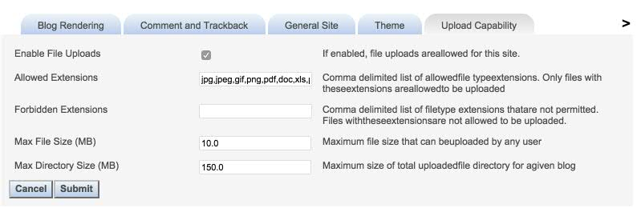

# Picture guidelines {#id_name .reference}

The different news widgets display pictures in various ways. Depending on the CI adaption and the layout there should be maintenance guidelines in place to ensure a consistent layout.

When formulating your guidelines, consider the following issues:

## Picture ratio { .section}

The Top News widget, News Overview widget and the News widget will always display the original image sized to the width of the used placeholder. Therefore the ratio of the pictures will have a big impact on the layout outcome and should be predefined in a guideline.

The following examples display the impact on the layout. The used widget and placeholders are consistent, only each picture's ratio is different:

The News Channel widget always re-sizes the picture to a set width and cut the height after a specific amount \(150px x 155px\). This ensures a specific and harmonic layout, but might cut off pictures in unintended ways if not minded.

## Picture size { .section}

To ensure a better performance the embedded pictures should be re-sized to a fitting web format before embedded in the blog entry. One way to eliminate the upload of too big pictures is offered thru the general HCL Connections settings for blogs. The upload capability for blogs can be set to a fitting size, so that no file extending the limit can be uploaded. With the Connections Administration Toolkit, this is an easy set up:

**Parent topic:**[Best practices](../../connectors/icec/cec-best-practices.md)

