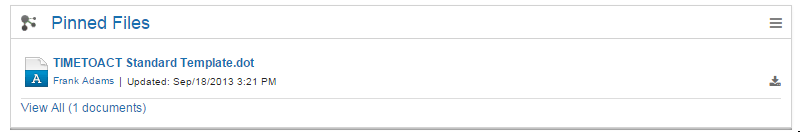

# My Pinned Files {#id_name .reference}

Displays all of a user's pinned files.

Displays link to all of a user's pinned files.

Download-button to direct download of this file.

Uploader and date will be displayed.

## Content source { .section}

The widget will display files that are uploaded in Connections and will be pinned to a user's own files. Each user can have different pinned files.

## Expected format { .section}

The widget should look like the normal [Files List](cec-files.md#) widget.

## Configuration options for Admin/Page Editor { .section}

Number of Items

