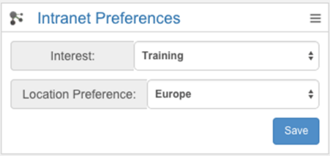

# Preferences {#id_name .reference}

Allows users to update their preferences for Connections Engagement Center, that is, their preferences for the home and landing pages.

In the edit area you can select all fields you want to show in the widget. These fields can be a select box or an input field.

## Content source { .section}

All fields in the profile edit area.

## Expected format { .section}

Input fields or select boxes with a save button.

**Caution:**This widget isn't available in Cloud or Anonymous mode of Connections Engagement Center.

## Configuration options for Admin/Page Editor { .section}

Fields to show

