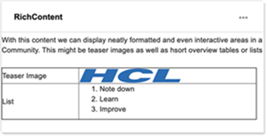

# Rich Content {#cec-rich-content .reference}

This widget allows you to display contents from the Rich Content widget of a specified community.

## Content source {#section_w15_hgl_jkb .section}

The contents of a Rich Content widget of a specified Community will be displayed. If the specified community contains more than one Rich Content widget, you can specify to display the last modified widget or a selected block from that community.

## Display format {#section_vx5_lgl_jkb .section}

The widget displays the selected rich text with Connections Engagement Center/Connections standard formatting.

## Configuration options for Admin/Page Editor {#section_rms_4gl_jkb .section}

**Allow Content Creation**: Effectively allows for editing existing content. If you are the owner of the source community, an additinal button allows you to open the rich content editor right from the widget.

**Source**: The source community to pull rich content from.

**Show Page**: Toggles between **Latest** and **Selected**. When **Selected** is displayed, you can select the content block indicated by its position on the Overview page.

