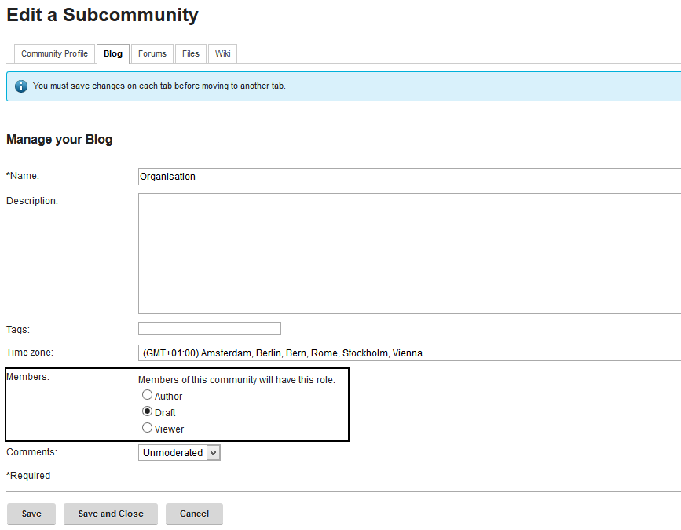

# Roles and restrictions in source communities {#id_name .reference}

If widgets are set to display the **latest** content of a Community each new post within this community will be displayed on the corresponding Connections Engagement Center page. This enables an easy content creation process. To make sure that only a defined set of people are allowed to publish content within this sources there are different options.

## Option 1: Set the Community access to moderated { .section}

Each owner can change the access level of a Community by switching in the edit mode and changing the access configuration:

These way only defined users can join the Community and start contributing to the content. All possible applications will be only usable by the defined members of the Community.

## Option 2: Set single apps on a restricted mode { .section}

Within the edit mode of a Community most embedded applications can be further configured. Access each tab to see the possible restrictions. For most applications members can be set to reader role. Through this setting only Community owners can create and change new content within an application.

## Option 3: Approval workflow for all News widgets { .section}

For Blogs there is the option to let members only create draft versions of an entry. The draft is then submitted to the owners for approval or denial. This setting enables an approval workflow.

**Parent topic:**[Best practices](../../connectors/icec/cec-best-practices.md)

