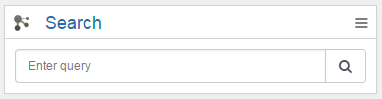

# Saved Search {#id_name .reference}

Saved custom search with limited results. Sort by relevance or date

You have different opportunities to use the Saved Search widget. First you can enter a normal search string in the query field like **Business**. Also you can search with a configured Connections-Search. Therefore you have to enter the URL of the Search-Feed. You can get this here:

If you want to have a searchbar in the widget, you have to empty the query field.

**Note:** The Search API is used for this widget. If the Search Index isn't up to date, it might be that the widget will show you old content or nothing. This widget will not be displayed in mobile, because the mobile-app does not support this API.

## Content source { .section}

Connections

## Expected format { .section}

Search results of connections content in a pager or a simple search bar.

## Configuration options for Admin/Page Editor { .section}

Items per Page

Total Items

Search-Query

