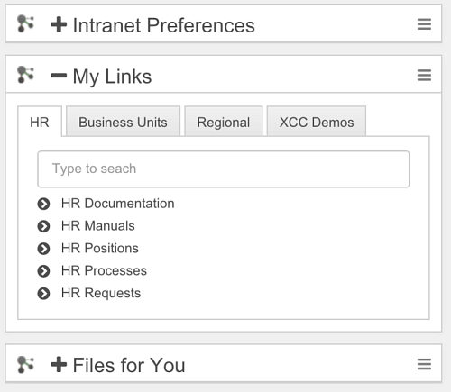
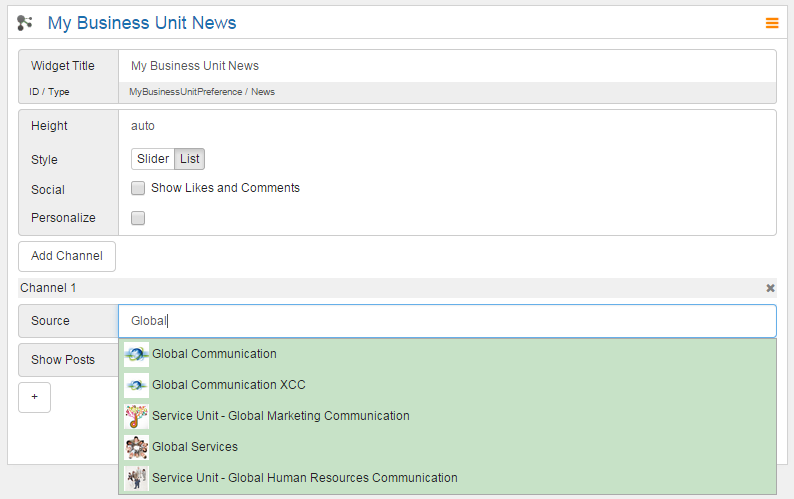

# Widgets {#id_name .reference}

Engagement Center widgets can be embedded in placeholders on every Connections Engagement Center page. The height of each widget can be defined pixel perfect or set to **auto** for a height responsive to the content.

The Engagement Center widget header will be hidden, if no widget title is defined.

You can include a twisty, to toggle the widget body. You only need to add the following html snippet to the widget title:

```
<i class="fa fa-plus toggleClick"></i>
```

If you will add the class **open**, the widget body will be shown, otherwise the widget body will be hidden.

If you want to have the icon and the title to toggle the widget on click, you need to do this like the following example:

```
<i class="fa fa-plus toggleTitle">widget title</i>
```

So instead of **toggleClick** you need to enter **toggleTitle** as a Class and put the widget title inside of the <i\> tag.



## Content source { .section}

The content source **type** is set as default for each widget. To fill the widgets with content you have to select a community or standalone application in the source field. Therefore start to type in the name of your community in the field. After typing in the first letters a dropdown menu will appear showing you matching communities with the community image. Select your community by clicking on it.

If you just type in the full name without clicking on the name your choice won't be saved.



The different colors indicate which type of community the community is. Green are public, yellow are moderated and red are restricted communities. If you set a restricted community as content make sure that your users have access to the community otherwise they will see an empty widget.

## Configuration options for Admin/Page Editor { .section}

-   Positioning by means of drag and drop
-   Height of the widget
-   widget title

**Note:** For correct display of the content within the widgets of Connections Engagement Center the sources need to deliver valid HTML. If content is not displayed check the source for validity first. Sometimes HCL Connections lets users save invalid HTML code.

