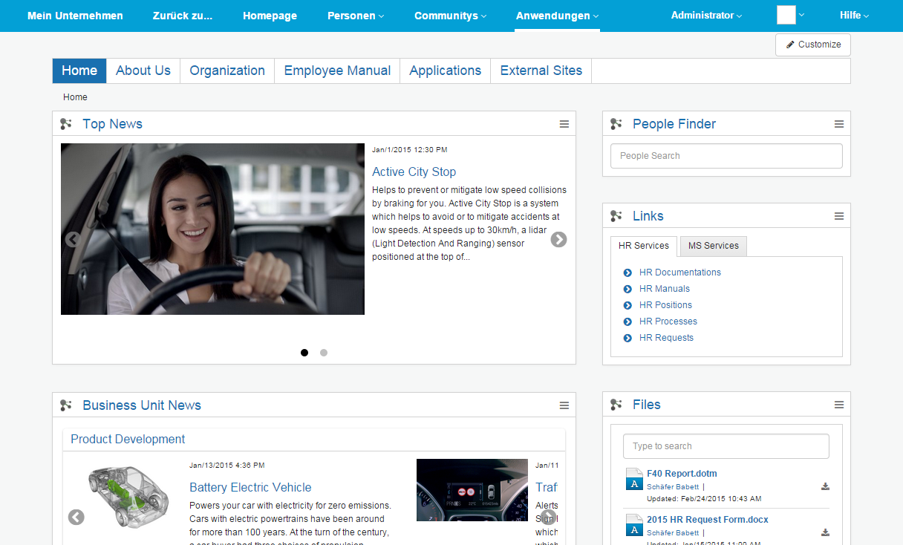
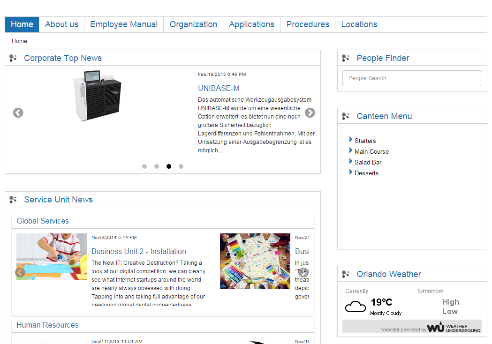
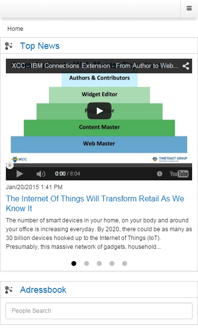

# URLs to access Connections Engagement Center {#id_name .reference}

Here are the browser links to access the various modes of HCL Connections Engagement Center.

## On-premises mode { .section}

You can access Connections Engagement Center in your browser with the following URL:

https://your\_server/xcc/main?page=page\_name

If you have the role **Page Editor** or **ADMIN**, you will see the **Customize button**.

## Flyout mode { .section}

You can access Connections Engagement Center in your browser by using the configured Connections flyout menu, or with the following URL:

https://your\_server/xcc/flyout

## Cloud mode { .section}

You can access Connections Engagement Center4Cloud in your browser with the following URL:

https://your\_server/xcc/cloud?page=page\_name

If you have the role **Page Editor** or **ADMIN**, you will see the **Customize button**.

## Community mode { .section}

You can access Connections Engagement Center4Communities in your browser with the following URL:

https://your\_server/communities/service/html/communitystart?communityUuid=\{commId\}\#fullpagewidgetId=\{wId\}

Create the Connections Engagement Center widget using Community Actions link or select it in the left navigation.

If you have the role **Page Editor** or **ADMIN**, you will see the **Customize button**.

## Anonymous mode { .section}

You can access a Connections Engagement Center4 Anonymous in your browser with the following URL:

https://your\_server/xcc/global?page=page\_name

Note that the global page should be already created and configured as a public page.

## Mobile mode { .section}

You can access a mobile page in your browser / mobile app with the following URL:

https://your\_server/xcc/mobile?page=page\_name

**Parent topic:**[Installing and configuring Connections Engagement Center](../../connectors/icec/cec-inst-install_top.md)

