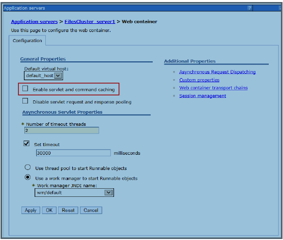
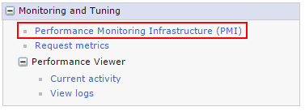
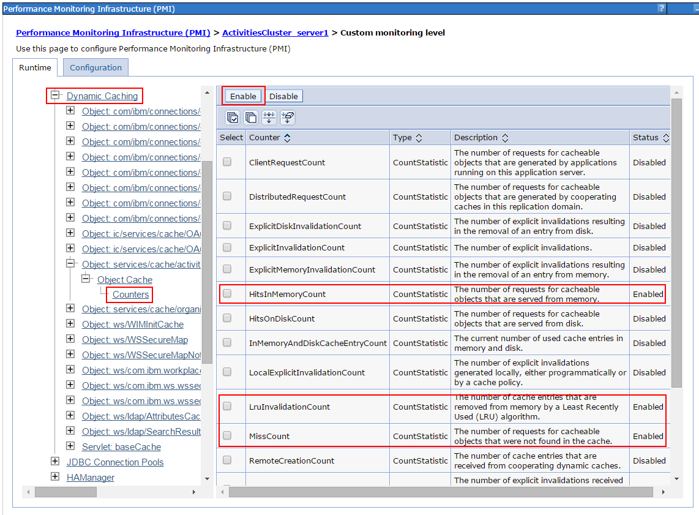
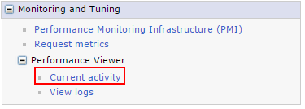

# HCL Connections Version 8 Performance Tuning Guide

## Introduction

## About this document

This guide provides information on how to optimize the performance of HCL Connections Version 8.

Tuning and the resulting system capacity can be affected by many factors, including the characteristics of the load on the system and the hardware used, including servers, disk subsystems, and network topology. Therefore, the objective of this paper is not necessarily to recommend specific values, but rather to make you aware of the parameters used in the HCL Connections Version 8 performance benchmarks.

This document does, however, provide tuning values specific to the hardware, topology, and workloads used for HCL benchmarks. With this in mind, administrators can use these values as an initial reference subject before conducting a formal sizing and tuning exercise specific to an individual customer's environment.

## What's New in Connections 8

[Find out about features that are new or updated in this release of HCL Connections](https://opensource.hcltechsw.com/connections-doc/v8-cr3/admin/overview/whats_new.html)

## Performance Tuning Overview

Tuning the HCL Connections environment involves tuning and configuring the various systems and components of the environment. This chapter discusses some general concepts and details the specifics of the configuration used in HCL's measurement environments. These specifics are as follows:

- Configuring the application server and the resources defined for that application server
- Tuning the databases and database server
- Tuning the web server and/or proxy server
- Tuning the operating system and network
- Tuning the HCL Connections services

When tuning specific systems, it is important to begin with a baseline and monitor performance metrics to determine if any parameters should be changed. When a change is made, another measurement should be made to determine the effectiveness of the change.

In addition to the tuning changes made in HCL's measurement environments, there are some additional tuning options available, which can improve performance in certain circumstances; these are discussed in the [Other Considerations](#OC) section.
 
## Environment Recommendations

Before installing HCL Connections, you should consider how the environment will be used to achieve ideal performance.

### 64-bit

All measurements were run with 64-bit operating systems running 64-bit versions of WebSphere. This is the recommended configuration for production deployments.

### Hardware Multi-threading (Hyper-threading)

Many modern processor architectures support hardware multi-threading. This is known as Hyper-Threading (HT) on Intel processors and Simultaneous Multi-threading (SMT) on Power-series processors. HCL's experience is that using hardware multi-threading provides an improvement in capacity in all of the scenarios and platforms HCL has measured, so we would recommend its use on platforms where this is an option.

### Virtualization

When virtualizing HCL Connections, it is important to ensure that the virtual machines are allocated enough resources to perform optimally. To reach capacity on a virtual machine (VM), it might be necessary to ensure that the virtual resources map one-to-one with physical resources, especially CPU and memory. The memory used by Java-based applications, such as HCL Connections, should not cause excessive disk swapping; otherwise, the application can suffer significant performance degradation.

Running HCL Connections on a VM whose host is overcommitted does not achieve optimal performance. Consider dedicating CPUs and memory to the HCL Connections VMs. In addition, ensure that the network bandwidth to the host is sufficient for all VMs. Depending on requirements, the HCL Connections VM might require a dedicated network interface on the host.

### HCL Connections Topologies

HCL Connections supports wide-ranging business requirements with a variety of deployment topologies. Typical deployments use a three-tier configuration:

- Proxy and HTTP server(s)
- Application server(s)
- Database and directory server(s)

The primary benefit of having a multi-tiered configuration is to avoid resource contention caused by multiple databases and applications residing on a single server. For example, if the database server shares a node with the application server, the combined resource contention would negatively impact the amount of throughput that can be achieved. On the other hand, a small deployment might have sufficiently small resource requirements that some of these servers could be deployed on a single node.

A multi-tiered configuration also allows a single component to be scaled up by adding extra clustered servers. HCL Connections cluster server nodes, for instance, can be added to increase capacity without also requiring a new database installation and configuration.

#### Single-Server Topology

For smaller deployments, some of these tiers might be run on a single system. For example, a common configuration is to use a single node to run the HTTP server and the application server, while the database and directory servers are run on separate servers. This is the configuration we have used for most performance benchmarks on Linux.

Figure 1 illustrates a typical system diagram used for the performance benchmark tests.

Figure 1: Connections Performance Benchmark System Diagram

### Deployment Options

To choose the most effective deployment topology, you need to evaluate security requirements, network infrastructure, management complexity, integration with other products, and performance considerations.

This section describes different types of deployment topologies and strategies for achieving high performance when building the HCL Connections environment.

When installing HCL Connections Version 8, the HCL Installation Manager presents three deployment options. Note that the Medium and Large deployments offer considerably more scaling capabilities and support multiple clusters.

- In the Small deployment option, all applications run within a single Java Virtual Machine (JVM). This option is typically used for low-volume deployments of HCL Connections, such as proof-of-concept deployments.

- The Medium deployment has changed since HCL Connections 7.0. Applications have been rebalanced in 4 clusters instead of 5:
  - Infra: Common, Communities, ConnProxy, Help, ICEC, News, Profiles, Search, URLPreview, Oauth, WidgetContainer
  - Util: Homepage, Invite, Moderation, RichTextEditors, Sharepoint, Sidebar, Touchpoint
  - Apps: Activities, Blogs, Bookmarks (Dogear), Files, Forums, Metrics, ic360, StrorageProxy, Mobile, MobileAdmin, Wikis
  - Push: PushNotifications

- The Large deployment option provides a predefined cluster name for each application. This option provides the best performance in terms of scalability and availability options, but also requires more system resources. Since HCL Connections 5.5, the following applications are separated out in their own clusters: Common, PushNotification, RichTextEditor, WidgetContainer.

Note that this configuration was used for HCL's performance benchmarks.

**Note:** If you expect users to frequently download multiple big files in a single download session, we strongly recommend a Large deployment.
For a more in-depth overview and deployment diagrams, Refer to [HCL Connections Version 8 documentation](https://opensource.hcltechsw.com/connections-doc/v8-cr3/admin/plan/c_installation_overview.html)

You can also review the [Other Considerations](#OC) section.

### Clustered Deployments

A clustered HCL Connections deployment utilizes the clustering capability of WebSphere Application Server to run applications on two or more cluster members - the JVMs that run the applications. The cluster members can be deployed on the same node (server machine) or can be spread across multiple nodes. Running multiple cluster members on the same node is known as vertical clustering, while running cluster members on separate nodes is known as horizontal clustering.

### HCL Connections and Horizontal Clustering

Horizontal clustering has two main purposes: increasing capacity and increasing reliability. Since horizontal clusters run on multiple nodes, more resources are available, increasing the total number of users that can be supported by the cluster. A horizontal cluster also provides greater reliability, as the failure of a single node does not cause a failure of the entire cluster.

Production deployment strategies are discussed in more detail in the [Planning section of the HCL Connections Version 8 product documentation](https://opensource.hcltechsw.com/connections-doc/v8-cr3/admin/plan/c_installation_overview.html)

All performance benchmarks were run on single-node environments.

**Key point:** Horizontal clustering of HCL Connections provides increased capacity and reliability compared to single-node deployments.

### HCL Connections and Vertical Clustering

**Key point:** In HCL Connections, vertical clustering is not required and not supported.

Vertical clustering is utilized for certain Web applications that cannot fully utilize all system resources with a single application server instance. For such applications, multiple application servers are deployed on each node in the cluster. For HCL Connections, it is recommended to use a Medium or Large deployment model, which deploys multiple application servers to each node, allowing for better use of the resources on the host node. It should be noted that HCL Connections does not support vertical clustering.

### Considerations for Network File Sharing

In a clustered environment, HCL Connections employs a shared file system to store file content, attachments in Activities, message stores for the WebSphere Application Server's Service Integration Bus (WASSIB), and other content.

**Notes:**

- The search index must be stored locally on each node where the Search application is installed.
- The shared file system used for HCL Connections must support advanced locking capabilities:
- When using NFS, NFSv4 should be used as NFSv3 lacks advanced locking capability.
- Microsoft Distributed FileSystem (DFS) lacks a distributed locking facility for files, thus it cannot be used for HCL Connections environments.

To plan the installation, refer to [https://opensource.hcltechsw.com/connections-doc/v8-cr3/admin/plan/c_planning_the_installation.html](https://opensource.hcltechsw.com/connections-doc/v8-cr3/admin/plan/c_planning_the_installation.html).

A shared file system may cause performance issues. Therefore, it is important to pay attention to network tuning, hardware, and other areas to limit this risk. For example, in one performance deployment, the anti-virus software on the application server was scanning the content on the mapped network drive. This is an extra level of precaution but imposes a performance cost.

All of the HCL Connections Version 8 deployments used for the performance benchmarks used a remote file system mapped over the network for shared data. Although small deployments do not strictly require the file content to be available outside the node, we chose to emulate this production environment strategy for all HCL's benchmark systems.

**NFS Disk Usages Recommendation:**

An activity was conducted to understand the I/O requirements regarding NFS Share Performance to ensure disk and network I/O is sufficient to meet the demand. The purpose of this load test was to simulate an end-user process and assess the performance of the software.

*The test environment used:*

- 1xDMGR (100GB Disk, 8GB RAM, 2 CPUs)
- 1xConnection node (200GB Disk, 64GB RAM, 8 CPUs)
- 1xNFS node (2T Disk, 2 GB RAM, 2 CPUs)

*Scenario:*

- Load: 500 users
- Duration: 8hrs	
- Think Time: 10sec
- Throughput: 50pages/sec

And the test covers all workflows that comes under files feature.

*Disk Usage Observations during the test:*

-	Disk Space usage is consistent throughout the test duration. Averaged about 118gb
-	Avg of Disk Reads and writes completed are as follows 25.9 io/s & 778 io/s
-	Avg of successful io usage read bytes and writes bytes are 3.1 Mib and 6.4Mib
-	Avg time spent doing I/Os is 558 ms
-	Network traffic for receive/transmitted are 26 and 27 mbps

 **Key point:** The network file share plays a critical role in the performance and reliability of a deployment. Size carefully to ensure disk and network I/O is sufficient to meet the demand. For better performance, a dedicated NFS system is needed.
 For Docs,suggestion is to plan some additional capacity on top of what the above the test is showing.

### Files Content Conversion

Connections uses the Apache Tika file conversion libraries for converting business documents from various types to plain text. The plain text is required before the content can be indexed. A test was conducted to observe the time taken by Tika Libraries to convert file content and resulting search with file content.
Requirement was how to choose a value based on machine resources with optimal setting, not too high, not too low. And then the changed settings are actually making a difference, based on which we can scale-out to larger file sets. We should be able to provide some timings that can be used to predict how many files per hour we can convert. This will be quite variable based on file type and size, but we want to give an idea of what it would be.

*Test Scenarios:*

Parameters to be modified. All 3 should be kept equal.

MAX_CONVERSIONS_THREADS == maxConcurrentDownloads == tikaFileConversion.maxConversionThreads

 - Note: 1st one to be modified through was console and next two in search-config.xml
 - We have used the 1000 variable size/type file-set and monitored at different settings (2,4,6,8,10,12,14).
 - 5000  file set with 2, 3 and 6 threads
 - 10000 File set with 6 threads

*Test Environment/Specs:*

- Disk space- 200
- RAMP- 64
- CPUs- 16

A series of tests was performed to identify the best possible settings for file content tika conversion based on environments.
According to the results, with varied file types/sizes and keeping conversion threads equal 
MAX_CONVERSIONS_THREADS == maxConcurrentDownloads == tikaFileConversion.maxConversionThreads

For 5000 Files,
considering the default settings to 2 - we are getting approx. 220 files per min with 1365 ms is the total conversion time.

- if we change it to 3 - we can see there is improvement of approx. 30% in conversion time
- if we change it to 6 - we can see the there is improvement of approx. 60% in conversion time

### Database Server Hardware

HCL Connections relies heavily on its databases to provide its functionality, so the performance of those databases is crucial to achieving good performance for HCL Connections. The database server(s) should have a significant amount of memory, with at least 8GB on small deployments and as much as 128GB on larger deployments. In our benchmark tests, we used a minimum of 48GB. In addition, the performance of the disk subsystem where the content is stored is very important. This should be a dedicated storage device, such as an HCL Storwize® V7000 device, or some other high-performance disk system capable of handling a high disk I/O throughput.

From HCL's observations, nearly 1/3 of the disk write operations are due to the databases' transactional log files. It is recommended that you locate these log files on a separate high-performance disk subsystem, for example, based on Solid State Disks (SSD).

**Key point:** The database server(s) are a crucial component of an HCL Connections deployment, and the hardware used for them must be adequate for the workload.

### Database Server Architecture

For the database server(s), it is recommended that you use 64-bit architecture exclusively, if possible. A 64-bit database server can access vastly more memory than a 32-bit database server. This provides a performance benefit for the database, as it is able to do greater in-memory caching, which reduces disk I/O and improves overall database performance.

With 64-bit database server(s), it is possible to deploy a single database instance per node, or one database instance per Database. HCL's experience with the HCL Connections databases is that deploying each database in its own instance provides the best performance, at the cost of somewhat higher memory demand. Therefore, if sufficient physical memory is available, we recommend deploying each database in its own instance.

For HCL's performance benchmarks, we used 64-bit hardware and one DB2 instance for each database.

**Key points:** If possible, deploy the databases used by HCL Connections on 64-bit hardware, with each database deployed in its own database instance, if sufficient physical memory is available.

### Content Caching and Compression Overview

HCL Connections includes resources that can be cached and compressed. Implementing a caching solution reduces the impact on the Application Server, therefore increasing capacity. Implementing a compression solution reduces the network bandwidth usage, improving users' experience. Compression is particularly recommended if the site will be accessed by users with slow network links or who are a long distance from the application server (for example, users on a different continent from the application servers).

#### Content Caching Details and Implementation Choices

HCL Connections includes resources that change infrequently, such as static page elements, JavaScript, stylesheets, and images. Also cacheable are some public requests otherwise processed by the application server. For example, the list of public Wikis can be cached for a short period of time. Caching them reduces the load on the application and database servers for a busy site. We recommend including a caching solution in any large-volume deployment.

There are two choices for caching: using a reverse proxy or enabling caching in the HTTP server. In this section, we discuss both options.

**Note:** For our single server benchmark configurations, we enabled caching on the HTTP server.

We suggest having the HTTP server reside on a different server than Connections for high workloads. Caching on the HTTP server is a good solution for this setup.

A reverse proxy can be used:

- as an alternative to an HTTP server to cache and compress public content
- to support a high number of concurrent "LongPoll" connections.

Other configurations are viable, but make sure that large cacheable resources are cached and compressed.

The advantage of using a reverse proxy over an HTTP server for caching depends on the topology used. In general, it is best to have the caching done on a system other than the application server. If the HTTP server is on the same server as the application server, it is good to use a separate server as a caching reverse proxy.

We used IBM HTTP Server 8.5 in our measurement environments. Our Single-Server configurations have the web server running on the same system as the Connections application server. If, during your monitoring, you notice insufficient processor capacity on the system when running the web server and the Connections server co-located on a single system, consider separating the servers onto different systems.

**Key point:** Caching is recommended for increasing server performance and improving the client experience.

#### Content Compression Details and Implementation Choices

HCL Connections makes use of a significant amount of readily-compressible content, such as JavaScript files and style sheets. Therefore we recommend compressing all content except images. This reduces the demand for network bandwidth and provides better performance for clients connecting over slower network.
HCL Connections content can be compressed either at the HTTP server or the proxy server. It does not make sense to try to compress content at both locations. In HCL's lab measurements, we chose to compress the content on the HTTP server tier. See [https://opensource.hcltechsw.com/connections-doc/v8-cr3/admin/install/t_ihs_config_not_compressing_files.html](https://opensource.hcltechsw.com/connections-doc/v8-cr3/admin/install/t_ihs_config_not_compressing_files.html)

**Key point:** Caching and compressing content is recommended to reduce network bandwidth usage and for an improved client experience, especially over slow networks.

Information about configuring HCL Connections with a caching proxy can be found in the HCL Connections Version 8 product documentation at: [https://opensource.hcltechsw.com/connections-doc/v8-cr3/admin/install/t_install_deploy_caching_proxy.html](https://opensource.hcltechsw.com/connections-doc/v8-cr3/admin/install/t_install_deploy_caching_proxy.html)

### HTTP Server

The HTTP Server is a mandatory element of HCL Connections deployments, and is typically configured after HCL Connections is installed. Since HCL Connections Version 5.5, the Install Manager can configure IHS if pre-installed with WebSphere before installing Connections. All of HCL's benchmark environments had the HCL HTTP Server (IHS) co-located with the application server for ease of management.

IBM HTTP Server on Windows has a Parent process and a single multi-threaded Child process.

On 64-bit Windows operating systems, each instance of IHS is limited to approximately 2000 Threads Per Child. [http://publib.boulder.ibm.com/httpserv/ihsdiag/ihs_performance.html#tpc_win](http://publib.boulder.ibm.com/httpserv/ihsdiag/ihs_performance.html#tpc_win)
With PI04922, it's possible to use nearly twice as much memory (nearly twice as many threads). See PI04922 [http://www-01.ibm.com/support/docview.wss?uid=swg1PI04922](http://www-01.ibm.com/support/docview.wss?uid=swg1PI04922)

<para>These numbers are not exact and depend on many factors. The upper limits become even more restrictive when loading other modules such as mod_mem_cache etc. No specific limits can be provided, but it is suggested that anything approaching the limits indicated above on a Windows operating system could be at risk.</para>

<para>Currently, there is no 64-bit version of IHS on Windows. So, if more threads are needed, a separate non-Windows server will be needed for IHS.</para>

Note that all of the HCL Connections Version 8 deployments used for the performance benchmarks used the 64-bit version of IHS on Linux.

For more information, see:

"_IBM WebSphere Application Server Performance Cookbook: Web servers_" [http://publib.boulder.ibm.com/httpserv/cookbook/Web_Servers.html](http://publib.boulder.ibm.com/httpserv/cookbook/Web_Servers.html)

"_IBM HTTP Server Performance Tuning_" [http://publib.boulder.ibm.com/httpserv/ihsdiag/ihs_performance.html#ibm-http-server-performance-tuning](http://publib.boulder.ibm.com/httpserv/ihsdiag/ihs_performance.html#ibm-http-server-performance-tuning)

"_Maximizing the number of client connections to WebSphere Application Server by tuning IBM HTTP Server_"

[http://www-01.ibm.com/support/docview.wss?uid=swg21167658](http://www-01.ibm.com/support/docview.wss?uid=swg21167658)

### Configuring file downloads through the HTTP Server

This section is to stress the importance of the following mandatory post-configuration steps. IBM's benchmark environments were configured in this way.

**Key point:** To increase efficiency in downloading files from Files, Wikis, Activities, and Library applications, configure an HCL HTTP Server to handle most of the download process instead of the WebSphere® Application Server.

In the default deployment with an HCL HTTP Server, file download requests are passed from the HCL HTTP Server to the WebSphere Application Server. The WebSphere Application Server accesses the binary files in a data directory on the file system and returns them to the HCL HTTP Server, which then passes them to the browser. This means that one thread on the application server is in use while the download is in progress.

When large numbers of users are downloading files, this deployment is inefficient. This is partly because WebSphere Application Server has a limited thread pool that is tuned for short-lived transactions. Additionally, WebSphere Application Server is optimized for Java Platform, Enterprise Edition applications and not for file downloads. In this type of deployment, you might have to create a cluster to handle downloads, especially if you have slow transfer rates.

Configuring IBM HTTP Server to download files makes down loading much more efficient,because IBM HTTP Server is designed specifically for serving files. This configuration leaves WebSphere Application Server to carry out tasks such as security checking and cache validation.

If you choose not to configure the IBM HTTPServer to download files, you must configure the WebSphere Application Server to transfer data synchronously instead of asynchronously to avoid errors related to using too much memory.Forinstructions,seethe"ExcessivenativememoryuseinHCLWebSphereApplicationServer"technoteat:

[http://www.ibm.com/support/docview.wss?uid=swg21317658](http://www.ibm.com/support/docview.wss?uid=swg21317658)

Instructions for configuring file downloads through HCL HTTP Server are provided in the HCL Connections Version 8 Knowledge Center at: [https://opensource.hcltechsw.com/connections-doc/v8/admin/install/t_install_post_files_downloads.html](https://opensource.hcltechsw.com/connections-doc/v8/admin/install/t_install_post_files_downloads.html)

### Configuring file uploads through the HTTP Server

This feature was introduced from HCL Connections 5.5 and allows you to Configure the HCL HTTP Server to manage file uploads from Activities and Files.  As we explained for file downloads in the preceding section, this approach is more efficient than using the IBM WebSphere® Application Server to receive files.

Instructions for configuring file uploads through HTTP Servers are provided in the HCL Connections Version 8 Help Center at: [https://opensource.hcltechsw.com/connections-doc/v8/admin/install/t_install_post_files_uploads.html](https://opensource.hcltechsw.com/connections-doc/v8/admin/install/t_install_post_files_uploads.html)

## Other Considerations

### Search

The Search application is responsible for indexing all the searchable content in HCL Connections and handling search requests. It also powers the social analytics widgets, such as Recommendations, Do You Know, Things in Common, and Who Connects Us. Depending on the size of the deployment (Medium or Large options), it may be beneficial to dedicate an individual node to the Search application.

See "Making Search-Related Configuration Changes to Newly Added Nodes" at [https://help.hcltechsw.com/connections/v6/admin/admin/t_admin_search_add_search_node.html](https://help.hcltechsw.com/connections/v6/admin/admin/t_admin_search_add_search_node.html).

To ensure smooth downloads of multiple large files in a single session, follow these steps for large deployments:

- Disable servlet caching on the Files application server cluster.
- Monitor Java heap usage and size accordingly.

Note: These instructions are applicable to the "Large Deployment" option where the Files application is deployed to its own application server cluster.

To disable Files servlet caching, in the WebSphere Integrated Solutions Console, click: Servers → Server Types → WebSphere application servers → FilesCluster → Container Settings: Web Container Settings → Web container → Un-check "Enable servlet and command caching".

Figure 2: Disable Files servlet caching

Additional Resources:

- HCL Connections Version 8 Product Documentation at [https://opensource.hcltechsw.com/connections-doc/v8-cr3/admin/welcome/welcome_admin.html](https://opensource.hcltechsw.com/connections-doc/v8-cr3/admin/welcome/welcome_admin.html)
- WebSphere Application Server Network Deployment Version 8.5 documentation at [http://www-01.ibm.com/support/knowledgecenter/SSAW57_8.5.5/com.ibm.websphere.nd.multiplatform.doc/ae/welcome_ndmp.html](http://www-01.ibm.com/support/knowledgecenter/SSAW57_8.5.5/com.ibm.websphere.nd.multiplatform.doc/ae/welcome_ndmp.html)
- DB2 11.5 Information Center at [https://www.ibm.com/docs/en/db2/11.5](https://www.ibm.com/docs/en/db2/11.5)

### Benchmark System Used for Performance Measurements:

This section provides context for how HCL derived its tuning recommendations.

Workloads:

The teams that evaluate HCL Connections Version 8 performance run two main types of measurement workloads:

- Integrated and Single application
- The Integrated workload is the main reference benchmark measurement, the results of which are published in the Connections Version 8 Benchmark Report. In this workload, all the components are exercised simultaneously as in a real-world scenario.
- The purpose of the Single application measurement is to evaluate the performance of the specific Connections Version 8 application, in relative isolation, outside of interaction with the other suite of offerings (although News and Search are always interacting with all components).
- The metrics gathered from these measurements are also used for the Connections Version 8 sizing tool.
### Benchmark Deployments

For all measurements (Integrated and Single components), the performance teams used the **Large** deployment option with each application in its own JVM.

All of the components offered in HCL Connections Version 8 were installed and populated - much in the same manner as a production environment. Each application runs in its own JVM, each application database was installed in its own DB2 instance, and each database was stored in its own "logical drive or LUN" to allow us to monitor disk activity in greater detail. However, this is not needed for production deployments. The logical drives were located on a RAID disk subsystem. The HCL HTTP was also configured to cache, compress and handle file downloading. For more information, see the [HTTP Server](#_bookmark1) section of this white paper.

### Benchmark Hardware & Operating Systems

The servers running the measurement use 64-bit hardware, Red Hat Enterprise Linux Server release 6.8 (Santiago) 64-bit.

The typical environment used for the benchmark workload is as follows:

- 1 WebSphere Application Server node – typically a 16-core server with 64GB of RAM running the HCL Connections Version 8 product in 19 clusters (JVMs) with the HCL HTTP Server co-located. 
- WebSphere Deployment Manager (DM) node serving to administer the environment. Note that the DM has minimal impact on the system.
- 1 database server – typically a 16-core with 64GB of RAM server running IBMDB2® software.
- 1 LDAP server, running Tivoli® Directory Server – processor load on this tier is minimal.
- A dedicated network file-system having 2T of disk
- Note that in a large production environment, a dedicated file server is recommended.
- For the DB2 server and the mapped network file-system, we used a high-performing disk subsystem.

## Tuning the Connections System

In general, the following observations about HCL Connections Version 8 can be made:

- Performance across all the components is typically limited by disk I/O, either on the database, the file repository, or both. This is especially true for the News application accessing the Homepage database. Performance can be improved by adding RAM on the DB server to cache more data. From our observations, nearly 1/3 of the disk write operations are due to the databases' transactional log files. We suggest locating these log files on a separate high-performance disk subsystem; for example, based on Solid State Disks (SSD).
- End-user experience can be affected by external factors, such as network latency, network bandwidth, and browser rendering times. Configuring a forward proxy server, to cache content near the user, improves client-side performance for public content.
- Compressing content, as explained earlier in this document, provides a significant improvement in terms of network bandwidth usage and end user overall response time.
- Caching content with a reverse caching proxy near the HCL Connections server, reduces the workload on the application server and significantly improves throughput.
- With the recommended heap sizes provided in the following section, none of the applications were memory constrained within the JVM heap in HCL's integrated benchmarks.

### Tuning the Application Server Environment

Because HCL Connections is composed of standard Java web applications, typical tuning practices for WebSphere®
applications apply. At a minimum, database connection pools, the application server thread pools, and JVM heap should
be sized and monitored.

### Tuning via the Integrated Solutions Console

To get to the WebSphere Application Server (WAS) Integrated Solutions Console, start WebSphere and then log in to
the WebSphere Integrated Solutions Console via http://yourserver:9060/ibm/console with the administrator user ID
created during the WAS installation.

The port number, 9060, is the default port number in IBM®'s lab deployments, but other deployments might use
different ports. To find out the ports in use for your installation, look for ‘adminhost’ in the following path:

wasprofileroot/config/cells/cellname/nodes/nodename/serverindex.xml.

For more details on configuring a WebSphere Application Server, see the Tuning section of the product documentation
located at [https://www.ibm.com/support/knowledgecenter/SSAW57_8.5.5/as_ditamaps/was855_welcome_ndmp.html](https://www.ibm.com/support/knowledgecenter/SSAW57_8.5.5/as_ditamaps/was855_welcome_ndmp.html)

### Tuning the JVM

Reference material: IBM® WebSphere Application Server Information Center “Network Deployment > Tuning
performance > Tuning the full profile > Tuning the application serving environment > Tuning the JVM” in: [http://www-
01.ibm.com/support/knowledgecenter/SSAW57_8.5.5/com.ibm.websphere.nd.multiplatform.doc/ae/container_tune_jvm
.html](http://www-
01.ibm.com/support/knowledgecenter/SSAW57_8.5.5/com.ibm.websphere.nd.multiplatform.doc/ae/container_tune_jvm
.html)

### Heap Size 

When setting the heap size for an application server, keep the following in mind:

- Size the physical memory of the server to fit all of the processes into memory, plus enough for the operating
system. When more memory is allocated than the available physical memory on the system, paging occurs and
can result in very poor performance.
- The total JVM process size is made up by the Java heap, which you set, and the Java native heap, which grows
to its working size after the system has “warmed-up” to its nominal load. For more information, see the
developerWorks web site at:
[http://www.ibm.com/developerworks/linux/library/j-nativememory-linux/index.html](http://www.ibm.com/developerworks/linux/library/j-nativememory-linux/index.html)
- We set the minimum and maximum heap sizes to the same values because we are using generational, concurrent (or 'gencon') garbage collection, which helps avoid heap fragmentation. HCL's measurements have shown that generational concurrent garbage collection provides the best throughput and response time results. This is the default setting when installing HCL Connections.
- Note that running clustered WebSphere nodes might require larger heap sizes compared to stand-alone, non-clustered systems if session replication is being used. This is especially true when using memory-to-memory session replication since session information is also stored in the JVM.
- After doing any heap size tuning, do the following:

  - Monitor the system to make sure that paging is not occurring.
  - Monitor the verbose garbage collection output to determine if the selected size is appropriate. Ideally, the system should spend no more than 3-5% of its time in garbage collection.

By default, when installing HCL Connections Version 8, the HCL Installation Manager sets the initial heap size to 512MB and the maximum heap size to 2560MB for all deployment options: Small, Medium, and Large.

**Key Point:** These values must be reviewed for production systems based on sizing guidelines and then fine-tuned based on usage statistics.

Based on HCL's latest integrated (i.e. a mix of all components) and single workload tests, we have revised HCL's recommendation for initial Java heap tuning.

We have now grouped the min/max Java Heap size recommendations in three categories: Small (1.5GB), Medium (2GB), and Large (2.5GB).

**Small**: Bookmarks, Homepage, Common, WidgetContainer, RTE

**Medium**: Blogs, Files, Forum, Profiles, Wikis, Mobile

**Large**: Activities, Communities, News, Search, Metrics

**Special case**: PushNotification - see notes below

**Note:** More content will drive a requirement for a bigger heap in Search; therefore, we recommend you monitor the heap usage and adjust accordingly.

On HCL's benchmark systems, we saw good performance using the heap sizes given in Table 1.

Table 1: Base HCL Connections Version 8 Maximum Heap Sizes

**JVM Minimum and Maximum Heap Sizes**

| Application | GB |
| --- | --- |
| Activities | 2.5 |
| Blogs | 2 |
| Bookmarks | 1.5 |
| Common | 1.5 |
| Communities | 2.5 |
| Files | 2 |
| Forums | 2 |
| Homepage | 1.5 |
| Metrics | 2.5 |
| Mobile | 2 |
| Moderation | 0.5 |
| News | 2.5 |
| Profiles | 2 |
| PushNotifications | See Note\* |
| RTE | 1.5 |
| Search | 2.5-4GB\*\* |
| WidgetContainer | 1.5 |
| Wikis | 2 |

**Note:** Refer to this chapter [Tuning the Push Notifications server for File Sync and Notifications Center](#_bookmark4)

**Search:** Depending on your data population, you might have to increase the heap size to build a full index from scratch. We required a heap of 4GB to build an index of this size:

- Size on disk: 33GB
- Number of files: 406
- Number of fields: 526,843
- Number of documents: 7,341,075
- Number of terms: 61,935,171

**How to Set:** In the WebSphere Integrated Solutions Console, click:

**Servers → Server Types → WebSphere Application Servers → \<application\_clusterServer\> → Server Infrastructure: Java and Process Management → Process Definition → Java Virtual Machine**

  - Initial heap size
  - Maximum heap size

Regardless of deployment topology, we recommend enabling verbose garbage collection logging and monitoring heap use for all JVMs. Verbose GC logging has a minimal impact on performance and provides valuable performance diagnostic information.

**Servers → Server Types → WebSphere Application Servers → \<application\_clusterServer\> → Server Infrastructure: Java and Process Management → Process Definition → Java Virtual Machine**

- Check the Verbose garbage collection check-box.

**Key points:** Monitor verbose garbage collection logs and make sure sufficient heap space is available. When setting the maximum JVM heap size, pay particular attention to ensure sufficient physical memory exists to support the chosen value.

#### Nursery Size

Benchmarks show that the generational garbage collector gives the best performance; therefore, it is enabled by default since HCL Connections, version 3.0. The string -Xgcpolicy:gencon is present in the Generic JVM Arguments field in the WAS Admin Console.

The generational garbage collector splits the heap into two sections: the nursery and the tenured region. The collector can be fine-tuned by setting the size of the space where new objects are allocated, the nursery. A large nursery is typically good for throughput, while a small nursery is typically good for low pause times. Moreover, good WebSphere Application Server performance (throughput) usually requires a reasonably large nursery. A good starting point would be to size the nursery to ¼ of the Max Heap size, e.g. 512 MB for a 2GB heap size. Next, move up or down to determine optimal value, measure throughput or response times, and analyze GC logs to understand frequency and length of scavenges. In particular, watch the "flipped bytes" count and keep that as low as possible.

The nursery size is set with the JVM argument -Xmn (for example, **–Xmn512M** )

### Tuning the Data sources

#### Connection Pool Size

By default, when installing HCL Connections Version 8, the HCL Installation Manager sets the minimum connection pool size to 1 and the maximum connection pool size to 25. These are good values to start with. You should then monitor their usage and adjust to your workload requirements. See [Data Sources Tuning](#DST) used for our tests. Note that each application has its own connection pool.

**How to Set:** In the WebSphere Integrated Solutions Console, click:

**Resources → JDBC Providers → \<provider name\> → Data Sources → \<data source name\> → Connection pool properties**

- Maximum connections
- Minimum connections

#### Prepared Statement Cache Size

All data sources are configured in a similar manner. By default, HCL Connections components install with a prepared statement cache value of 100. The default prepared statement cache size is optimum for DB2. However, deployments with a different RDBMS, such as Oracle, which use larger prepared statements, you might want to reduce the size of the cache.

**How to Set:** In the WebSphere Integrated Solutions Console, click:

**Resources → JDBC Providers → \<provider name\> → Data Sources → \<data source name\> → WebSphere Application Server data source properties → Statement cache size.**

Be aware that specifying a larger prepared statement cache size can lead to OutOfMemory errors in situations where your application memory is already being highly used by your workload. The prepared statement cache size setting is the maximum allowed cache entries per database connection. So increasing the cache size on a data source that has a large number of connections can quickly increase the heap usage for these cache objects. Any changes should be considered for each individual data source independently instead of across all data sources globally. Before increasing a data source's prepared statement cache size, you should monitor your memory usage under a heavy workload to determine if there is enough JVM heap available to handle an additional increase.

Below table summarizes sizes used in HCL's benchmarks:

Table 2: Data Sources Tuning

| **Data Source** | **JDBC Pool (min/max)** | **Statement Cache Size** |
| --- | --- | --- |
| Activities | 1/50 | 10 |
| Blogs | 1/250 | 10 |
| Dogear (Bookmarks) | 1/150 | 10 |
| Communities | 10/200 | 10 |
| essapps | 1/50 | 10 |
| Files | 10/100| 10 |
| Forum| 50/100 | 10 |
| Homepage| 20/100 | 10 |
| ICEC | 1/75| 10 |
| Metrics | 1/75 | 10 |
| Mobile | 1/100 | 10 |
| News | 50/75 | 10 |
| oauth_provider | 1/50 | 10 |
| Profile | 1/100 | 10 |
| Push | 25/75 | 10 |
| Search | 50/75 | 10 |
| urlpreview | 50/75 | 10 |
| WidgetContainer | 50/75 | 10 |
| Wikis | 1/100 | 10 |

It is always recommended to periodically evaluate connection pool sizes and requirements in the actual environment
using the IBM® Tivoli® Performance Monitor, integral to WebSphere 8, or other tools.

**Key points:** Increase the JDBC connection pool sizes from the default values and monitor their usage. The prepared
statement cache values should not need to be changed if using DB2 as the back-end RDBMS.

### Web Container Thread Pools

By default, IBM Installation Manager sets the minimum Web Container Thread Pool size to 50 and the maximum to 75 when installing HCL Connections Version 8. These values are good to start with, but you should monitor their usage and adjust to your workload requirements. For a high-volume site, we recommend increasing the Web Container thread pool to 100 in all application servers to allow more simultaneous requests.

To set the minimum and maximum size threads, go to the WebSphere Integrated Solutions Console and click on Servers → Server Types → WebSphere application servers → \<ActivitiesCluster\_server1\> → Additional Properties: Thread Pools → Web Container → Thread Pool. This needs to be repeated for all application servers.

A key point to keep in mind is that users should periodically monitor the actual number of threads being used in the pool by enabling the appropriate performance counters in the HCL Tivoli Performance Monitor.

### Service Integration Bus Message Stores

For high-volume sites, we recommend tuning the Service Integration Bus (SIB) Message File Store. For example, for the Activities application, the following tuning worked well in HCL's workloads:

- Message Store - High loads on the Activities application generate a high message traffic, which needs a larger message store for the Activities Messaging Engine (ME). We noticed good performance using the following values:
  - Log size = 500MB
  - Minimum permanent store size = 500MB
  - Maximum permanent store size = 3000MB
  - Minimum temporary store size = 500MB
  - Maximum temporary store size = 1000MB

Other ME candidates for the same tuning based on traffic are News, Communities, and Files. 

To set the message thresholds, go to the WebSphere Integrated Solutions Console and click on Service integration → Buses → ConnectionsBus → Messaging engines → ActivitiesCluster.000-ConnectionsBus → Message Store.

From HCL's performance measurements, we observed a significant message traffic, which required us to increase the size of the News Connections bus. You should monitor the typical queue sizes and growth patterns and tune accordingly. We saw good performance using the following values:

- Default messaging engine high message threshold = 300,000
- High message threshold per message point = 300,000

For the News cluster ME, go to Service integration → Buses → ConnectionsBus → Messaging engines → \<News cluster ME\> → Publication points → connections.events@NewsCluster.000-ConnectionsBus.

Similar obersvations for Communities, Files, Metrics and Profiles. Recommended to set same message thresholds.

### Tuning the Web Server

All performance benchmark measurements were conducted with the IBM® HTTP Server co-located on the node
running the WebSphere Application Server. IBM® HTTP Server fast file downloading option was configured for:
Activities, Files, Mobile and Wikis. This permits the IHS server to download binary content directly, instead of
passing the download requests to the application server, as we found this increased server capacity.

The IBM HTTP Server provided with IBM WebSphere Application Server ND requires very little tuning, as most of the default settings are set for excellent performance. However, the following performance changes were made, in addition to configuring the HTTP Server for SSL:

#### Process and Thread Settings in http conf

| **Parameter** | **Value** | **Comments** |
| --- | --- | --- |
| KeepAliveTimeout | 5 | This value is less than the think time defined in test scripts to ensure that testing is conservative. Each user is assumed to open a new TCP connection for each page view. However, in a live environment, it can be helpful to increase the KeepAliveTimeout. A higher timeout value can increase contention for HTTP server processes. If you are running out of HTTP processes, decrease this value |
| ThreadLimit | 25 | --- |
| ThreadsPerChild | 25 | --- |
| MaxRequestsPerChild | 0 | --- |
| MaxKeepAliveRequests | 0 | Selecting 0 lets an unlimited number of HTTP requests calls to a single TCP connection. This permits maximum reuse of connections between a proxy and the HTTP server |
| StartServers | 2 | --- |
| Accesslogging | On | Access logging was enabled. This setting has little impact on performance and most users choose to enable some logging policy on their HTTP server(s) |
| ServerLimit | 160 | This value should be set to MaxClients ÷ ThreadsPerChild |
| MinSpareThreads | 25 | --- |
| MaxSpareThreads | 4000 | This value should be set to the same values as MaxClients |
| MaxClients | 4000 | --- |

#### Tuning the NGINX conf
| Parameter | Value |
| --- | --- |
| proxy_connect_timeout  | 75s |
| proxy_send_timeout | 600s |
| proxy_read_timeout | 900s |
| keepalive timeout  | 160s | 

For Linux, AIX, and z/OS, these values assume that IHS is using the default Worker Multi-Processing Module. This
module creates multiple processes (servers) to handle requests. Each server, in turn, can create multiple threads. HTTP
requests are handled by a thread. So, the number of threads determines how many concurrent connections the server can
service. In the settings table above, notice that the ThreadLimit setting multiplied by the ServerLimit is equal to the
MaxClient value. If MaxClients is set lower, each server will not be able to start as many threads as are set in
ThreadLimit.

To increase MaxClients, either the ServerLimit, ThreadLimit, or both must also be increased. Note that UNIX-based HTTP servers cache information in each process. So, when increasing settings, raise the number of threads first before raising the number of processes. This reduces the overall memory needed by the HTTP server.

The values used in the performance benchmarks are set to ensure there are sufficient resources to handle hundreds of
hits per second from thousands of users. For smaller environments, lower values that use less server resources can be
used. For example, to serve several hundred hits per second, ServerLimit could be set to 5, ThreadLimit could be set to
160 and MaxClients could be set to 800.
These numbers are not exact and depend on many factors. The upper limits become even more restrictive when loading
other modules such as mod_mem_cache etc.

A key point to keep in mind is that the HCL HTTP Server should need very little tuning, but make sure to configure File Serving if appropriate for the deployment and enable compression for file types if not doing so on the proxy server. 

### Enabling Caching in IHS

For the performance evaluation of HCL Connections Version 8, disk caching was used since in-memory caching is deprecated. With proper setup of the operating system's file system buffering, disk caching achieves results similar to in-memory caching. Disk caching implicitly uses system memory as file system cache which can be swapped out if needed.

#### How to Set Disk Caching

These values are set in the HTTP server's httpd.conf file:

On Linux, make sure that the HTTP server has permission to write to the location specified by CacheRoot by running the command: chown nobody /ihscache

Make sure to select either disk or in-memory caching, but not both. If a caching reverse proxy is used, in most cases there is no need for caching on the HTTP\ server as well.

Caching Files and Wikis apps that use preconditions when requesting certain content might return status 412 when those preconditions are not met. For Files, we disable the Community Files request from being cached.

#### Performance Considerations

For best performance, it might be necessary to place the disk cache on a separate disk. This not only helps IO throughput, but also allows changing mount options on the cache disk. For best performance on Linux, set the noatime option on the file system to prevent writing access times on each file read.

More information on configuring disk caching can be found in this blog post on developerWorks® [https://www.ibm.com/developerworks/mydeveloperworks/blogs/portalops/entry/apache_mod_mem_cache_versus_mod_disk_cache_choose_mod_disk_cache20?lang=en](https://www.ibm.com/developerworks/mydeveloperworks/blogs/portalops/entry/apache_mod_mem_cache_versus_mod_disk_cache_choose_mod_disk_cache20?lang=en).

### Content Compression Directives

To reduce network traffic, GZIP compression was enabled on the HTTP server for all benchmarks.

Follow the steps documented in the HCL Knowledge Center: [https://help.hcltechsw.com/connections/v7/admin/install/t_ihs_config_not_compressing_files.html](https://help.hcltechsw.com/connections/v7/admin/install/t_ihs_config_not_compressing_files.html)

If a proxy server is used, then we recommend to enable compression on the Proxy server instead.

**Note:** Do not compress content at both the HTTP server and the proxy server.

### Monitoring HTTP Server Activity

Users are advised to enable monitoring and adjust the number of workers, if needed.

We enabled the server-status module (mod_status.so) so that the number of running and available Web server processes could be monitored under load. This enables appropriate tuning of the parameters shown in [Table 3](#_bookmark6).

### HTTP Logging / Problem Determination

Access logs are crucial to problem determination. We recommend you enable logging of requests at one tier within the Connections deployment, such as at the proxy or HTTP server. In our performance measurements, we enabled this on the HTTP server.

We found it useful to add the response time to the access logs. This can be done by adding the %D token (for response times) to the combined log format, 'combined' log format, as in this example:

LogFormat "%h %l %u %t \"%r\" %>s %b RESPONSE_TIME: [%D microseconds] \"%{Referer}i\" \"%
{User-Agent}i\"" combined
CustomLog logs/access.log combined

For further debugging, we found it useful to add some additional details, as in this example:

LogFormat "%h:%p %l %u %t RESPONSE_CODE:[%>s] AGE: [%{Age}o] CACHE_MISS: [%{CACHE_MISS}e
] CACHE-STATUS: [%{cache-status}e] SIZE: [%b] RESPONSE_TIME: [%T/%D] (microseconds) WAS:
[%{WAS}e] \"%r\" %>s REFERER: \"%{Referer}i\" USER_AGENT: \"%{User-Agent}i\"" combined  

References: [http://www.ibm.com/developerworks/library/co-websphere-access-feature/](http://www.ibm.com/developerworks/library/co-websphere-access-feature/) [http://www-01.ibm.com/support/docview.wss?uid=swg21570830](http://www-01.ibm.com/support/docview.wss?uid=swg21570830)

**Note:** Make sure you manage logs size and logs rotation to avoid running out of space on the disk where you are writing the logs too.

Example:

CustomLog"|/opt/IBM/HTTPServer/bin/rotatelogs-llogs/access\_%Y-%m-%d\_%H\_%M\_%S.log500M"combined

References: [http://publib.boulder.ibm.com/httpserv/manual70/programs/rotatelogs.html](http://publib.boulder.ibm.com/httpserv/manual60/programs/rotatelogs.html)

## Tuning the Database – DB2®

## General Tuning

DB2 database tuning in general revolves around reorganization and runstats. _Reorganization_ changes the physical arrangement of data on disk, and should be done when a significant amount of data is added to the database. _Runstats_ provides DB2 with statistics about table contents, allowing it to pick efficient paths to evaluate queries. _Runstats_ should be run regularly to ensure that queries are being executed optimally.

**Note:** When applying DB2 fix packs, several steps are needed to ensure a smooth upgrade and good operational performance when the upgrade is all done. Consult the HCL Connections bundles scripts in the product's connections.sql folder to organize and update statistics on each of the application databases. We recommend using the supplied scripts instead of manually doing a subset of tables, as the supplied scripts are optimized for HCL Connections.

We also recommend frequent review of the DB2 general error log – db2diag.log – looking for general and critical warnings.

## Autonomic Features

HCL Connections takes advantage of the self-configuring and self-maintaining features of DB2 V11.1. These should be left on so that DB2 can optimize itself based on actual workload.

**Key point:** Run the reorg and statistics update scripts for each installed application, bundled with the product. These are especially critical after an initial data load or significant shifts in population.

## DB2\MINIMIZE\LISTPREFETCH

We recommend applying this setting; otherwise, you might experience high CPU utilization with a relatively small load.

db2set DB2\_MINIMIZE\_LISTPREFETCH=YES

List prefetch is a special table access method that involves retrieving the qualifying row IDs from an index, sorting them by page number and then prefetching the data pages. Sometimes the optimizer does not have accurate information to determine if list prefetch is a good access method. This might occur when predicate selectivities contain parameter markers or host variables that prevent the optimizer from using catalog statistics to determine the selectivity.

This occurs on a number of the query plans in the HCL Connections databases. Applying this setting reverts the access plan back to simple IXSCAN (index scan), thus reducing database CPU utilization.

**Note:** Apply this setting to each DB2 server instance used for the Connections databases and restart the instance for it to take effect.

For more information on this option see the IBM DB2 11.1 Knowledge Center [https://www.ibm.com/support/knowledgecenter/SSEPGG\_11.1.0/com.ibm.db2.luw.admin.regvars.doc/doc/r0005664.ht](http://www.ibm.com/support/knowledgecenter/SSEPGG_10.5.0/com.ibm.db2.luw.admin.regvars.doc/doc/r0005664.html)[ml](http://www.ibm.com/support/knowledgecenter/SSEPGG_10.5.0/com.ibm.db2.luw.admin.regvars.doc/doc/r0005664.html)

## DB2\SELECTIVITY

We recommend applying this setting to improve the performance of Connections queries that include selectivity hints.

db2set DB2\SELECTIVITY=YES

**Note:** Apply this setting to each DB2 server instance used for the Connections databases and restart the instance for it to take effect.

For more information on this option see the IBM DB2 11.1 Knowledge Center [https://www.ibm.com/support/knowledgecenter/SSEPGG\_11.1.0/com.ibm.db2.luw.admin.regvars.doc/doc/r0005664.ht](http://www.ibm.com/support/knowledgecenter/SSEPGG_10.5.0/com.ibm.db2.luw.admin.regvars.doc/doc/r0005664.html)[ml](http://www.ibm.com/support/knowledgecenter/SSEPGG_10.5.0/com.ibm.db2.luw.admin.regvars.doc/doc/r0005664.html)

## DB2 Data Compression

DB2 provides a compression technology option that reduces storage requirements, improves I/O efficiency and performance, and provides quicker access to data from disk.

**Note:** To use compression, you **must** have a license for the DB2 Storage optimization Feature.

HCL's measurements with table and index compression applied to all the Homepage database tables yielded the following overall performance improvements:

- 25% reduction in database size on disk
- A 16% reduction in IOPS (Homepage generates by far the single highest number of IOPS at 64% of the total test workload)
- The DB2 and WebSphere CPU utilization values were quite similar between the uncompressed and compressed DB workloads at the same throughput, i.e., we did not observe a significant CPU penalty when applying DB compression.

**Note:** In addition to the disk space and disk I/O improvements listed above, DB2 Data Compression typically reduces the DB2 buffer pool memory requirements as well. This means that for memory-limited DB2 servers and DB2 servers having no further capacity to expand memory, DB2 Data Compression can help reduce host memory stresses.

For more information about this compression option, see the following documentation:

- IBM DB2 11.1 Information Center - Data Compression [https://www.ibm.com/support/knowledgecenter/SSEPGG\_11.1.0/com.ibm.db2.luw.admin.dbobj.doc/doc/c005540](http://www-01.ibm.com/support/knowledgecenter/SSEPGG_10.5.0/com.ibm.db2.luw.admin.dbobj.doc/doc/c0055401.html)[1.html](http://www-01.ibm.com/support/knowledgecenter/SSEPGG_10.5.0/com.ibm.db2.luw.admin.dbobj.doc/doc/c0055401.html)

- developerWorks – Technical article on data compression in DB2 [http://www.ibm.com/developerworks/data/library/techarticle/dm-0605ahuja/](http://www.ibm.com/developerworks/data/library/techarticle/dm-0605ahuja/)

## Enable compression and compress
As a companion to this tuning guide we have provided in Appendix C – DB2 Compress Homepage a compression SQL
script for the Homepage database.

Step 1. Enable Compression on the database

From a DB2 command window on the DB2 server, issue the following command to run the provided compression
script:

su - DB2_instance_name

db2 -td@ -vf Compress_homepage_DB2.sql

Note: DB2_instance_name is the name of the user that owns the DB2 instance serving the database. If you use
multiple instances e.g. one for each database, you need to switch or login with the user that owns the instance serving
the Homepage database.

Example:

su - dbi_HP

db2 -td@ -vf Compress_homepage_DB2.sql

Step 2. Compress the databases

The compression takes effect only once the table/index dictionaries are built, which is usually during the REORG
phase. The “reorg.sql” scripts are provided for all databases with the IBM® Connections DBWizard. Run the one for the
Homepage database. 

Follow the detailed steps documented in the IBM® Knowledge Center “Improving access
performance and defragmenting DB2 database data”:

[https://www.ibm.com/support/knowledgecenter/SSYGQH_6.0.0/admin/admin/t_admin_db_maintain_compact.html](https://www.ibm.com/support/knowledgecenter/SSYGQH_6.0.0/admin/admin/t_admin_db_maintain_compact.html)

For more information about building and updating/maintaining the compression dictionaries read:

- “Table-level compression dictionary creation”
[https://www.ibm.com/support/knowledgecenter/SSEPGG_11.1.0/com.ibm.db2.luw.admin.dbobj.doc/doc/c0052331.html](https://www.ibm.com/support/knowledgecenter/SSEPGG_11.1.0/com.ibm.db2.luw.admin.dbobj.doc/doc/c0052331.html)

- “Index compression”
[https://www.ibm.com/support/knowledgecenter/SSEPGG_11.1.0/com.ibm.db2.luw.admin.dbobj.doc/doc/c0054539.html](https://www.ibm.com/support/knowledgecenter/SSEPGG_11.1.0/com.ibm.db2.luw.admin.dbobj.doc/doc/c0054539.html)

## Tuning the Operating System

In any high-load environment, it is important to closely monitor the network to ensure consistent and acceptable performance. The settings mentioned in the following sections may not be optimal for all environments, but they are provided to highlight the importance of managing network tuning as part of any bottleneck resolution process.

For more information on tuning System and Servers for performance, see [http://www.redbooks.ibm.com/redbooks/SG245287/wwhelp/wwhimpl/js/html/wwhelp.htm](http://www.redbooks.ibm.com/redbooks/SG245287/wwhelp/wwhimpl/js/html/wwhelp.htm).

### Swapping

The vm.swappiness parameter (value range 0 to 100) defines the kernel's attitude towards swapping. The larger the value, the more willing the kernel is to swap an application to disk rather than free some memory from its own buffers. By default, Linux uses a value of 60, which is tuned towards moderately aggressive swapping to increase disk cache. However, for the Application Server, we recommend setting vm.swappiness to 0 to discourage the kernel from swapping out application memory.

### Network Tuning on Linux

We added the settings listed in Table 4 to file /etc/sysctl.conf and then ran the **sysctl -p** command.

_Table 4: Network Tuning Linux_

| **Parameter** | **Value** |
| --- | --- |
| net.ipv4.ip\_forward | 0 |
| net.ipv4.conf.default.rp\_filter | 1 |
| net.ipv4.conf.default.accept\_source\_route | 0 |
| net.core.rmem\_max | 16777216 |
| net.core.wmem\_max | 16777216 |
| net.ipv4.tcp\_rmem | 4096 87380 16777216 |
| net.ipv4.tcp\_wmem | 4096 65536 16777216 |
| net.ipv4.tcp\_fin\_timeout | 30 |
| net.core.netdev\_max\_backlog | 3000 |
| net.core.somaxconn | 10000 |
| net.ipv4.tcp\_keepalive\_intvl | 15 |
| net.ipv4.tcp\_keepalive\_probes | 5 |

To inspect current TCP parameters, run the following command: **sysctl -a | fgrep tcp**

### Setting Shell Limits on the DB2 Database System

The DB2® database engine automatically raises the ulimits to varying degrees depending on your installation, eliminating the need for manual tuning.

For IBM DB2 11.5 root install on Linux, the db2start command dynamically sets the ulimit value required by the database manager without changing the permanent setting of ulimit for the instance owner ID. However, there are situations when manual increase is necessary even for root install.

For non-root install, ulimit for 'data' should be set to 'unlimited' and 'nofiles' should be set to 65536 or the maximum value allowed on your system.

For more information on this compression option, see the following documentation:

- IBM DB2 11.5 Knowledge Center – Operating system user limit requirements (Linux and UNIX) at [https://www.ibm.com/docs/en/db2/11.5?topic=unix-os-user-limit-requirements](https://www.ibm.com/docs/en/db2/11.5?topic=unix-os-user-limit-requirements)

- IBM DB2 11.5 Knowledge Center – db2start – Start DB2 command at [https://www.ibm.com/docs/en/db2/11.5?topic=commands-db2start-start-db2](https://www.ibm.com/docs/en/db2/11.5?topic=commands-db2start-start-db2)

For HCL's performance benchmarks, we have IBM DB2 11.5 root install on Linux with ulimit set as shown in Table 5.

_Table 5: Setting User Limits for DB2_

| **Shell Limit** | **Limits.conf Parameter** | **Hard Limit** |
| --- | --- | --- |
| Maximum number of open file descriptors | nofile | 65536 |
| Maximum number of processes available to a single user | nproc | 16384 |
| Maximum size of the stack segment of the process | stack | 10240 |

To increase the shell limits for root install:

1. Add the following lines in the /etc/security/limits.conf file:

2. Add the following line to the /etc/pam.d/login file, if it does not already exist:

session required pam_limits.so

### Setting Shell Limits for the Connection User on the Application Server Tier

To improve the performance of the WAS software, increase the following shell limits for the user running Connections.

Setting Shell Limits for the Connections User

To increase the shell limits:

1. Add the following lines in the /etc/security/limits.conf file:

2. Add the following line to the /etc/pam.d/login file, if it does not already exist:

session required pam_limits.so 

3. Depending on the root user's default shell, make the following changes to the default shell startup file:

- For the Bourne, Bash, or Korn shell, add the following lines in the /etc/profile file (or the /etc/profile.local
file on SUSE Linux Enterprise Server systems):

- For the C shell, add the following lines in the /etc/csh.login file (or the /etc/csh.login.local file on SUSE
Linux Enterprise Server systems):

## Tuning HCL Connections Applications

### Profiles Login Attributes

A user can log in with a number of attributes, depending on their company policy, (User ID, eMail ID, and so on). These
attributes can be specified in profiles-config.xml. The default out of the box installation of HCL Connections
specifies three of the most common attributes that customers might use to login, as in the following example. A
customer can also specify other attributes:

Each attribute listed in the profiles-config.xml incurs a look-up performance cost. For the majority of customers using a
single attribute login option, the system can be configured to use a single value to avoid unnecessary multiple look-ups
and therefore improve performance.
Here is an example for a customer using the UID as the login attribute:

### Tuning the Social Analytics Indexer

To build the Social Analytics (SaND) index there is a trade-off between the time it takes and the memory it uses for this
task. There is a configuration option to control the number of iterations of relationship data collection in the graph. This
affects the trade-off as follows:

- The higher the number of iterations, the longer it takes to build the graph, but its memory consumption is much
lower.
- The lower the number of iterations, the less time it takes to build the graph, but its memory consumption is
higher. The default value is set to 100. On large data populations, we saw good performance improvement by lowering this
value to 20.
- SearchCellConfig.setSandIndexerTuning("graph",20)

For more information, see:

[https://opensource.hcltechsw.com/connections-doc/v8/admin/admin/t_admin_search_tune_sand_indexing.html?h=service+tuning+social+analytics+indexing](https://opensource.hcltechsw.com/connections-doc/v8/admin/admin/t_admin_search_tune_sand_indexing.html?h=service+tuning+social+analytics+indexing)

### Public Blogs Page Cache-Control

To reduce the CPU usage of both WAS and the Database servers, the Public Blogs page has a public cache-control
which makes it cachable by a caching proxy and the browser. The default age is 5 seconds.

Cache-Control:"public, max-age=5, s-maxage=5"

For web sites that don't have frequent blog updates or where a delay of the new items being displayed on the public blog
page can be tolerated, we can tune the cache control age to a longer time. For example 1 minute or even longer
depending on the usage.

To tune this value edit the following file:

was_profile_root\installedApps\cell_name\Blogs.ear\blogs.war\WEBINF\classes\roller.properties

Then change the value of the following property: (5 indicates 5 seconds)

http_cache.maxAge.html=5

### Tuning Activities Subject Cache

In Connections 6.0 we have increased the subject cache to support up to 2000 concurrent users. For Activities workloads
with more than 2000 concurrent users per cluster member we recommend to tune the Activities Subject Cache
according to the number of concurrent users accessing the system. 

NOTE: Communities concurrent users are also implicitly Activities concurrent users as well.

Main Steps

1. Tune subject cache size
2. Tune Activities Application Server Java Heap
3. Monitor the cache size occupancy and hit rate

Step 1: Tune subject cache size

Calculate the Subject Cache size with the following formula:

(number of active users / number of nodes in cluster) * 3

For example for a population of 5,000 active users, we would calculate a cache size of (5000 / 2) *3 = 7500.

Edit:

was_profile_root/installedApps/cell_name/Activities.ear/oawebui.war/WEBINF/classes/cacheinstances.

change the cacheSize line:

cache.instance.0=/services/cache/activitiesSubject

cache.instance.0.cacheSize=7500

Step 2: Tune Activities Application Server Java Heap

Increase the heap size of the Activities server by 10MB for each 5,000 entries allowed in the cache (to avoid running
low on heap space due to the larger cache).

Step 3. Monitor the cache size occupancy and hit rate.
Ensure that the cache has sufficient space (i.e. not full) and verify hitrate %

Setup Monitoring
From the WebSphere Application Server (WAS) Integrated Solutions Console

Monitor cache statistics under load

Calculate Hit rate

hitrate% = (HitsInMemoryCount) / (HitsInMemoryCount + MissCount) * 100

e.g. 70 / (70+3) * 100 = 95.89%

Cache Size Occupancy

Ensure the InMemoryCacheEntry count is below the cache.instance.0.cacheSize you have set in Step 1

Note: Poor hit rate would also suggest the cache size was not sufficient.

### Tuning Push Notifications for FileSync and Notifications Center

The PushNotifications server is used to push updates to the Notifications Center and to the File Sync clients using a
technique called “Long Polling”; where the client subscribes to a channel after a successful handshake with the server.
If the subscription is successful, the client starts a heartbeat mechanism with the server by exchanging connect
messages without expecting response from each other. The request is return only when:

- the server has new information and it pushes it to the client;
- after default time-out of 215 seconds expires.

The heartbeat will continue between the client and server with steps above until either side decides to
disconnect.

**Note**: For more than 5,000 concurrent connections a Proxy server that supports "non-blocking I/O" such as WebSphereApplicationServer(WAS)Proxy,F5serverorNGINXisneededtoroutethe_Long-Poll_connectionstothe _PushNotifications_ server cluster.

For instructions on how to configure and tune the WebSphere Application Server (WAS) Proxy, please refer to the HCL Connections 8 product documentation in Knowledge Center at [https://opensource.hcltechsw.com/connections-doc/v8/admin/secure/t_admin_config_was_proxy.html](https://opensource.hcltechsw.com/connections-doc/v8/admin/secure/t_admin_config_was_proxy.html).

For instructions on how to configure NGINX server for long polling, please refer to the HCL Connections 8 product documentation in the Knowledge Center at [https://opensource.hcltechsw.com/connections-doc/v8/admin/install/inst_post_nginx.html?h=tasks+configuring+nginx+server+long+polling](https://opensource.hcltechsw.com/connections-doc/v8/admin/install/inst_post_nginx.html?h=tasks+configuring+nginx+server+long+polling).

Further instructions to configure NGINX can be found at [https://developer.ibm.com/wasdev/docs/nginx-websphere-application-server/](https://developer.ibm.com/wasdev/docs/nginx-websphere-application-server/).

Push notifications is very different from the other Connections components in terms of architecture, design, and tuning. Therefore, it runs in its own separate server cluster to achieve better performance and avoid affecting other components' performance.

**Notes:**

- The tuning settings listed below are for one Push Notifications node supporting up to 35,000 concurrent connections. For a higher number of concurrent connections, we recommend scaling horizontally on multiple nodes.
- The "WebSphere authentication cache" is a global cache and needs to be multiplied by the number of nodes. See details below in step 7.

**Step 1. JVM Tuning for Push Notifications**

**How to Set:** In the WebSphere Integrated Solutions Console, click:

**Servers → Server Types → WebSphere application servers → \<PushNotificationCluster\_server1\> → Server Infrastructure: Java and Process Management → Process Definition → Java Virtual Machine**

- Less than 15,000 concurrent connections per node:
 Initial and maximum heap size: 4096
 Generic JVM arguments: -Xgcpolicy:gencon

- Up to 25,000 concurrent connections per node:
 Initial and maximum heap size: 6144 MB
 Generic JVM arguments: -Xgcpolicy:gencon

- Up to 35,000 concurrent connections per node:
 Initial and maximum heap size: 8192 MB
 Generic JVM arguments: -Xgcpolicy:gencon

**Step 2. Push Notifications Work Manager**

Tune this work manager thread pool larger than the default to avoid threads hanging during peak hours:

**How to Set:**_ In the WebSphere Integrated Solutions Console, click:

**Resources → Asynchronous beans → Work managers → PushNotificationWorkManager**

- Work request queue size: 400
- Work request queue full action: fail
- Number of alarm threads: 15
- Minimum number of threads: 1
- Maximum number of threads: 40
- Growable: false/unchecked

**Step 3. DB2 data source: jdbc/pushnotification**

**How to Set:** In the WebSphere Integrated Solutions Console, click:

**Resources → JDBC → Data sources → \<pushnotification\> → Connection pool properties**

Maximum connection for the pool: 100

**Step 4. TCP transport channel: Increase the number of Maximum Open Connections**

**How to Set:** In the WebSphere Integrated Solutions Console, click:

**Servers → Server Types → WebSphere application servers → \<PushNotificationCluster\_server1\> → Web Container Settings → Web container transport chains**

**Edit the following transport chains:**

- WCInboundDefault
- WCInboundDefaultSecure
- HttpQueueInboundDefault
- HttpQueueInboundDefaultSecure

Click on "TCP Inbound channel" and set Maximum open connections to: 50,000. This is a good value to support 30,000+ concurrent users. Also, leaves some buffer for TIME\_WAIT, CLOSE\_WAIT, etc.

**Servers:** Apply all the above to the following Application Server cluster nodes:

- Push Notifications
- Files
- News

**OS TCP Tuning:** When increasing the WAS limits for TCP connections, please also check the OS limits.

For example, on Linux run:

cat /proc/sys/net/ipv4/ip\_local\_port\_range

and if the reported range is too small, then adjust the limits accordingly. For example, on Linux do:

echo "102464000" >/proc/sys/net/ipv4/ip\_local\_port\_range

**Step 6. Web Container Thread Pool**

**How to Set:** In the WebSphere Integrated Solutions Console, click:

**Servers → Server Types → WebSphere application servers → \<PushNotificationCluster\_server1\> → Additional Properties: Thread Pools → Web Container → Thread Pool**

Maximum connections: 100
**Step 7: Setting WebSphere Authentication Cache**

To set the WebSphere authentication cache, follow these steps in the WebSphere Integrated Solutions Console:

1. Click on Global Security.
2. Click on Authentication Cache Setting.
3. Set the Max Cache Size to 50,000.

**Notes**:

- The WebSphere authentication cache is a global cache and needs to be multiplied by the number of nodes. For example, for 35K connections with 1 node, set AuthCache to 50,000. For 105K connections with 3 nodes, set AuthCache to 150,000.
- You might need to increase these values if other workloads (concurrent users) are hitting the Connections system.

**Step 8: LDAP Tuning**

The LDAP tuning depends on the brand of LDAP you use. The goal of this step is to tune the LDAP server to support more concurrent connections and to support possible authentication floods caused by the timed LTPA token expiring.

For IBMTDI, locate the ibmsldapd.conf file (e.g. c:\idsladpd-dsrdbm01\etc\ibmsldapd.conf) and follow these steps:

1. In the section dn:cn=FrontEnd, cn=Configuration, add the following directive: ibm-slapdSetenv:SLAPD_OCHANDLERS=30.
2. Locate the existing directive ibm-slapdDbConnections:20 and increase the value to ibm-slapdDbConnections:50.

Reference: [http://www-01.ibm.com/support/docview.wss?uid=swg21165974](http://www-01.ibm.com/support/docview.wss?uid=swg21165974)

**Step 9: Increase LTPA Time-Out**

The WebSphere LTPA time-out has a default of 120 minutes. This value was considered too small for dedicated deployments of the PushNotifications service. Increasing the time-out reduces the number of re-authentications.

In our load tests at 35,000 long-poll concurrent connections per server node with the default LTPA time-out, the load caused by re-authentications became significant: ~6 re-authentications/second. We experimented with an LTPA time-out of 18.5 hours; the authentication load was reduced to 0.6 re-authentications/second.

To set the LTPA time-out, follow these steps in the WebSphere Integrated Solutions Console:

1. Click on Security.
2. Click on Global Security.
3. Click on LTPA.
4. Set the LTPA timeout to 1120.

**Step 10: Hystrix Thread Pool**

To set the Hystrix thread pool, edit the core thread pool size. This is the maximum number of concurrent Hystrix commands that can be executed. Increase the value to 75.

hystrix.threadpool.default.coreSize=75

Monitor the SystemOut.log of PushNotifications server nodes. If you see any of these messages, you might need to increase that value.

com.netflix.hystrix.exception.HystrixRuntimeException: DS_SearchAccountByExactLoginUserNameMatch_0 could not be queued for execution and no fallback available. java.util.concurrent.RejectedExecutionException:Rejectedcommandbecause thread-pool queueSize is at rejection threshold.
at com.netflix.hystrix.HystrixCommand.subscribeWithThreadIsolation(HystrixCommand.java:1158)

**Step 11: Long-Poll Time-Out**

Ideally, the long-poll connection time-out would be infinite but this is limited by various tiers in the network infrastructure such as proxies, routers, etc. The recommendation is to set it as long as possible as allowed by the network delivery chain, i.e. to the network device with the lowest connection time-out. Longer time-outs result in less-frequent requests to the PushNotifications server and thus lower CPU load on the application server.

The default time-out is 215 seconds and fits most networks but you can change it to suit your network delivery infrastructure.

To set the long-poll time-out, edit the following:
/opt2/IBM/WebSphere/AppServer/profiles/Dmgr01/config/cells/Cell01/LotusConnections-config/pushnotification-config.xml

Timeout  215000ms

Note: Time-out is expressed in milliseconds.

## System Monitoring

### Overview

In addition to performance tuning, it is important to monitor the system for possible performance bottlenecks. Performance monitoring is a very broad topic, with a great number of tools available to make the task more efficient. This document is not going to attempt to cover the entire field of performance monitoring. Rather, this section will discuss important metrics which we have found useful when monitoring systems in IBM's performance measurements.

## Areas to Monitor

### Metrics

The following metrics are important to monitor in an IBM Connections deployment:

- Processor usage: Typically this is shown as a percentage of the available processor power available, so 50% utilization indicates that half of the available processing power is in use. Hardware multi-threading can make a single physical processor core appear as two or more processors. Keep this in mind when looking at processor usage, since operating systems typically report utilization as a percentage of available processors.

- Physical memory: Monitor the amount of free memory available within the machine. If possible, also monitor
paging activity (pages swapped in/out). Together, these provide a good picture of whether enough physical
memory is available.

- JVM memory: In addition to the total memory on the system, monitor the memory usage within the Java heap
of all IBM® Connections application servers. Enable verbose garbage collection on those application servers
so that it is possible to view memory usage statistics within the Java heap.

- Disk I/O: The metrics available for monitoring disk I/O will vary by platform. The key is to be able to
determine if the disk system is overloaded. Look at the portion of time the disk is busy. Another useful metric
where it's available is the disk queue length

- Network I/O: Look at both read and write rates in bytes per second (or megabytes per second).

- Logs: Periodically check the logs from the servers in the environment. This includes SystemOut.log and
SystemErr.log on the application servers, db2diag.log on DB2 databases (or corresponding logs on
other databases), and any logs on the HTTP servers or proxy servers.

### Systems

Remember to monitor all of the systems which make up the IBM® Connections deployment. Start with the entry point
to the system, such as a load balancer or reverse proxy, go through the HTTP servers and application servers, to the
database servers and directory (LDAP) servers. Also make sure to monitor the network link to the system entry point as
well as network links between different tiers. Network bandwidth and latency have significant impact on the overall
response time of the client (the browser).

### Virtualised Environments

Virtualised environments provide additional deployment flexibility and might reduce overall hardware costs. However,
they can make performance monitoring more difficult. It's important to monitor utilization within the virtual machines
to see if a specific virtual machine is seeing a performance problem. It's equally important to monitor the physical hosts
where the virtual machines are located. This is especially important if resources on the physical host are over
committed, where more processors, memory, or other resources are allocated to virtual machines than exist in the
physical machine. This is especially true for memory which should never swap to disk.

### What to look for

It is hard to make broad, accurate generalisations about what performance metrics indicate a problem. Therefore
consider these as guidelines rather than hard-and-fast rules of what does or doesn't indicate a problem. With that in
mind, consider the following:

- **Processor usage:** On the reverse proxy and application server tiers, a processor load over 70% that is sustained
for at least 5 minutes indicates that the processor might be heavily loaded. On database servers, a processor
load over 50% for at least 5 minutes might indicate heavy load. If the processor is heavily loaded, more nodes
or nodes with more processors might be needed to handle additional load.

- **Physical Memory:** The system should always have enough physical memory to fit all running processes in memory. Only minimal paging activity should be occurring. Sustained paging activity will cause significant performance problems, particularly on the application server tier. When attempting to estimate the memory requirement for the application server tier, remember that the process size for an application server is larger than just its heap size. For example, a JVM which has a heap size of 1 GB might consume a total of 1.3 GB or more.

- **JVM Memory:** HCL Connections uses the generational (or 'gencon') garbage collector by default. This setting means that two types of garbage collections will be run: short, frequent collections of the 'nursery' region of the heap, and longer, infrequent collections of the 'tenured' region of the heap. Nursery garbage collections typically should account for no more than 10% of elapsed time. If nursery collections are consuming a higher portion of time, consider increasing the nursery size with the -Xmn JVM parameter. Garbage collections of the tenured region should come at least 10 minutes apart under high load. If they are coming more frequently, consider increasing the total heap size to make more memory available in the tenured region. When increasing the heap size, make sure to not exceed the available physical memory.

- **Disk I/O:** The performance of the disk system will vary based on the workload it is handling, so it is not usually possible to compare the current workload against the maximum capacity of the disk system. We have found it useful to monitor the portion of the time the disk system is idle. Our observation was that when the amount of idle time on a disk system drops below 50% for a sustained period (at least 5 minutes), that disk system might start to impact the performance of the HCL Connections system.

- **Network I/O:** With modern network switches, it is usually possible to run a network interface at 60% of its stated capacity for a sustained period of time, with higher bursts possible. For example, a 100Mbps network is usually able to sustain 7.5 megabytes (60 megabits) per second of traffic. Sustained use above this level can indicate a network bottleneck. Make sure to check the actual network interface speed and duplex setting, not the adapter's rated speed. A 1Gbps full-duplex network adapter which is running at 100Mbps half-duplex will not be able to handle 40 megabytes/second of network traffic.

- **Logs:** Logs can contain a wealth of information. The following are messages we have seen, which can indicate performance problems:

  - WebSphereSystemOut-HMGR0152W: CPU Starvation detected. Current thread scheduling delay is 9 seconds. This can indicate excessively high processor load on the application server, or possibly other performance problems. More discussion of this message is available at [http://www.ibm.com/support/docview.wss?uid=swg21236327](http://www.ibm.com/support/docview.wss?uid=swg21236327).
  
  - WebSphere SystemOut - WSVR0605W: Thread _threadname_ has been active for _hangtime_ and may be hung. There are _totalthreads_ threads in total in the server that may be hung. If threadname is a WebContainer thread, such as WebContainer:3, this can indicate a problem, as the WebContainer threads should typically handle requests quickly. However, HCL Connections has other threads which perform background work and which might execute for long periods of time, so this message is of less concern if it references one of those background threads.

## Appendix A - Reference Material

- HCL Connections Version 8 Product Documentation: [http://www.lotus.com/ldd/lcwiki.nsf/xpViewCategories.xsp?lookupName=Product Documentation](http://www.lotus.com/ldd/lcwiki.nsf/xpViewCategories.xsp?lookupName=Product%20Documentation).

- WebSphere Application Server Performance Cookbook [http://publib.boulder.ibm.com/httpserv/cookbook/](http://publib.boulder.ibm.com/httpserv/cookbook/)

- WebSphere Application Server Network Deployment Version 8.5 documentation: [http://www-01.ibm.com/support/knowledgecenter/SSAW57_8.5.5/com.ibm.websphere.nd.multiplatform.doc/ae/welcome_ndmp.html](http://www-01.ibm.com/support/knowledgecenter/SSAW57_8.5.5/com.ibm.websphere.nd.multiplatform.doc/ae/welcome_ndmp.html)

- DB2 11.1 Information Center: [https://www.ibm.com/support/knowledgecenter/SSEPGG\_11.1.0/com.ibm.db2.luw.welcome.doc/doc/welcome.html](https://www.ibm.com/support/knowledgecenter/SSEPGG\_11.1.0/com.ibm.db2.luw.welcome.doc/doc/welcome.html)

- Tuning IBM® System x Servers for Performance:
[http://www.redbooks.ibm.com/redbooks/SG245287/wwhelp/wwhimpl/js/html/wwhelp.html](http://www.redbooks.ibm.com/redbooks/SG245287/wwhelp/wwhimpl/js/html/wwhelp.html)

- Understanding how the JVM uses native memory on Windows and Linux
[http://www.ibm.com/developerworks/linux/library/j-nativememory-linux/index.html](http://www.ibm.com/developerworks/linux/library/j-nativememory-linux/index.html)

- DB2 best practices: Storage optimization with deep compression
[http://www.ibm.com/developerworks/data/bestpractices/deepcompression/index.html](http://www.ibm.com/developerworks/data/bestpractices/deepcompression/index.html)

- DB2 best practices: Managing data growth
[http://www.ibm.com/developerworks/data/bestpractices/managingdatagrowth/index.html](http://www.ibm.com/developerworks/data/bestpractices/managingdatagrowth/index.html)

- Best Practices: Tuning and Monitoring Database System Performance
[http://www.ibm.com/developerworks/data/bestpractices/systemperformance/](http://www.ibm.com/developerworks/data/bestpractices/systemperformance/)

- Troubleshooting:
[https://www.ibm.com/support/knowledgecenter/en/SSYGQH_6.0.0/admin/troubleshoot/ts_c_welcome.html](https://www.ibm.com/support/knowledgecenter/en/SSYGQH_6.0.0/admin/troubleshoot/ts_c_welcome.html)

- developerWorks IBM® Cognos 10 BI Community
[https://www.ibm.com/developerworks/mydeveloperworks/groups/service/html/communityview?communityUuid=8d7e4a2b-2364-4719-9f4e-aa9e24db7465](https://www.ibm.com/developerworks/mydeveloperworks/groups/service/html/communityview?communityUuid=8d7e4a2b-2364-4719-9f4e-aa9e24db7465)

## Appendix C – DB2 Compress Homepage

Cut and paste the lines between “Begin and End of Compress_homepage_DB2.sql – Do NOT copy this line”
into a file that you can call Compress_homepage_DB2.sql

From a DB2 terminal window on the DB2 server, issue the following commands:

su - DB2_instance_name

db2 -td@ -vf Compress_HP_DB2.sql

Note: DB2_instance_name is the name of the DB2 instance serving the Homepage database. If
you use multiple instances, e.g. one for each database, you need to identify the one serving the
Homepage database.

CONNECT TO HOMEPAGE@  
ALTER INDEX HOMEPAGE.PK_APPLICATIONS COMPRESS YES@  
COMMIT@  
ALTER INDEX HOMEPAGE.UNQ_APPREG_APP_ORG_ID COMPRESS YES@  
COMMIT@  
ALTER INDEX HOMEPAGE.UNQ_APPREG_APP_ID_ORG_ID COMPRESS YES@  
COMMIT@  
ALTER INDEX HOMEPAGE.UNQ_APPREG_APP_APP_NAME_ORG_ID COMPRESS YES@  
COMMIT@  
ALTER INDEX HOMEPAGE.UNQ_APPREG_APP_APP_ID_ORG_ID COMPRESS YES@  
COMMIT@  
ALTER INDEX HOMEPAGE.PK_APPEXT_APPLICATION_EXTENSION COMPRESS YES@  
COMMIT@  
ALTER INDEX HOMEPAGE.UNQ_APPREG_APP_EXT_APP_ID COMPRESS YES@  
COMMIT@  
ALTER INDEX HOMEPAGE.UNQ_APPREG_APP_EXT_EXT_ID COMPRESS YES@  
COMMIT@  
ALTER INDEX HOMEPAGE.PK_EVENTS COMPRESS YES@  
COMMIT@  
ALTER INDEX HOMEPAGE.UK_EVENTS COMPRESS YES@  
COMMIT@  
ALTER INDEX HOMEPAGE.PK_EXTENSIONS COMPRESS YES@  
COMMIT@  
ALTER INDEX HOMEPAGE.UNQ_APPREG_EXT_EXT_NAME COMPRESS YES@  
COMMIT@  
ALTER INDEX HOMEPAGE.UNQ_APPREG_EXT_EXT_ID COMPRESS YES@  
COMMIT@  
ALTER INDEX HOMEPAGE.UNQ_APPREG_EXT_EXT_TYPE COMPRESS YES@  
COMMIT@  
ALTER INDEX HOMEPAGE.PK_EXTEVN_EXTENSION_EVENT COMPRESS YES@  
COMMIT@  
ALTER INDEX HOMEPAGE.UK_EXTEVN_EXTENSION_ID COMPRESS YES@  
COMMIT@  
ALTER INDEX HOMEPAGE.UNQ_APPREG_EXT_EVN_EVN_ID COMPRESS YES@  
COMMIT@  
ALTER INDEX HOMEPAGE.PK_EXTOBJ_EXTENSION_OBJECT COMPRESS YES@  
COMMIT@  
ALTER INDEX HOMEPAGE.UK_EXTOBJ_EXTENSION_ID COMPRESS YES@  
COMMIT@  
ALTER INDEX HOMEPAGE.UNQ_APPREG_EXT_OBJ_OBJ_ID COMPRESS YES@  
COMMIT@  
ALTER INDEX HOMEPAGE.PK_EXTPTH_EXTENSION_PATH COMPRESS YES@  
COMMIT@  
ALTER INDEX HOMEPAGE.UK_EXTPTH_EXTENSION_ID COMPRESS YES@  
COMMIT@  
ALTER INDEX HOMEPAGE.UNQ_APPREG_EXT_PTH_PTH_ID COMPRESS YES@  
COMMIT@  
ALTER INDEX HOMEPAGE.PK_EXTRES_EXTENSION_RESOURCE COMPRESS YES@  
COMMIT@  
ALTER INDEX HOMEPAGE.UK_EXTRES_EXTENSION_ID COMPRESS YES@  
COMMIT@  
ALTER INDEX HOMEPAGE.UNQ_APPREG_EXT_RES_RES_ID COMPRESS YES@  
COMMIT@  
ALTER INDEX HOMEPAGE.PK_EXTTHM_EXTENSION_THEME COMPRESS YES@  
COMMIT@  
ALTER INDEX HOMEPAGE.UK_EXTTHM_EXTENSION_ID COMPRESS YES@  
COMMIT@  
ALTER INDEX HOMEPAGE.UNQ_APPREG_EXT_THM_THM_ID COMPRESS YES@  
COMMIT@  
ALTER INDEX HOMEPAGE.PK_OBJECTS COMPRESS YES@  
COMMIT@  
ALTER INDEX HOMEPAGE.UK_OBJECTS COMPRESS YES@  
COMMIT@  
ALTER INDEX HOMEPAGE.PK_PATHS COMPRESS YES@  
COMMIT@  
ALTER INDEX HOMEPAGE.UK_PATHS COMPRESS YES@  
COMMIT@  
ALTER INDEX HOMEPAGE.PK_RESOURCES COMPRESS YES@  
COMMIT@  
ALTER INDEX HOMEPAGE.UK_RESOURCES COMPRESS YES@  
COMMIT@  
ALTER INDEX HOMEPAGE.PK_SERVICES_ID COMPRESS YES@  
COMMIT@  
ALTER INDEX HOMEPAGE.UK_SERVICE_NAME COMPRESS YES@  
COMMIT@   
ALTER INDEX HOMEPAGE.PK_SRVAPP_SERVICE_APPLICATION COMPRESS YES@  
COMMIT@  
ALTER INDEX HOMEPAGE.UNQ_APPREG_SRV_APP_SRV_ID COMPRESS YES@  
COMMIT@  
ALTER INDEX HOMEPAGE.UNQ_APPREG_SRV_APP_APP_ID COMPRESS YES@  
COMMIT@  
ALTER INDEX HOMEPAGE.PK_SRVEVN_SERVICE_EVENT COMPRESS YES@  
COMMIT@  
ALTER INDEX HOMEPAGE.UNQ_APPREG_SRV_EVN_SRV_ID COMPRESS YES@  
COMMIT@  
ALTER INDEX HOMEPAGE.UNQ_APPREG_SRV_EVN_EVN_ID COMPRESS YES@  
COMMIT@   
ALTER INDEX HOMEPAGE.PK_SRVOBJ_SERVICE_OBJECT COMPRESS YES@  
COMMIT@  
ALTER INDEX HOMEPAGE.UNQ_APPREG_SRV_OBJ_SRV_ID COMPRESS YES@  
COMMIT@  
ALTER INDEX HOMEPAGE.UNQ_APPREG_SRV_OBJ_OBJ_ID COMPRESS YES@  
COMMIT@  
ALTER INDEX HOMEPAGE.PK_SRVPTH_SERVICE_PATH COMPRESS YES@  
COMMIT@  
ALTER INDEX HOMEPAGE.UNQ_APPREG_SRV_PTH_SRV_ID COMPRESS YES@  
COMMIT@  
ALTER INDEX HOMEPAGE.UNQ_APPREG_SRV_PTH_PTH_ID COMPRESS YES@  
COMMIT@  
ALTER INDEX HOMEPAGE.PK_SRVRES_SERVICE_RESOURCE COMPRESS YES@  
COMMIT@  
ALTER INDEX HOMEPAGE.UNQ_APPREG_SRV_RES_SRV_ID COMPRESS YES@  
COMMIT@  
ALTER INDEX HOMEPAGE.UNQ_APPREG_SRV_RES_RES_ID COMPRESS YES@  
COMMIT@  
ALTER INDEX HOMEPAGE.PK_SRVTHM_SERVICE_THEME COMPRESS YES@  
COMMIT@  
ALTER INDEX HOMEPAGE.UNQ_APPREG_SRV_THM_SRV_ID COMPRESS YES@  
COMMIT@  
ALTER INDEX HOMEPAGE.UNQ_APPREG_SRV_THM_THM_ID COMPRESS YES@  
COMMIT@  
ALTER INDEX HOMEPAGE.PK_APPREG_SETTINGS COMPRESS YES@  
COMMIT@  
ALTER INDEX HOMEPAGE.PK_THEMES COMPRESS YES@  
COMMIT@  
ALTER INDEX HOMEPAGE.UK_THEMES COMPRESS YES@  
COMMIT@   
ALTER INDEX HOMEPAGE.BOARD_PK COMPRESS YES@  
COMMIT@  
ALTER INDEX HOMEPAGE.CONTAINER_ID_UNQ COMPRESS YES@  
COMMIT@  
ALTER INDEX HOMEPAGE.BOARD_OWNER_ASSOC_UIDX COMPRESS YES@  
COMMIT@  
ALTER INDEX HOMEPAGE.PK_BRD_COMMENT_ID COMPRESS YES@  
COMMIT@  
ALTER INDEX HOMEPAGE.BRD_COMM_ITEM_COR_PUB COMPRESS YES@  
COMMIT@  
ALTER INDEX HOMEPAGE.CREATION_DATE_IDX COMPRESS YES@  
COMMIT@  
ALTER INDEX HOMEPAGE.CREATION_DATE_ITEM_IDX COMPRESS YES@  
COMMIT@  
ALTER INDEX HOMEPAGE.ITEM_CORR_CREATION_IDX COMPRESS YES@  
COMMIT@  
ALTER INDEX HOMEPAGE.ITEM_ITEM_CORR_IDX COMPRESS YES@  
COMMIT@  
ALTER INDEX HOMEPAGE.NEWS_BRD_ITEM_CORR_ID COMPRESS YES@  
COMMIT@  
ALTER INDEX HOMEPAGE.NEWS_BRD_ITEM_ID COMPRESS YES@  
COMMIT@  
ALTER INDEX HOMEPAGE.PK_CUR_ST_ID COMPRESS YES@  
COMMIT@  
ALTER INDEX HOMEPAGE.ACTOR_ENTRY COMPRESS YES@  
COMMIT@  
ALTER INDEX HOMEPAGE.BRD_CURRENT_STATUS COMPRESS YES@  
COMMIT@  
ALTER INDEX HOMEPAGE.CURRENT_STATUS_INDEX COMPRESS YES@  
COMMIT@  
ALTER INDEX HOMEPAGE.PK_BRD_ENTRIES COMPRESS YES@  
COMMIT@  
ALTER INDEX HOMEPAGE.BRD_ENTRIES_ITEM COMPRESS YES@  
COMMIT@  
ALTER INDEX HOMEPAGE.BRD_E_CONTAINER_ID_UIDX COMPRESS YES@  
COMMIT@  
ALTER INDEX HOMEPAGE.BRD_IS_DEL_CDATE_ACT_ENT COMPRESS YES@  
COMMIT@  
ALTER INDEX HOMEPAGE.BRD_SL_UPDATED_DEL COMPRESS YES@  
COMMIT@  
ALTER INDEX HOMEPAGE.CREATION_ITEM_IDX COMPRESS YES@  
COMMIT@  
ALTER INDEX HOMEPAGE.ITEM_ID_IDX COMPRESS YES@  
COMMIT@  
ALTER INDEX HOMEPAGE.NEWS_BRD_SL_UPDATE COMPRESS YES@  
COMMIT@  
ALTER INDEX HOMEPAGE.SEEDLIST_BRD_IDX COMPRESS YES@  
COMMIT@  
ALTER INDEX HOMEPAGE.PK_BRD_MEN_ID COMPRESS YES@  
COMMIT@  
ALTER INDEX HOMEPAGE.BRD_MEN_ITEM_IDX COMPRESS YES@  
COMMIT@  
ALTER INDEX HOMEPAGE.BRD_MEN_PER_IDX COMPRESS YES@  
COMMIT@  
ALTER INDEX HOMEPAGE.PK_BRD_OBJ_ID COMPRESS YES@  
COMMIT@  
ALTER INDEX HOMEPAGE.BRD_AUTHOR_IDX COMPRESS YES@  
COMMIT@  
ALTER INDEX HOMEPAGE.BRD_ENTRY_IDX COMPRESS YES@  
COMMIT@  
ALTER INDEX HOMEPAGE.PK_BRD_RECOMM_ID COMPRESS YES@  
COMMIT@  
ALTER INDEX HOMEPAGE.BRD_RECOMMENDER_ID COMPRESS YES@  
COMMIT@  
ALTER INDEX HOMEPAGE.BRD_RECOMMENDER_ID_D COMPRESS YES@  
COMMIT@  
ALTER INDEX HOMEPAGE.BRD_REC_ITEM_ID COMPRESS YES@  
COMMIT@  
ALTER INDEX HOMEPAGE.BRD_REC_RECOM_D_ITEM_ID COMPRESS YES@  
COMMIT@  
ALTER INDEX HOMEPAGE.PK_QUARANTINE COMPRESS YES@  
COMMIT@  
ALTER INDEX HOMEPAGE.DELETED_STORY_ID COMPRESS YES@  
COMMIT@  
ALTER INDEX HOMEPAGE.PK_EMAIL_PREFS_ID COMPRESS YES@  
COMMIT@  
ALTER INDEX HOMEPAGE.EMD_EMAIL_PREFS_PER COMPRESS YES@  
COMMIT@  
ALTER INDEX HOMEPAGE.EMD_EMAIL_PREFS_TR COMPRESS YES@  
COMMIT@  
ALTER INDEX HOMEPAGE.PK_RES_PREF_ID COMPRESS YES@  
COMMIT@  
ALTER INDEX HOMEPAGE.EMD_RESOURCE_PREF_UNQ COMPRESS YES@  
COMMIT@  
ALTER INDEX HOMEPAGE.EMD_RES_PREF_PER_ID COMPRESS YES@  
COMMIT@  
ALTER INDEX HOMEPAGE.NR_EMD_RES_PRF_PER_FRQ_RES_IDX COMPRESS YES@  
COMMIT@  
ALTER INDEX HOMEPAGE.PK_TRANCHE_ID COMPRESS YES@  
COMMIT@  
ALTER INDEX HOMEPAGE.SEQ_NUMBER_UNIQUE COMPRESS YES@  
COMMIT@  
ALTER INDEX HOMEPAGE.PK_TRC_INFO_ID COMPRESS YES@  
COMMIT@  
ALTER INDEX HOMEPAGE.PK_HP_TAB COMPRESS YES@  
COMMIT@  
ALTER INDEX HOMEPAGE.PK_HP_TAB_INST COMPRESS YES@  
COMMIT@  
ALTER INDEX HOMEPAGE.HP_TAB_INST_UNQ COMPRESS YES@   
COMMIT@  
ALTER INDEX HOMEPAGE.TAB_INST_TAB_ID COMPRESS YES@  
COMMIT@  
ALTER INDEX HOMEPAGE.TAB_INST_UI_ID_IDX COMPRESS YES@  
COMMIT@  
ALTER INDEX HOMEPAGE.PK_HP_UI COMPRESS YES@  
COMMIT@  
ALTER INDEX HOMEPAGE.HP_UI_PERSONID COMPRESS YES@  
COMMIT@  
ALTER INDEX HOMEPAGE.HP_UI_R COMPRESS YES@  
COMMIT@  
ALTER INDEX HOMEPAGE.PK_USER_PREFS_ID COMPRESS YES@  
COMMIT@  
ALTER INDEX HOMEPAGE.USER_PREF_NAME_IDX COMPRESS YES@  
COMMIT@  
ALTER INDEX HOMEPAGE.USER_PREF_PER_IDX COMPRESS YES@  
COMMIT@  
ALTER INDEX HOMEPAGE.USER_PREF_PER_NAME_UNQ COMPRESS YES@  
COMMIT@  
ALTER INDEX HOMEPAGE.PK_HP_WIDGET_INST COMPRESS YES@  
COMMIT@  
ALTER INDEX HOMEPAGE.HP_WIDGET_IDX COMPRESS YES@  
COMMIT@  
ALTER INDEX HOMEPAGE.HP_WIDGET_INST_TAB_INST_ID_IDX COMPRESS YES@  
COMMIT@  
ALTER INDEX HOMEPAGE.WIDGET_INST COMPRESS YES@  
COMMIT@  
ALTER INDEX HOMEPAGE.PK_WIDGET_TAB COMPRESS YES@  
COMMIT@  
ALTER INDEX HOMEPAGE.PK_IMG_CACHE_ID COMPRESS YES@  
COMMIT@  
ALTER INDEX HOMEPAGE.IMG_CACHE_DEL_BATCH_IDX COMPRESS YES@  
COMMIT@  
ALTER INDEX HOMEPAGE.IMG_CACHE_FILE_UNQ COMPRESS YES@  
COMMIT@  
ALTER INDEX HOMEPAGE.IMG_CACHE_URL_IDX COMPRESS YES@  
COMMIT@  
ALTER INDEX HOMEPAGE.PK_COMPANY_ID COMPRESS YES@  
COMMIT@  
ALTER INDEX HOMEPAGE.UNQ_OPENID_ORG_IDX COMPRESS YES@  
COMMIT@  
ALTER INDEX HOMEPAGE.PK_COMPANY_ENT_ID COMPRESS YES@  
COMMIT@  
ALTER INDEX HOMEPAGE.COM_ENT_COMP_IDX COMPRESS YES@  
COMMIT@  
ALTER INDEX HOMEPAGE.COM_ENT_ORG_IDX COMPRESS YES@  
COMMIT@  
ALTER INDEX HOMEPAGE.COM_ENT_PKG_IDX COMPRESS YES@  
COMMIT@  
ALTER INDEX HOMEPAGE.UNQ_COM_ENT_COM_PKG_IDX COMPRESS YES@  
COMMIT@  
ALTER INDEX HOMEPAGE.PK_COMPANY_PKG_PREFS_ID COMPRESS YES@  
COMMIT@  
ALTER INDEX HOMEPAGE.COMP_PRF_COMP_IDX COMPRESS YES@  
COMMIT@  
ALTER INDEX HOMEPAGE.COMP_PRF_ORG_IDX COMPRESS YES@  
COMMIT@  
ALTER INDEX HOMEPAGE.COMP_PRF_PKG_IDX COMPRESS YES@  
COMMIT@   
ALTER INDEX HOMEPAGE.UNQ_COM_PKG_PREF_IDX COMPRESS YES@  
COMMIT@  
ALTER INDEX HOMEPAGE.PK_EXT_BIND_ID COMPRESS YES@  
COMMIT@  
ALTER INDEX HOMEPAGE.UNQ_EXT_BIND_IDX COMPRESS YES@  
COMMIT@  
ALTER INDEX HOMEPAGE.PK_EXT_META2_ID COMPRESS YES@  
COMMIT@  
ALTER INDEX HOMEPAGE.EXT_META2_ORG_IDX COMPRESS YES@  
COMMIT@  
ALTER INDEX HOMEPAGE.EXT_META2_PARENT_IDX COMPRESS YES@  
COMMIT@  
ALTER INDEX HOMEPAGE.EXT_META2_UNIDNKEY_IDX COMPRESS YES@  
COMMIT@  
ALTER INDEX HOMEPAGE.PK_EXT_POINT_ID COMPRESS YES@  
COMMIT@  
ALTER INDEX HOMEPAGE.PK_L3T_ORGANIZATION_ID COMPRESS YES@  
COMMIT@  
ALTER INDEX HOMEPAGE.UNQ_L3T_ORG_EXID COMPRESS YES@  
COMMIT@  
ALTER INDEX HOMEPAGE.PK_PACKAGES_ID COMPRESS YES@  
COMMIT@  
ALTER INDEX HOMEPAGE.PKG_ORG_IDX COMPRESS YES@  
COMMIT@  
ALTER INDEX HOMEPAGE.PKG_OWNER_IDX COMPRESS YES@   
COMMIT@  
ALTER INDEX HOMEPAGE.PK_PACKAGE_DETAILS_ID COMPRESS YES@  
COMMIT@  
ALTER INDEX HOMEPAGE.L3T_PACKAGE_DETAILS_LABSID_IDX COMPRESS YES@  
COMMIT@  
ALTER INDEX HOMEPAGE.PKG_DET_ORG_IDX COMPRESS YES@  
COMMIT@  
ALTER INDEX HOMEPAGE.PKG_DET_PKG_IDX COMPRESS YES@  
COMMIT@  
ALTER INDEX HOMEPAGE.PK_PACKAGE_LOCATION_ID COMPRESS YES@  
COMMIT@  
ALTER INDEX HOMEPAGE.L3T_PACKAGE_LOCATN_LABSID_IDX COMPRESS YES@  
COMMIT@  
ALTER INDEX HOMEPAGE.PKG_LOC_ORG_IDX COMPRESS YES@  
COMMIT@  
ALTER INDEX HOMEPAGE.PK_USERS_ID COMPRESS YES@  
COMMIT@  
ALTER INDEX HOMEPAGE.UNQ_OPENID_IDENTITY_IDX COMPRESS YES@  
COMMIT@  
ALTER INDEX HOMEPAGE.USERS_COMP_IDX COMPRESS YES@  
COMMIT@  
ALTER INDEX HOMEPAGE.USERS_ORG_IDX COMPRESS YES@  
COMMIT@  
ALTER INDEX HOMEPAGE.PK_USER_ENTITLEMENTS_ID COMPRESS YES@  
COMMIT@  
ALTER INDEX HOMEPAGE.UNQ_USR_ENT_PKG_USR_IDX COMPRESS YES@  
COMMIT@  
ALTER INDEX HOMEPAGE.PK_USER_PKG_PREFS_ID COMPRESS YES@  
COMMIT@  
ALTER INDEX HOMEPAGE.USER_PKG_PREF_PKG_USR_IDX COMPRESS YES@  
COMMIT@  
ALTER INDEX HOMEPAGE.USR_PGK_PFR_PKG_IDX COMPRESS YES@  
COMMIT@  
ALTER INDEX HOMEPAGE.USR_PKG_PRF_ORG_IDX COMPRESS YES@  
COMMIT@  
ALTER INDEX HOMEPAGE.PK_LOGINNAME_ID COMPRESS YES@  
COMMIT@  
ALTER INDEX HOMEPAGE.LOGINNAME_UNIQUE COMPRESS YES@  
COMMIT@  
ALTER INDEX HOMEPAGE.LOTUSCONNECTIONSLMPR_IDX1 COMPRESS YES@  
COMMIT@  
ALTER INDEX HOMEPAGE.UNIQUE_LCT_NAME COMPRESS YES@  
COMMIT@  
ALTER INDEX HOMEPAGE.LOTUSCONNECTIONSTASK_IDX1 COMPRESS YES@  
COMMIT@  
ALTER INDEX HOMEPAGE.LOTUSCONNECTIONSTASK_IDX2 COMPRESS YES@  
COMMIT@  
ALTER INDEX HOMEPAGE.PK_METRIC_STAT_ID COMPRESS YES@  
COMMIT@  
ALTER INDEX HOMEPAGE.METRIC_IDX COMPRESS YES@  
COMMIT@  
ALTER INDEX HOMEPAGE.PK_ID COMPRESS YES@  
COMMIT@  
ALTER INDEX HOMEPAGE.UNIQUE_ID COMPRESS YES@  
COMMIT@  
ALTER INDEX HOMEPAGE.SETTINGS_BY_ID COMPRESS YES@  
COMMIT@  
ALTER INDEX HOMEPAGE.PK_MT_CFG_DEFINITION COMPRESS YES@  
COMMIT@  
ALTER INDEX HOMEPAGE.UNQ_NAME COMPRESS YES@  
COMMIT@  
ALTER INDEX HOMEPAGE.PK_MT_CFG_FILE COMPRESS YES@  
COMMIT@  
ALTER INDEX HOMEPAGE.UNQ_SETTING COMPRESS YES@  
COMMIT@  
ALTER INDEX HOMEPAGE.PK_MT_CFG_SETTINGS COMPRESS YES@  
COMMIT@  
ALTER INDEX HOMEPAGE.UNQ_ORG_NAME COMPRESS YES@  
COMMIT@  
ALTER INDEX HOMEPAGE.PK_ORGANIZATION_ID COMPRESS YES@  
COMMIT@   
ALTER INDEX HOMEPAGE.UNQ_ORG_EXID COMPRESS YES@  
COMMIT@  
ALTER INDEX HOMEPAGE.ACTIONABLE_READERS_ROLLUP_IIIX COMPRESS YES@  
COMMIT@  
ALTER INDEX HOMEPAGE.PK_ACTION_READERS COMPRESS YES@  
COMMIT@  
ALTER INDEX HOMEPAGE.ACTIONABLE_READERS_CD_IX COMPRESS YES@  
COMMIT@  
ALTER INDEX HOMEPAGE.ACTIONABLE_READERS_COMM_IDX COMPRESS YES@  
COMMIT@  
ALTER INDEX HOMEPAGE.ACTIONABLE_READERS_DEL_SERV_IX COMPRESS YES@  
COMMIT@  
ALTER INDEX HOMEPAGE.ACTIONABLE_READERS_ITM_IX COMPRESS YES@  
COMMIT@  
ALTER INDEX HOMEPAGE.ACTIONABLE_READERS_RLL_BRD_VVI COMPRESS YES@  
COMMIT@  
ALTER INDEX HOMEPAGE.ACTIONABLE_READERS_RLL_IIX COMPRESS YES@  
COMMIT@  
ALTER INDEX HOMEPAGE.ACTIONABLE_READERS_STR_IX COMPRESS YES@  
COMMIT@  
ALTER INDEX HOMEPAGE.ACTIONABLE_READERS_STR_RDR COMPRESS YES@  
COMMIT@  
ALTER INDEX HOMEPAGE.PK_AGG_READERS COMPRESS YES@  
COMMIT@  
ALTER INDEX HOMEPAGE.AGGREGATED_READERS_CD_IX COMPRESS YES@  
COMMIT@  
ALTER INDEX HOMEPAGE.AGGREGATED_READERS_COMM_IDX COMPRESS YES@  
COMMIT@  
ALTER INDEX HOMEPAGE.AGGREGATED_READERS_DEL_SERV_IX COMPRESS YES@  
COMMIT@  
ALTER INDEX HOMEPAGE.AGGREGATED_READERS_ITM_IX COMPRESS YES@  
COMMIT@  
ALTER INDEX HOMEPAGE.AGGREGATED_READERS_RLL_BRD_VVI COMPRESS YES@  
COMMIT@  
ALTER INDEX HOMEPAGE.AGGREGATED_READERS_RLL_IIX COMPRESS YES@  
COMMIT@  
ALTER INDEX HOMEPAGE.AGGREGATED_READERS_ROLLUP_IIIX COMPRESS YES@  
COMMIT@  
ALTER INDEX HOMEPAGE.AGGREGATED_READERS_STR_IX COMPRESS YES@  
COMMIT@  
ALTER INDEX HOMEPAGE.AGGREGATED_READERS_STR_RDR COMPRESS YES@  
COMMIT@  
ALTER INDEX HOMEPAGE.MPM_AGG_READERS_1B COMPRESS YES@  
COMMIT@  
ALTER INDEX HOMEPAGE.NR_AS_CONFIG_PK COMPRESS YES@  
COMMIT@  
ALTER INDEX HOMEPAGE.NR_CONTENTSTATS_PK COMPRESS YES@  
COMMIT@  
ALTER INDEX HOMEPAGE.PK_AS_COUNT_ID COMPRESS YES@  
COMMIT@  
ALTER INDEX HOMEPAGE.NR_AS_COUNT_ORG_IDX COMPRESS YES@  
COMMIT@  
ALTER INDEX HOMEPAGE.NR_AS_COUNT_PER_IDX COMPRESS YES@  
COMMIT@  
ALTER INDEX HOMEPAGE.NR_COUNT_PER_VIEW_UNQ COMPRESS YES@  
COMMIT@  
ALTER INDEX HOMEPAGE.NR_AS_STATUS_PK COMPRESS YES@  
COMMIT@  
ALTER INDEX HOMEPAGE.NR_SEEDLIST_PK COMPRESS YES@  
COMMIT@  
ALTER INDEX HOMEPAGE.NR_AS_SEEDLIST_COMM_IDX COMPRESS YES@  
COMMIT@  
ALTER INDEX HOMEPAGE.NR_SL_CD_DELETED COMPRESS YES@  
COMMIT@  
ALTER INDEX HOMEPAGE.NR_SL_ITEM_ID_IX COMPRESS YES@  
COMMIT@  
ALTER INDEX HOMEPAGE.NR_SL_STR_UNIQUE COMPRESS YES@  
COMMIT@  
ALTER INDEX HOMEPAGE.NR_SL_UD_DELETED COMPRESS YES@  
COMMIT@  
ALTER INDEX HOMEPAGE.NR_SL_UD_DELETED_VIS COMPRESS YES@  
COMMIT@  
ALTER INDEX HOMEPAGE.NR_SL_UD_STR COMPRESS YES@  
COMMIT@  
ALTER INDEX HOMEPAGE.NR_SL_VIS_DELETED_US_STR COMPRESS YES@  
COMMIT@  
ALTER INDEX HOMEPAGE.COMMUNITIES_VIEW_ROLLUP_IIIX COMPRESS YES@  
COMMIT@  
ALTER INDEX HOMEPAGE.PK_CV_READERS COMPRESS YES@  
COMMIT@  
ALTER INDEX HOMEPAGE.COMMUNITIES_VIEW_CD_IX COMPRESS YES@  
COMMIT@  
ALTER INDEX HOMEPAGE.COMMUNITIES_VIEW_COMM_IDX COMPRESS YES@  
COMMIT@  
ALTER INDEX HOMEPAGE.COMMUNITIES_VIEW_DEL_SERV_IX COMPRESS YES@  
COMMIT@  
ALTER INDEX HOMEPAGE.COMMUNITIES_VIEW_ITM_IX COMPRESS YES@  
COMMIT@  
ALTER INDEX HOMEPAGE.COMMUNITIES_VIEW_RLL_BRD_VVI COMPRESS YES@  
COMMIT@  
ALTER INDEX HOMEPAGE.COMMUNITIES_VIEW_RLL_IIX COMPRESS YES@  
COMMIT@  
ALTER INDEX HOMEPAGE.COMMUNITIES_VIEW_STR_IX COMPRESS YES@  
COMMIT@  
ALTER INDEX HOMEPAGE.COMMUNITIES_VIEW_STR_RDR COMPRESS YES@  
COMMIT@  
ALTER INDEX HOMEPAGE.PK_COMM_FOLLOW_ID COMPRESS YES@  
COMMIT@  
ALTER INDEX HOMEPAGE.UNIQUE_PERS_COMM COMPRESS YES@  
COMMIT@  
ALTER INDEX HOMEPAGE.NR_COMM_FOLLOW_COM_ID COMPRESS YES@  
COMMIT@  
ALTER INDEX HOMEPAGE.NR_COMM_FOLLOW_PERSON_ID COMPRESS YES@  
COMMIT@  
ALTER INDEX HOMEPAGE.PK_COMM_PER_ID COMPRESS YES@  
COMMIT@  
ALTER INDEX HOMEPAGE.UNIQUE_PERS_P_COMM COMPRESS YES@  
COMMIT@  
ALTER INDEX HOMEPAGE.NR_COMM_FOLLOW_COM_PER_ID COMPRESS YES@  
COMMIT@  
ALTER INDEX HOMEPAGE.NR_COMM_PERSON_F COMPRESS YES@  
COMMIT@  
ALTER INDEX HOMEPAGE.NR_COMM_PER_FOLLOW_PER_ID COMPRESS YES@  
COMMIT@  
ALTER INDEX HOMEPAGE.PK_COMM_ID COMPRESS YES@  
COMMIT@  
ALTER INDEX HOMEPAGE.PK_CUSTOM_LIST_ID COMPRESS YES@  
COMMIT@  
ALTER INDEX HOMEPAGE.NR_CUSTOM_LIST_PER_D_IDX COMPRESS YES@  
COMMIT@  
ALTER INDEX HOMEPAGE.NR_CUSTOM_LIST_PER_ORG_IDX COMPRESS YES@  
COMMIT@  
ALTER INDEX HOMEPAGE.PK_CUSTOM_LIST_ITEM_ID COMPRESS YES@  
COMMIT@  
ALTER INDEX HOMEPAGE.NR_CUSTOM_LIST_ID_ORG_IDX COMPRESS YES@  
COMMIT@  
ALTER INDEX HOMEPAGE.NR_CUSTOM_LIST_ITEM_CRTIME_IDX COMPRESS YES@  
COMMIT@  
ALTER INDEX HOMEPAGE.NR_CUSTOM_LIST_ITEM_IDX_UNQ COMPRESS YES@  
COMMIT@  
ALTER INDEX HOMEPAGE.NR_CUSTOM_LIST_ITEM_PER_D_IDX COMPRESS YES@  
COMMIT@  
ALTER INDEX HOMEPAGE.PK_ENTRY_ID COMPRESS YES@  
COMMIT@  
ALTER INDEX HOMEPAGE.NR_ENTRIES_CONT COMPRESS YES@  
COMMIT@  
ALTER INDEX HOMEPAGE.NR_ENTRIES_ITEMORG COMPRESS YES@  
COMMIT@  
ALTER INDEX HOMEPAGE.PK_ENTRY_AR_ID COMPRESS YES@  
COMMIT@  
ALTER INDEX HOMEPAGE.NR_ENTRIES_AR_CONT COMPRESS YES@  
COMMIT@  
ALTER INDEX HOMEPAGE.NR_ENTRIES_AR_ITEMORG COMPRESS YES@  
COMMIT@  
ALTER INDEX HOMEPAGE.PK_ENTRIES_ROLLUP_ACTION_ID COMPRESS YES@  
COMMIT@  
ALTER INDEX HOMEPAGE.ENTR_ROLLUP_ACT_AUT_ID_IDX COMPRESS YES@  
COMMIT@  
ALTER INDEX HOMEPAGE.ENTR_ROLLUP_ACT_CDATE_IDX COMPRESS YES@  
COMMIT@  
ALTER INDEX HOMEPAGE.ENTR_ROLLUP_ACT_UDATE_IDX COMPRESS YES@  
COMMIT@  
ALTER INDEX HOMEPAGE.ENTR_ROLLUP_ACT_UNQ_IDX COMPRESS YES@  
COMMIT@  
ALTER INDEX HOMEPAGE.ENTR_ROLLUP_ENTRYACT_IDX COMPRESS YES@  
COMMIT@  
ALTER INDEX HOMEPAGE.PK_ENTRY_ROLLUP_PERSON_ID COMPRESS YES@  
COMMIT@  
ALTER INDEX HOMEPAGE.ENTR_ROLLUP_PER_CDATE_IDX COMPRESS YES@  
COMMIT@  
ALTER INDEX HOMEPAGE.ENTR_ROLLUP_PER_ENTRUDATE_IDX COMPRESS YES@  
COMMIT@  
ALTER INDEX HOMEPAGE.ENTR_ROLLUP_PER_PER_ID_IDX COMPRESS YES@  
COMMIT@  
ALTER INDEX HOMEPAGE.ENTR_ROLLUP_PER_ROL_ACTI_IDX COMPRESS YES@  
COMMIT@  
ALTER INDEX HOMEPAGE.ENTR_ROLLUP_PER_UDATE_IDX COMPRESS YES@  
COMMIT@  
ALTER INDEX HOMEPAGE.EXTERNAL_READERS_ROLLUP_IIIX COMPRESS YES@  
COMMIT@  
ALTER INDEX HOMEPAGE.PK_EXT_READERS COMPRESS YES@  
COMMIT@  
ALTER INDEX HOMEPAGE.EXTERNAL_READERS_CD_IX COMPRESS YES@  
COMMIT@  
ALTER INDEX HOMEPAGE.EXTERNAL_READERS_COMM_IDX COMPRESS YES@  
COMMIT@  
ALTER INDEX HOMEPAGE.EXTERNAL_READERS_DEL_SERV_IX COMPRESS YES@  
COMMIT@  
ALTER INDEX HOMEPAGE.EXTERNAL_READERS_ITM_IX COMPRESS YES@  
COMMIT@  
ALTER INDEX HOMEPAGE.EXTERNAL_READERS_RLL_BRD_VVIS COMPRESS YES@  
COMMIT@  
ALTER INDEX HOMEPAGE.EXTERNAL_READERS_RLL_IIX COMPRESS YES@  
COMMIT@  
ALTER INDEX HOMEPAGE.EXTERNAL_READERS_STR_IX COMPRESS YES@  
COMMIT@  
ALTER INDEX HOMEPAGE.EXTERNAL_READERS_STR_RDR COMPRESS YES@  
COMMIT@  
ALTER INDEX HOMEPAGE.PK_FOLLOWS_ID COMPRESS YES@  
COMMIT@  
ALTER INDEX HOMEPAGE.NR_FOLLOWS_IDX COMPRESS YES@  
COMMIT@  
ALTER INDEX HOMEPAGE.NR_FOLLOWS_PERS COMPRESS YES@  
COMMIT@  
ALTER INDEX HOMEPAGE.NR_FOLLOWS_PER_RES_UIDX COMPRESS YES@  
COMMIT@  
ALTER INDEX HOMEPAGE.NR_FOLLOWS_RES COMPRESS YES@
COMMIT@
ALTER INDEX HOMEPAGE.MENTIONS_READERS_ROLLUP_IIIX COMPRESS YES@
COMMIT@
ALTER INDEX HOMEPAGE.PK_MEN_READERS COMPRESS YES@  
COMMIT@  
ALTER INDEX HOMEPAGE.MENTIONS_READERS_CD_IX COMPRESS YES@  
COMMIT@  
ALTER INDEX HOMEPAGE.MENTIONS_READERS_COMM_IDX COMPRESS YES@  
COMMIT@  
ALTER INDEX HOMEPAGE.MENTIONS_READERS_DEL_SERV_IX COMPRESS YES@  
COMMIT@  
ALTER INDEX HOMEPAGE.MENTIONS_READERS_ITM_IX COMPRESS YES@  
COMMIT@  
ALTER INDEX HOMEPAGE.MENTIONS_READERS_RLL_BRD_VVIS COMPRESS YES@  
COMMIT@  
ALTER INDEX HOMEPAGE.MENTIONS_READERS_RLL_IIX COMPRESS YES@  
COMMIT@  
ALTER INDEX HOMEPAGE.MENTIONS_READERS_STR_IX COMPRESS YES@  
COMMIT@  
ALTER INDEX HOMEPAGE.MENTIONS_READERS_STR_RDR COMPRESS YES@  
COMMIT@  
ALTER INDEX HOMEPAGE.PK_NETWORK_ID COMPRESS YES@  
COMMIT@  
ALTER INDEX HOMEPAGE.COLL_PERSON_IDX COMPRESS YES@  
COMMIT@  
ALTER INDEX HOMEPAGE.NR_NETWORK_PERS COMPRESS YES@  
COMMIT@  
ALTER INDEX HOMEPAGE.NR_NETWORK_PER_COL_IDX COMPRESS YES@  
COMMIT@  
ALTER INDEX HOMEPAGE.PK_C_CONTENT_ID COMPRESS YES@  
COMMIT@  
ALTER INDEX HOMEPAGE.NR_NEWS_COMMENT_CONTENT_ID COMPRESS YES@  
COMMIT@  
ALTER INDEX HOMEPAGE.PK_NEWS_COMMENT_ID COMPRESS YES@  
COMMIT@  
ALTER INDEX HOMEPAGE.CL_STATUS_COMMENT_IDX COMPRESS YES@  
COMMIT@  
ALTER INDEX HOMEPAGE.NR_STATUS_COMMENT_DATE COMPRESS YES@  
COMMIT@  
ALTER INDEX HOMEPAGE.STATUS_COMMENT_ITEM_ID COMPRESS YES@  
COMMIT@  
ALTER INDEX HOMEPAGE.PK_S_CONTENT_ID COMPRESS YES@  
COMMIT@  
ALTER INDEX HOMEPAGE.NR_NEWS_SC_CD COMPRESS YES@  
COMMIT@  
ALTER INDEX HOMEPAGE.NR_NEWS_SC_ITEM_ID COMPRESS YES@  
COMMIT@  
ALTER INDEX HOMEPAGE.NR_SC_UDATE COMPRESS YES@  
COMMIT@  
ALTER INDEX HOMEPAGE.PK_NEWS_STATUS_ID COMPRESS YES@  
COMMIT@  
ALTER INDEX HOMEPAGE.NEWS_STATUS_NET_R_U COMPRESS YES@  
COMMIT@  
ALTER INDEX HOMEPAGE.NR_NEWS_SN_READER_FOLL COMPRESS YES@  
COMMIT@  
ALTER INDEX HOMEPAGE.NR_NEWS_SN_READER_IDX COMPRESS YES@  
COMMIT@  
ALTER INDEX HOMEPAGE.NR_NEWS_SN_READER_NETW COMPRESS YES@  
COMMIT@  
ALTER INDEX HOMEPAGE.NR_NEWS_STATUS_NETWORK_ITEM_ID COMPRESS YES@  
COMMIT@  
ALTER INDEX HOMEPAGE.NR_SN_ITEM_READ_UNQ COMPRESS YES@  
COMMIT@  
ALTER INDEX HOMEPAGE.NR_STATUS_NETWORK_DATE COMPRESS YES@  
COMMIT@  
ALTER INDEX HOMEPAGE.NR_STATUS_UPDATE_IX COMPRESS YES@  
COMMIT@  
ALTER INDEX HOMEPAGE.PK_REC_NOT_READ COMPRESS YES@  
COMMIT@  
ALTER INDEX HOMEPAGE.NOT_REC_READERS_CD_IX COMPRESS YES@  
COMMIT@  
ALTER INDEX HOMEPAGE.NOT_REC_READERS_COMM_IDX COMPRESS YES@  
COMMIT@  
ALTER INDEX HOMEPAGE.NOT_REC_READERS_DEL_SERV_IX COMPRESS YES@  
COMMIT@  
ALTER INDEX HOMEPAGE.NOT_REC_READERS_ITM_IX COMPRESS YES@  
COMMIT@  
ALTER INDEX HOMEPAGE.NOT_REC_READERS_RLL_BRD_VVIS COMPRESS YES@  
COMMIT@  
ALTER INDEX HOMEPAGE.NOT_REC_READERS_RLL_IIX COMPRESS YES@  
COMMIT@  
ALTER INDEX HOMEPAGE.NOT_REC_READERS_ROLLUP_IIIX COMPRESS YES@  
COMMIT@  
ALTER INDEX HOMEPAGE.NOT_REC_READERS_STR_IX COMPRESS YES@  
COMMIT@  
ALTER INDEX HOMEPAGE.NOT_REC_READERS_STR_RDR COMPRESS YES@  
COMMIT@  
ALTER INDEX HOMEPAGE.PK_SENT_NOT_READ COMPRESS YES@  
COMMIT@  
ALTER INDEX HOMEPAGE.NOTIFICA_READERS_CD_IX COMPRESS YES@  
COMMIT@  
ALTER INDEX HOMEPAGE.NOTIFICA_READERS_COMM_IDX COMPRESS YES@  
COMMIT@  
ALTER INDEX HOMEPAGE.NOTIFICA_READERS_DEL_SERV_IX COMPRESS YES@  
COMMIT@  
ALTER INDEX HOMEPAGE.NOTIFICA_READERS_ITM_IX COMPRESS YES@  
COMMIT@  
ALTER INDEX HOMEPAGE.NOTIFICA_READERS_RLL_BRD_VVIS COMPRESS YES@  
COMMIT@  
ALTER INDEX HOMEPAGE.NOTIFICA_READERS_RLL_IIX COMPRESS YES@  
COMMIT@  
ALTER INDEX HOMEPAGE.NOTIFICA_READERS_ROLLUP_IIIX COMPRESS YES@  
COMMIT@  
ALTER INDEX HOMEPAGE.NOTIFICA_READERS_STR_IX COMPRESS YES@  
COMMIT@  
ALTER INDEX HOMEPAGE.NOTIFICA_READERS_STR_RDR COMPRESS YES@  
COMMIT@  
ALTER INDEX HOMEPAGE.PROFILES_VIEW_ROLLUP_IIIX COMPRESS YES@  
COMMIT@  
ALTER INDEX HOMEPAGE.PK_PROFILES_VIEW COMPRESS YES@  
COMMIT@  
ALTER INDEX HOMEPAGE.PROFILES_VIEW_CD_IX COMPRESS YES@  
COMMIT@  
ALTER INDEX HOMEPAGE.PROFILES_VIEW_COMM_IDX COMPRESS YES@  
COMMIT@  
ALTER INDEX HOMEPAGE.PROFILES_VIEW_DEL_SERV_IX COMPRESS YES@  
COMMIT@  
ALTER INDEX HOMEPAGE.PROFILES_VIEW_ITM_IX COMPRESS YES@  
COMMIT@  
ALTER INDEX HOMEPAGE.PROFILES_VIEW_ORG_IIDX COMPRESS YES@  
COMMIT@  
ALTER INDEX HOMEPAGE.PROFILES_VIEW_RLL_BRD_VVIS COMPRESS YES@  
COMMIT@  
ALTER INDEX HOMEPAGE.PROFILES_VIEW_RLL_IIX COMPRESS YES@  
COMMIT@  
ALTER INDEX HOMEPAGE.PROFILES_VIEW_STR_IX COMPRESS YES@  
COMMIT@  
ALTER INDEX HOMEPAGE.PROFILES_VIEW_STR_RDR COMPRESS YES@  
COMMIT@  
ALTER INDEX HOMEPAGE.PK_READ_STATUS_ID COMPRESS YES@  
COMMIT@  
ALTER INDEX HOMEPAGE.READ_STATUS_ORG_IDX COMPRESS YES@  
COMMIT@  
ALTER INDEX HOMEPAGE.READ_STATUS_PER_STR_UNQ_IDX COMPRESS YES@  
COMMIT@  
ALTER INDEX HOMEPAGE.PK_RESOURCE_ID COMPRESS YES@  
COMMIT@  
ALTER INDEX HOMEPAGE.UNIQUE_RES COMPRESS YES@  
COMMIT@  
ALTER INDEX HOMEPAGE.NR_RESOURCE_TYPE_CONT COMPRESS YES@  
COMMIT@  
ALTER INDEX HOMEPAGE.NR_RESOURCE_TYPE_CONT_IX COMPRESS YES@  
COMMIT@  
ALTER INDEX HOMEPAGE.NR_RES_CONT_NAME_ORG_ID_IDX COMPRESS YES@  
COMMIT@  
ALTER INDEX HOMEPAGE.NR_RES_LU_UIDX COMPRESS YES@  
COMMIT@  
ALTER INDEX HOMEPAGE.PK_SAVED_READERS COMPRESS YES@  
COMMIT@  
ALTER INDEX HOMEPAGE.SAVED_READERS_CD_IX COMPRESS YES@  
COMMIT@  
ALTER INDEX HOMEPAGE.SAVED_READERS_COMM_IDX COMPRESS YES@  
COMMIT@  
ALTER INDEX HOMEPAGE.SAVED_READERS_DEL_SERV_IX COMPRESS YES@  
COMMIT@  
ALTER INDEX HOMEPAGE.SAVED_READERS_ITM_IX COMPRESS YES@  
COMMIT@  
ALTER INDEX HOMEPAGE.SAVED_READERS_RLL_BRD_VVIS COMPRESS YES@  
COMMIT@  
ALTER INDEX HOMEPAGE.SAVED_READERS_RLL_IIX COMPRESS YES@  
COMMIT@  
ALTER INDEX HOMEPAGE.SAVED_READERS_ROLLUP_IIIX COMPRESS YES@  
COMMIT@  
ALTER INDEX HOMEPAGE.SAVED_READERS_STR_IX COMPRESS YES@  
COMMIT@  
ALTER INDEX HOMEPAGE.SAVED_READERS_STR_RDR COMPRESS YES@  
COMMIT@  
ALTER INDEX HOMEPAGE.NR_SCHEDULER_LMPR_IDX1 COMPRESS YES@  
COMMIT@  
ALTER INDEX HOMEPAGE.NR_SCHEDULER_TASK_IDX1 COMPRESS YES@  
COMMIT@  
ALTER INDEX HOMEPAGE.NR_SCHEDULER_TASK_IDX2 COMPRESS YES@  
COMMIT@  
ALTER INDEX HOMEPAGE.PK_SRC_TYPE_ID COMPRESS YES@  
COMMIT@  
ALTER INDEX HOMEPAGE.NR_SRC_TYPE_ORG_UIDX COMPRESS YES@  
COMMIT@  
ALTER INDEX HOMEPAGE.SRC_TYPE_ORG_ID COMPRESS YES@  
COMMIT@  
ALTER INDEX HOMEPAGE.UNQ_SOURCE_TYPE_SRC_ORG COMPRESS YES@  
COMMIT@  
ALTER INDEX HOMEPAGE.PK_SRC_TYPE_DEF_ID COMPRESS YES@  
COMMIT@  
ALTER INDEX HOMEPAGE.NR_SRC_DEF_UIDX COMPRESS YES@  
COMMIT@  
ALTER INDEX HOMEPAGE.NR_SRC_TYPE_DEF_UIDX COMPRESS YES@  
COMMIT@  
ALTER INDEX HOMEPAGE.PK_SU_READERS COMPRESS YES@  
COMMIT@  
ALTER INDEX HOMEPAGE.STATUS_READERS_CD_IX COMPRESS YES@  
COMMIT@  
ALTER INDEX HOMEPAGE.STATUS_READERS_COMM_IDX COMPRESS YES@  
COMMIT@  
ALTER INDEX HOMEPAGE.STATUS_READERS_ROLLUP_IIIX COMPRESS YES@  
COMMIT@  
ALTER INDEX HOMEPAGE.STATUS_READERS_DEL_SERV_IX COMPRESS YES@  
COMMIT@  
ALTER INDEX HOMEPAGE.STATUS_READERS_ITM_IX COMPRESS YES@  
COMMIT@  
ALTER INDEX HOMEPAGE.STATUS_READERS_RLL_BRD_VVIS COMPRESS YES@  
COMMIT@  
ALTER INDEX HOMEPAGE.STATUS_READERS_RLL_IIX COMPRESS YES@  
COMMIT@  
ALTER INDEX HOMEPAGE.STATUS_READERS_STR_IX COMPRESS YES@  
COMMIT@  
ALTER INDEX HOMEPAGE.STATUS_READERS_STR_RDR COMPRESS YES@  
COMMIT@  
ALTER INDEX HOMEPAGE.PK_STORY_ID COMPRESS YES@  
COMMIT@  
ALTER INDEX HOMEPAGE.NR_STORIES_DATE COMPRESS YES@  
COMMIT@  
ALTER INDEX HOMEPAGE.NR_STORIES_EIDX COMPRESS YES@  
COMMIT@  
ALTER INDEX HOMEPAGE.NR_STORIES_ER_UUID COMPRESS YES@  
COMMIT@  
ALTER INDEX HOMEPAGE.NR_STORIES_REL_COMM COMPRESS YES@  
COMMIT@  
ALTER INDEX HOMEPAGE.NR_STORY_CD_IDX COMPRESS YES@  
COMMIT@  
ALTER INDEX HOMEPAGE.STORIES_EVENT_ITEM_ACTOR_IDX COMPRESS YES@  
COMMIT@  
ALTER INDEX HOMEPAGE.STORIES_ITEM_CORR_ID COMPRESS YES@  
COMMIT@  
ALTER INDEX HOMEPAGE.STORIES_ITEM_ENTRY_CORR_ID COMPRESS YES@  
COMMIT@  
ALTER INDEX HOMEPAGE.STORIES_ITEM_ID_IX COMPRESS YES@   
COMMIT@  
ALTER INDEX HOMEPAGE.STORY_CONTAINED_ID COMPRESS YES@  
COMMIT@  
ALTER INDEX HOMEPAGE.PK_STORY_CONT_ID COMPRESS YES@  
COMMIT@  
ALTER INDEX HOMEPAGE.NR_STORIES_CONTENT_DATE COMPRESS YES@  
COMMIT@  
ALTER INDEX HOMEPAGE.STORIES_CONTENT_STORY COMPRESS YES@  
COMMIT@  
ALTER INDEX HOMEPAGE.PK_TEMPLATE_ID COMPRESS YES@  
COMMIT@  
ALTER INDEX HOMEPAGE.PK_TOPICS_READERS COMPRESS YES@  
COMMIT@  
ALTER INDEX HOMEPAGE.TOPICS_READERS_CD_IX COMPRESS YES@  
COMMIT@  
ALTER INDEX HOMEPAGE.TOPICS_READERS_COMM_IDX COMPRESS YES@  
COMMIT@  
ALTER INDEX HOMEPAGE.TOPICS_READERS_DEL_SERV_IX COMPRESS YES@  
COMMIT@  
ALTER INDEX HOMEPAGE.TOPICS_READERS_ITM_IX COMPRESS YES@  
COMMIT@  
ALTER INDEX HOMEPAGE.TOPICS_READERS_RLL_BRD_VVIS COMPRESS YES@  
COMMIT@  
ALTER INDEX HOMEPAGE.TOPICS_READERS_RLL_IIX COMPRESS YES@  
COMMIT@  
ALTER INDEX HOMEPAGE.TOPICS_READERS_STR_IX COMPRESS YES@  
COMMIT@  
ALTER INDEX HOMEPAGE.TOPICS_READERS_STR_RDR COMPRESS YES@  
COMMIT@  
ALTER INDEX HOMEPAGE.TOPICS_READERS_ROLLUP_IIIX COMPRESS YES@  
COMMIT@  
ALTER INDEX HOMEPAGE.PK_REPLYTO COMPRESS YES@   
COMMIT@  
ALTER INDEX HOMEPAGE.REPLYTO_RECIP_ID COMPRESS YES@  
COMMIT@  
ALTER INDEX HOMEPAGE.REPLYTO_IDX COMPRESS YES@  
COMMIT@  
ALTER INDEX HOMEPAGE.CLNT_NAME_UK COMPRESS YES@  
COMMIT@  
ALTER INDEX HOMEPAGE.PRVD_NAME_UK COMPRESS YES@  
COMMIT@  
ALTER INDEX HOMEPAGE.WIDGET_GADGET_UK COMPRESS YES@  
COMMIT@  
ALTER INDEX HOMEPAGE.OA2T_GBINDING_WID COMPRESS YES@  
COMMIT@  
ALTER INDEX HOMEPAGE.OA2T_PERSON_SERVICE COMPRESS YES@  
COMMIT@  
ALTER INDEX HOMEPAGE.OA2_TOKEN_SHA1_UNQ COMPRESS YES@  
COMMIT@  
ALTER INDEX HOMEPAGE.OEMBED_SCHEDULER_LMPR_IDX1 COMPRESS YES@  
COMMIT@  
ALTER INDEX HOMEPAGE.OEMBED_SCHEDULER_TASK_IDX1 COMPRESS YES@  
COMMIT@  
ALTER INDEX HOMEPAGE.OEMBED_SCHEDULER_TASK_IDX2 COMPRESS YES@  
COMMIT@  
ALTER INDEX HOMEPAGE.PK_LOOKUPKEY COMPRESS YES@  
COMMIT@  
ALTER INDEX HOMEPAGE.OH2P_CACHE_CNT COMPRESS YES@  
COMMIT@  
ALTER INDEX HOMEPAGE.OH2P_CACHE_EXPIRES COMPRESS YES@  
COMMIT@  
ALTER INDEX HOMEPAGE.OH2P_CACHE_DUP COMPRESS YES@  
COMMIT@  
ALTER INDEX HOMEPAGE.PK_COMPIDCLIENTID COMPRESS YES@  
COMMIT@  
ALTER INDEX HOMEPAGE.PERSON_EXID_STATE COMPRESS YES@  
COMMIT@  
ALTER INDEX HOMEPAGE.PK_PERSON_ID COMPRESS YES@  
COMMIT@  
ALTER INDEX HOMEPAGE.DISPLAYNAME_LOWER_MEM COMPRESS YES@  
COMMIT@  
ALTER INDEX HOMEPAGE.PERSON_DISPLAYNAME_LWR COMPRESS YES@  
COMMIT@  
ALTER INDEX HOMEPAGE.PERSON_EMD_CHECK COMPRESS YES@  
COMMIT@  
ALTER INDEX HOMEPAGE.PERSON_EXID_ORG COMPRESS YES@  
COMMIT@  
ALTER INDEX HOMEPAGE.PERSON_EXID_PER_ID_IX COMPRESS YES@  
COMMIT@  
ALTER INDEX HOMEPAGE.PERSON_IDX COMPRESS YES@  
COMMIT@  
ALTER INDEX HOMEPAGE.PERSON_LAST_CONN_VISIT COMPRESS YES@  
COMMIT@  
ALTER INDEX HOMEPAGE.PERSON_LAST_UPDATE COMPRESS YES@  
COMMIT@  
ALTER INDEX HOMEPAGE.PERSON_MEM_SAND_IX COMPRESS YES@  
COMMIT@  
ALTER INDEX HOMEPAGE.PERSON_MEM_STATE_IX COMPRESS YES@  
COMMIT@  
ALTER INDEX HOMEPAGE.PERSON_SAND_LAST_UPDATE COMPRESS YES@  
COMMIT@  
ALTER INDEX HOMEPAGE.PERSON_SAND_OPT_IDX COMPRESS YES@  
COMMIT@  
ALTER INDEX HOMEPAGE.PERSON_SND_SR COMPRESS YES@  
COMMIT@  
ALTER INDEX HOMEPAGE.PERSON_STATE_IDX COMPRESS YES@  
COMMIT@  
ALTER INDEX HOMEPAGE.PERSON_STATE_MEM_LU_IX COMPRESS YES@  
COMMIT@  
ALTER INDEX HOMEPAGE.PERSON_USER_MAIL_LWR COMPRESS YES@  
COMMIT@  
ALTER INDEX HOMEPAGE.PK_PERSON_ROLE_ID COMPRESS YES@  
COMMIT@  
ALTER INDEX HOMEPAGE.PERSON_ROLE_PER_IDX COMPRESS YES@  
COMMIT@  
ALTER INDEX HOMEPAGE.PERSON_ROLE_PER_R_IDX COMPRESS YES@  
COMMIT@  
ALTER INDEX HOMEPAGE.PERSON_ROLE_ROLE_IDX COMPRESS YES@  
COMMIT@  
ALTER INDEX HOMEPAGE.PK_PREREQ COMPRESS YES@  
COMMIT@  
ALTER INDEX HOMEPAGE.PK_BKUP_TASK_ID COMPRESS YES@  
COMMIT@  
ALTER INDEX HOMEPAGE.UNIQUE_TASK_ID_BKP COMPRESS YES@  
COMMIT@  
ALTER INDEX HOMEPAGE.PK_LABEL_ID COMPRESS YES@  
COMMIT@  
ALTER INDEX HOMEPAGE.UNIQUE_LABEL_NAME COMPRESS YES@  
COMMIT@  
ALTER INDEX HOMEPAGE.PK_PROPERTIES_ID COMPRESS YES@  
COMMIT@  
ALTER INDEX HOMEPAGE.PK_FEEDBACK_ID COMPRESS YES@  
COMMIT@  
ALTER INDEX HOMEPAGE.SR_FEEDBACK_CLIENT_IDX COMPRESS YES@  
COMMIT@  
ALTER INDEX HOMEPAGE.SR_FEEDBACK_PERSON_ID_IDX COMPRESS YES@  
COMMIT@  
ALTER INDEX HOMEPAGE.PK_FBK_CTXT_ID COMPRESS YES@  
COMMIT@  
ALTER INDEX HOMEPAGE.PK_FBK_PARAMS_ID COMPRESS YES@  
COMMIT@  
ALTER INDEX HOMEPAGE.PK_FCI_TASK_ID COMPRESS YES@  
COMMIT@  
ALTER INDEX HOMEPAGE.TASK_ID_UN_IDX COMPRESS YES@  
COMMIT@  
ALTER INDEX HOMEPAGE.PK_FC_TASK_ID COMPRESS YES@  
COMMIT@  
ALTER INDEX HOMEPAGE.UNIQUE_TASK_ID_FC COMPRESS YES@  
COMMIT@  
ALTER INDEX HOMEPAGE.PK_FILESCONTENT_ID COMPRESS YES@  
COMMIT@  
ALTER INDEX HOMEPAGE.UNIQUE_COMP_UUID COMPRESS YES@  
COMMIT@  
ALTER INDEX HOMEPAGE.SR_FILESCONTENT_STATUS_IDX COMPRESS YES@  
COMMIT@  
ALTER INDEX HOMEPAGE.SR_FILESCONTENT_VERSION_IDX COMPRESS YES@  
COMMIT@  
ALTER INDEX HOMEPAGE.PK_GSP_ID COMPRESS YES@   
COMMIT@  
ALTER INDEX HOMEPAGE.UNIQUE_GSP_NAME COMPRESS YES@  
COMMIT@  
ALTER INDEX HOMEPAGE.PK_INDEX_TASK_ID COMPRESS YES@  
COMMIT@  
ALTER INDEX HOMEPAGE.UNIQUE_TASK_ID_IND COMPRESS YES@  
COMMIT@  
ALTER INDEX HOMEPAGE.PK_INDEX_DOCS_ID COMPRESS YES@  
COMMIT@  
ALTER INDEX HOMEPAGE.SR_INDEX_CRAWL_SRV_ACT_IDX COMPRESS YES@  
COMMIT@  
ALTER INDEX HOMEPAGE.SR_INDEX_DOCS_ACS_IDX COMPRESS YES@  
COMMIT@  
ALTER INDEX HOMEPAGE.SR_INDEX_DOCS_ACT_IDX COMPRESS YES@  
COMMIT@  
ALTER INDEX HOMEPAGE.SR_INDEX_DOCS_FRID_IDX COMPRESS YES@  
COMMIT@  
ALTER INDEX HOMEPAGE.SR_INDEX_DOCS_LLT4_IDX COMPRESS YES@  
COMMIT@  
ALTER INDEX HOMEPAGE.SR_INDEX_DOCS_RPS_IDX COMPRESS YES@  
COMMIT@  
ALTER INDEX HOMEPAGE.SR_INDEX_DOCS_SUDCRA_IDX COMPRESS YES@  
COMMIT@  
ALTER INDEX HOMEPAGE.SR_INDEX_DOCS_SUID_IDX COMPRESS YES@  
COMMIT@  
ALTER INDEX HOMEPAGE.SR_INDEX_DOCS_TAW_IDX COMPRESS YES@  
COMMIT@  
ALTER INDEX HOMEPAGE.PK_INDEX_MGMT_ID COMPRESS YES@  
COMMIT@  
ALTER INDEX HOMEPAGE.PK_MIGTASKDEF_ID COMPRESS YES@  
COMMIT@  
ALTER INDEX HOMEPAGE.PK_NUM_STAT_ID COMPRESS YES@  
COMMIT@  
ALTER INDEX HOMEPAGE.SR_NUMBER_STAT_IDX COMPRESS YES@  
COMMIT@  
ALTER INDEX HOMEPAGE.PK_OPT_TASK_ID COMPRESS YES@  
COMMIT@  
ALTER INDEX HOMEPAGE.UNIQUE_TASK_ID_OPT COMPRESS YES@  
COMMIT@  
ALTER INDEX HOMEPAGE.PK_PFS_ID COMPRESS YES@  
COMMIT@  
ALTER INDEX HOMEPAGE.UNIQUE_SERVICE_NAME COMPRESS YES@  
COMMIT@  
ALTER INDEX HOMEPAGE.PK_TOKEN_ID COMPRESS YES@  
COMMIT@  
ALTER INDEX HOMEPAGE.PK_ST_TASK_ID COMPRESS YES@  
COMMIT@  
ALTER INDEX HOMEPAGE.UNIQUE_TASK_ID_ST COMPRESS YES@  
COMMIT@  
ALTER INDEX HOMEPAGE.PK_SR_STAT_ID COMPRESS YES@  
COMMIT@  
ALTER INDEX HOMEPAGE.UNIQUE_STAT_KEY COMPRESS YES@  
COMMIT@  
ALTER INDEX HOMEPAGE.PK_STR_STAT_ID COMPRESS YES@  
COMMIT@  
ALTER INDEX HOMEPAGE.SR_STRING_STAT_IDX COMPRESS YES@  
COMMIT@  
ALTER INDEX HOMEPAGE.PK_TASK_ID COMPRESS YES@  
COMMIT@  
ALTER INDEX HOMEPAGE.UNIQUE_TASK_NAME COMPRESS YES@  
COMMIT@  
ALTER INDEX HOMEPAGE.PK_TMR_STAT_ID COMPRESS YES@  
COMMIT@  
ALTER INDEX HOMEPAGE.SR_TIMER_STAT_IDX COMPRESS YES@  
COMMIT@  
ALTER INDEX HOMEPAGE.PK_VM_SUBSCRIBER_ID COMPRESS YES@  
COMMIT@  
ALTER INDEX HOMEPAGE.VM_VISITING_ORG_IDX COMPRESS YES@  
COMMIT@  
ALTER INDEX HOMEPAGE.VM_HOME_ORG_IDX COMPRESS YES@  
COMMIT@  
ALTER INDEX HOMEPAGE.PK_WIDGET COMPRESS YES@  
COMMIT@  
ALTER TABLE HOMEPAGE.APPREG_APPLICATIONS COMPRESS YES@  
COMMIT@  
ALTER TABLE HOMEPAGE.APPREG_APPLICATION_EXTENSION COMPRESS YES@  
COMMIT@  
ALTER TABLE HOMEPAGE.APPREG_EVENTS COMPRESS YES@  
COMMIT@   
ALTER TABLE HOMEPAGE.APPREG_EXTENSIONS COMPRESS YES@  
COMMIT@  
ALTER TABLE HOMEPAGE.APPREG_EXTENSION_EVENT COMPRESS YES@  
COMMIT@  
ALTER TABLE HOMEPAGE.APPREG_EXTENSION_OBJECT COMPRESS YES@  
COMMIT@  
ALTER TABLE HOMEPAGE.APPREG_EXTENSION_PATH COMPRESS YES@  
COMMIT@  
ALTER TABLE HOMEPAGE.APPREG_EXTENSION_RESOURCE COMPRESS YES@  
COMMIT@  
ALTER TABLE HOMEPAGE.APPREG_EXTENSION_THEME COMPRESS YES@  
COMMIT@  
ALTER TABLE HOMEPAGE.APPREG_OBJECTS COMPRESS YES@  
COMMIT@  
ALTER TABLE HOMEPAGE.APPREG_PATHS COMPRESS YES@  
COMMIT@  
ALTER TABLE HOMEPAGE.APPREG_RESOURCES COMPRESS YES@  
COMMIT@  
ALTER TABLE HOMEPAGE.APPREG_SERVICES COMPRESS YES@  
COMMIT@  
ALTER TABLE HOMEPAGE.APPREG_SERVICE_APPLICATION COMPRESS YES@  
COMMIT@  
ALTER TABLE HOMEPAGE.APPREG_SERVICE_EVENT COMPRESS YES@  
COMMIT@  
ALTER TABLE HOMEPAGE.APPREG_SERVICE_OBJECT COMPRESS YES@  
COMMIT@  
ALTER TABLE HOMEPAGE.APPREG_SERVICE_PATH COMPRESS YES@  
COMMIT@  
ALTER TABLE HOMEPAGE.APPREG_SERVICE_RESOURCE COMPRESS YES@  
COMMIT@  
ALTER TABLE HOMEPAGE.APPREG_SERVICE_THEME COMPRESS YES@  
COMMIT@  
ALTER TABLE HOMEPAGE.APPREG_SETTINGS COMPRESS YES@  
COMMIT@  
ALTER TABLE HOMEPAGE.APPREG_THEMES COMPRESS YES@  
COMMIT@  
ALTER TABLE HOMEPAGE.BOARD COMPRESS YES@  
COMMIT@  
ALTER TABLE HOMEPAGE.BOARD_COMMENTS COMPRESS YES@  
COMMIT@  
ALTER TABLE HOMEPAGE.BOARD_CURRENT_STATUS COMPRESS YES@   
COMMIT@  
ALTER TABLE HOMEPAGE.BOARD_ENTRIES COMPRESS YES@  
COMMIT@  
ALTER TABLE HOMEPAGE.BOARD_MENTIONS COMPRESS YES@  
COMMIT@  
ALTER TABLE HOMEPAGE.BOARD_OBJECT_REFERENCE COMPRESS YES@  
COMMIT@  
ALTER TABLE HOMEPAGE.BOARD_RECOMMENDATIONS COMPRESS YES@  
COMMIT@  
ALTER TABLE HOMEPAGE.DELETED_STORIES_QUEUE COMPRESS YES@  
COMMIT@  
ALTER TABLE HOMEPAGE.EMD_EMAIL_PREFS COMPRESS YES@  
COMMIT@  
ALTER TABLE HOMEPAGE.EMD_RESOURCE_PREF COMPRESS YES@  
COMMIT@  
ALTER TABLE HOMEPAGE.EMD_TRANCHE COMPRESS YES@  
COMMIT@  
ALTER TABLE HOMEPAGE.EMD_TRANCHE_INFO COMPRESS YES@  
COMMIT@  
ALTER TABLE HOMEPAGE.HOMEPAGE_SCHEMA COMPRESS YES@  
COMMIT@  
ALTER TABLE HOMEPAGE.HP_TAB COMPRESS YES@  
COMMIT@  
ALTER TABLE HOMEPAGE.HP_TAB_INST COMPRESS YES@  
COMMIT@  
ALTER TABLE HOMEPAGE.HP_UI COMPRESS YES@  
COMMIT@  
ALTER TABLE HOMEPAGE.HP_USER_PREFS COMPRESS YES@  
COMMIT@  
ALTER TABLE HOMEPAGE.HP_WIDGET_INST COMPRESS YES@  
COMMIT@  
ALTER TABLE HOMEPAGE.HP_WIDGET_TAB COMPRESS YES@  
COMMIT@  
ALTER TABLE HOMEPAGE.IMG_CACHE COMPRESS YES@  
COMMIT@  
ALTER TABLE HOMEPAGE.L3T_COMPANIES COMPRESS YES@  
COMMIT@  
ALTER TABLE HOMEPAGE.L3T_COMPANY_ENTITLEMENTS COMPRESS YES@  
COMMIT@  
ALTER TABLE HOMEPAGE.L3T_COMPANY_PKG_PREFS COMPRESS YES@  
COMMIT@  
ALTER TABLE HOMEPAGE.L3T_EXT_BINDS COMPRESS YES@  
COMMIT@  
ALTER TABLE HOMEPAGE.L3T_EXT_META2 COMPRESS YES@  
COMMIT@  
ALTER TABLE HOMEPAGE.L3T_EXT_POINTS COMPRESS YES@  
COMMIT@  
ALTER TABLE HOMEPAGE.L3T_ORGANIZATION COMPRESS YES@  
COMMIT@  
ALTER TABLE HOMEPAGE.L3T_PACKAGES COMPRESS YES@  
COMMIT@  
ALTER TABLE HOMEPAGE.L3T_PACKAGE_DETAILS COMPRESS YES@  
COMMIT@  
ALTER TABLE HOMEPAGE.L3T_PACKAGE_LOCATION COMPRESS YES@  
COMMIT@  
ALTER TABLE HOMEPAGE.L3T_USERS COMPRESS YES@  
COMMIT@  
ALTER TABLE HOMEPAGE.L3T_USER_ENTITLEMENTS COMPRESS YES@  
COMMIT@  
ALTER TABLE HOMEPAGE.L3T_USER_PKG_PREFS COMPRESS YES@  
COMMIT@  
ALTER TABLE HOMEPAGE.LOGINNAME COMPRESS YES@  
COMMIT@  
ALTER TABLE HOMEPAGE.LOTUSCONNECTIONSLMGR COMPRESS YES@  
COMMIT@  
ALTER TABLE HOMEPAGE.LOTUSCONNECTIONSLMPR COMPRESS YES@  
COMMIT@  
ALTER TABLE HOMEPAGE.LOTUSCONNECTIONSTASK COMPRESS YES@  
COMMIT@  
ALTER TABLE HOMEPAGE.LOTUSCONNECTIONSTREG COMPRESS YES@  
COMMIT@  
ALTER TABLE HOMEPAGE.METRIC_STAT COMPRESS YES@  
COMMIT@  
ALTER TABLE HOMEPAGE.MTCONFIG COMPRESS YES@  
COMMIT@  
ALTER TABLE HOMEPAGE.MT_CFG_DEFINITIONS COMPRESS YES@  
COMMIT@  
ALTER TABLE HOMEPAGE.MT_CFG_FILES COMPRESS YES@  
COMMIT@  
ALTER TABLE HOMEPAGE.MT_CFG_SETTINGS COMPRESS YES@  
COMMIT@  
ALTER TABLE HOMEPAGE.MT_ORGANIZATION COMPRESS YES@  
COMMIT@  
ALTER TABLE HOMEPAGE.NR_ACTIONABLE_READERS COMPRESS YES@  
COMMIT@  
ALTER TABLE HOMEPAGE.NR_AGGREGATED_READERS COMPRESS YES@  
COMMIT@  
ALTER TABLE HOMEPAGE.NR_AS_COLLECTION_CONFIG COMPRESS YES@  
COMMIT@  
ALTER TABLE HOMEPAGE.NR_AS_CONTENT_INDEX_STATS COMPRESS YES@  
COMMIT@   
ALTER TABLE HOMEPAGE.NR_AS_COUNTS COMPRESS YES@  
COMMIT@  
ALTER TABLE HOMEPAGE.NR_AS_CRAWLER_STATUS COMPRESS YES@  
COMMIT@  
ALTER TABLE HOMEPAGE.NR_AS_SEEDLIST COMPRESS YES@  
COMMIT@  
ALTER TABLE HOMEPAGE.NR_COMMUNITIES_VIEW COMPRESS YES@  
COMMIT@  
ALTER TABLE HOMEPAGE.NR_COMM_FOLLOW COMPRESS YES@  
COMMIT@  
ALTER TABLE HOMEPAGE.NR_COMM_PERSON_FOLLOW COMPRESS YES@  
COMMIT@  
ALTER TABLE HOMEPAGE.NR_COMM_SETTINGS COMPRESS YES@  
COMMIT@  
ALTER TABLE HOMEPAGE.NR_CUSTOM_LIST COMPRESS YES@  
COMMIT@  
ALTER TABLE HOMEPAGE.NR_CUSTOM_LIST_ITEM COMPRESS YES@  
COMMIT@  
ALTER TABLE HOMEPAGE.NR_ENTRIES COMPRESS YES@  
COMMIT@  
ALTER TABLE HOMEPAGE.NR_ENTRIES_ARCHIVE COMPRESS YES@  
COMMIT@  
ALTER TABLE HOMEPAGE.NR_ENTRIES_ROLLUP_ACTION COMPRESS YES@  
COMMIT@  
ALTER TABLE HOMEPAGE.NR_ENTRIES_ROLLUP_PERSON COMPRESS YES@  
COMMIT@  
ALTER TABLE HOMEPAGE.NR_EXTERNAL_READERS COMPRESS YES@  
COMMIT@  
ALTER TABLE HOMEPAGE.NR_FOLLOWS COMPRESS YES@  
COMMIT@  
ALTER TABLE HOMEPAGE.NR_MENTIONS_READERS COMPRESS YES@  
COMMIT@   
ALTER TABLE HOMEPAGE.NR_NETWORK COMPRESS YES@  
COMMIT@  
ALTER TABLE HOMEPAGE.NR_NEWS_COMMENT_CONTENT COMPRESS YES@  
COMMIT@  
ALTER TABLE HOMEPAGE.NR_NEWS_STATUS_COMMENT COMPRESS YES@  
COMMIT@  
ALTER TABLE HOMEPAGE.NR_NEWS_STATUS_CONTENT COMPRESS YES@  
COMMIT@  
ALTER TABLE HOMEPAGE.NR_NEWS_STATUS_NETWORK COMPRESS YES@  
COMMIT@  
ALTER TABLE HOMEPAGE.NR_NOTIFICATION_RECEIV_READERS COMPRESS YES@  
COMMIT@  
ALTER TABLE HOMEPAGE.NR_NOTIFICATION_SENT_READERS COMPRESS YES@   
COMMIT@  
ALTER TABLE HOMEPAGE.NR_PROFILES_VIEW COMPRESS YES@  
COMMIT@  
ALTER TABLE HOMEPAGE.NR_READ_STATUS COMPRESS YES@  
COMMIT@  
ALTER TABLE HOMEPAGE.NR_RESOURCE COMPRESS YES@  
COMMIT@  
ALTER TABLE HOMEPAGE.NR_SAVED_READERS COMPRESS YES@  
COMMIT@  
ALTER TABLE HOMEPAGE.NR_SCHEDULER_LMGR COMPRESS YES@  
COMMIT@  
ALTER TABLE HOMEPAGE.NR_SCHEDULER_LMPR COMPRESS YES@  
COMMIT@  
ALTER TABLE HOMEPAGE.NR_SCHEDULER_TASK COMPRESS YES@  
COMMIT@  
ALTER TABLE HOMEPAGE.NR_SCHEDULER_TREG COMPRESS YES@  
COMMIT@  
ALTER TABLE HOMEPAGE.NR_SOURCE_TYPE COMPRESS YES@  
COMMIT@  
ALTER TABLE HOMEPAGE.NR_SOURCE_TYPE_DEFAULT COMPRESS YES@  
COMMIT@  
ALTER TABLE HOMEPAGE.NR_STATUS_UPDATE_READERS COMPRESS YES@  
COMMIT@  
ALTER TABLE HOMEPAGE.NR_STORIES COMPRESS YES@  
COMMIT@  
ALTER TABLE HOMEPAGE.NR_STORIES_CONTENT COMPRESS YES@  
COMMIT@  
ALTER TABLE HOMEPAGE.NR_TEMPLATE COMPRESS YES@  
COMMIT@  
ALTER TABLE HOMEPAGE.NR_TOPICS_READERS COMPRESS YES@  
COMMIT@  
ALTER TABLE HOMEPAGE.NT_REPLYTO COMPRESS YES@  
COMMIT@  
ALTER TABLE HOMEPAGE.NT_REPLYTO_RECIPIENT COMPRESS YES@  
COMMIT@  
ALTER TABLE HOMEPAGE.OAUTH1_CLIENT COMPRESS YES@  
COMMIT@  
ALTER TABLE HOMEPAGE.OAUTH1_CONTEXT COMPRESS YES@  
COMMIT@  
ALTER TABLE HOMEPAGE.OAUTH1_PROVIDER COMPRESS YES@  
COMMIT@  
ALTER TABLE HOMEPAGE.OAUTH1_TOKEN COMPRESS YES@  
COMMIT@  
ALTER TABLE HOMEPAGE.OAUTH2_CLIENT COMPRESS YES@  
COMMIT@  
ALTER TABLE HOMEPAGE.OAUTH2_GADGET_BINDING COMPRESS YES@   
COMMIT@  
ALTER TABLE HOMEPAGE.OAUTH2_PROVIDER COMPRESS YES@  
COMMIT@  
ALTER TABLE HOMEPAGE.OAUTH2_TOKEN COMPRESS YES@  
COMMIT@  
ALTER TABLE HOMEPAGE.OEMBED_SCHEDULER_LMGR COMPRESS YES@  
COMMIT@  
ALTER TABLE HOMEPAGE.OEMBED_SCHEDULER_LMPR COMPRESS YES@  
COMMIT@  
ALTER TABLE HOMEPAGE.OEMBED_SCHEDULER_TASK COMPRESS YES@  
COMMIT@  
ALTER TABLE HOMEPAGE.OEMBED_SCHEDULER_TREG COMPRESS YES@  
COMMIT@  
ALTER TABLE HOMEPAGE.OH2P_CACHE COMPRESS YES@  
COMMIT@  
ALTER TABLE HOMEPAGE.OH2P_CLIENTCFG COMPRESS YES@  
COMMIT@  
ALTER TABLE HOMEPAGE.PERSON COMPRESS YES@  
COMMIT@  
ALTER TABLE HOMEPAGE.PERSON_ROLE COMPRESS YES@   
COMMIT@  
ALTER TABLE HOMEPAGE.PREREQ COMPRESS YES@  
COMMIT@  
ALTER TABLE HOMEPAGE.SNCORE_PERSON COMPRESS YES@  
COMMIT@  
ALTER TABLE HOMEPAGE.SR_ALLTASKSDEF COMPRESS YES@  
COMMIT@  
ALTER TABLE HOMEPAGE.SR_BACKUPTASKDEF COMPRESS YES@  
COMMIT@  
ALTER TABLE HOMEPAGE.SR_ECM_DOCUMENT_TYPE_LABELS COMPRESS YES@  
COMMIT@  
ALTER TABLE HOMEPAGE.SR_ECM_DOCUMENT_TYPE_PROPS COMPRESS YES@  
COMMIT@  
ALTER TABLE HOMEPAGE.SR_FEEDBACK COMPRESS YES@  
COMMIT@  
ALTER TABLE HOMEPAGE.SR_FEEDBACK_CONTEXT COMPRESS YES@  
COMMIT@  
ALTER TABLE HOMEPAGE.SR_FEEDBACK_PARAMETERS COMPRESS YES@  
COMMIT@  
ALTER TABLE HOMEPAGE.SR_FILECONTENTINDEXINGTASK COMPRESS YES@  
COMMIT@  
ALTER TABLE HOMEPAGE.SR_FILECONTENTTASKDEF COMPRESS YES@  
COMMIT@  
ALTER TABLE HOMEPAGE.SR_FILESCONTENT COMPRESS YES@  
COMMIT@  
ALTER TABLE HOMEPAGE.SR_GLOBAL_SAND_PROPS COMPRESS YES@  
COMMIT@  
ALTER TABLE HOMEPAGE.SR_INDEXINGTASKDEF COMPRESS YES@  
COMMIT@  
ALTER TABLE HOMEPAGE.SR_INDEX_DOCS COMPRESS YES@  
COMMIT@  
ALTER TABLE HOMEPAGE.SR_INDEX_MANAGEMENT COMPRESS YES@  
COMMIT@  
ALTER TABLE HOMEPAGE.SR_MIGTASKDEFINFO COMPRESS YES@  
COMMIT@  
ALTER TABLE HOMEPAGE.SR_NUMBER_STATS COMPRESS YES@  
COMMIT@  
ALTER TABLE HOMEPAGE.SR_OPTIMIZETASKDEF COMPRESS YES@  
COMMIT@  
ALTER TABLE HOMEPAGE.SR_POST_FILTERING_SERVICE COMPRESS YES@  
COMMIT@  
ALTER TABLE HOMEPAGE.SR_RESUME_TOKENS COMPRESS YES@  
COMMIT@  
ALTER TABLE HOMEPAGE.SR_SANDTASKDEF COMPRESS YES@  
COMMIT@  
ALTER TABLE HOMEPAGE.SR_STATS COMPRESS YES@  
COMMIT@  
ALTER TABLE HOMEPAGE.SR_STRING_STATS COMPRESS YES@  
COMMIT@  
ALTER TABLE HOMEPAGE.SR_TASKDEF COMPRESS YES@  
COMMIT@  
ALTER TABLE HOMEPAGE.SR_TIMER_STATS COMPRESS YES@  
COMMIT@  
ALTER TABLE HOMEPAGE.VM_EVENT_TRACKER COMPRESS YES@  
COMMIT@  
ALTER TABLE HOMEPAGE.WIDGET COMPRESS YES@  
COMMIT@  

COMMIT@  
FLUSH PACKAGE CACHE DYNAMIC@  
connect reset@  
terminate@  

End of Compress_homepage_DB2.sql .sql – Do NOT copy this line

## Trademarks
HCL, the HCL logo, and ibm.com are trademarks or registered trademarks of International Business Machines
Corporation in the United States, other countries, or both. If these and other IBM trademarked terms are marked on their
first occurrence in this information with a trademark symbol (® or ™), these symbols indicate U.S. registered or
common law trademarks owned by IBM at the time this information was published. Such trademarks might also be
registered or common law trademarks in other countries. A current list of HCL trademarks is available on the web at
Copyright and trademark information (www.ibm.com/legal/copytrade.shtml).

Adobe, the Adobe logo, PostScript, and the PostScript logo are either registered trademarks or trademarks of Adobe
Systems Incorporated in the United States, and/or other countries.

Intel, Intel logo, Intel Inside, Intel Inside logo, Intel Centrino, Intel Centrino logo, Celeron, Intel Xeon, Intel SpeedStep,
Itanium, and Pentium are trademarks or registered trademarks of Intel Corporation or its subsidiaries in the United
States and other countries.

Java and all Java-based trademarks and logos are trademarks of Sun Microsystems, Inc. in the United States, other
countries, or both.
Linux is a registered trademark of Linus Torvalds in the United States, other countries, or both.
Microsoft, Windows, Windows NT, and the Windows logo are trademarks of Microsoft Corporation in the United
States, other countries, or both.

UNIX is a registered trademark of The Open Group in the United States and other countries.
Other company, product, or service names might be trademarks or service marks of others.

## Terms and Conditions

Permissions for the use publications is granted subject to the following terms and conditions.
Personal Use: You may reproduce these publications for your personal, non commercial use provided that all
proprietary notices are preserved. You may not distribute, display or make derivative work of these publications, or any
portion thereof, without the express consent of HCL.
Commercial Use: You may reproduce, distribute and display these publications solely within your enterprise provided
that all proprietary notices are preserved. You may not make derivative works of these publications, or reproduce,
distribute or display these publications or any portion thereof outside your enterprise, without the express consent of
HCL.
Except as expressly granted in this permission, no other permissions, licenses or rights are granted, either express or
implied, to the publications or any information, data, software or other intellectual property contained therein.
IBM reserves the right to withdraw the permissions granted herein whenever, in its discretion, the use of the
publications is detrimental to its interest or, as determined by HCL, the above instructions are not being properly
followed.
You may not download, export or re-export this information except in full compliance with all applicable laws and regulations, including all United States export laws and regulations.
HCL MAKES NO GUARANTEE ABOUT THE CONTENT OF THESE PUBLICATIONS. THE PUBLICATIONS
ARE PROVIDED "AS-IS" AND WITHOUT WARRANTY OF ANY KIND, EITHER EXPRESSED OR IMPLIED,
INCLUDING BUT NOT LIMITED TO IMPLIED WARRANTIES OF MERCHANTABILITY AND FITNESS FOR A
PARTICULAR PURPOSE.