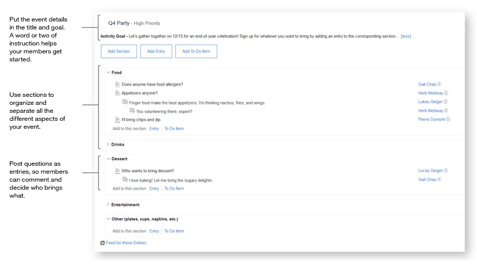

# Planning an event {#concept_w4t_dg3_yx .concept}

Preparing for an event? Coordinate with people using activities. You can make a list of supplies, decide on a location, and tell everyone what to bring.

## Next steps { .section}

Feel inspired? Strike while the iron's hot. Start by [creating an activity](c_create_activity.md).

**Parent topic:**[Getting acquainted](../activities/c_get_organized.md)

