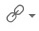

# Managing rich content pages {#t_com_community_manage_wik .concept}

After adding a rich content page to your community, you can make it more useful to members by adding content, such as text and images, or removing it when no longer relevant to your community.

## Editing a rich content page {#section_ylp_vxt_h5b .section}

1.  From the navigation bar, click **Communities** and select the community that contains the rich content you'd like to edit.
2.  In the community **Highlights** page, in the **Rich Content** area, click the **Menu** icon  and select **Edit**.
3.  Add content such as text, tables, images and links to the page in the **Rich Text** view. For more information, see [Using the rich text editor](../eucommon/eucommon_ckeditor.md). Here are some things you can do:
    -   To insert images, click **Insert/Edit Image** . You can then either upload an image from your computer or insert an image from a source on the web.
    -   To insert links to web content, click **Insert Link**  and select **URL Link**.
    -   To insert links to community files content, click **Insert Link**  and select **Link to Connections Files**.
4.  When you have finished adding content, click **Save**.

## Removing a rich content page {#section_qzs_wxt_h5b .section}

1.  From the navigation bar, click **Communities** and select the community that contains the rich content you'd like to remove.
2.  In the community **Highlights** page, in the **Rich Content** area, click the **Menu** icon  and select **Remove Widget**.

**Parent topic:**[Working with rich content](../communities/community_rich_content_frame.md)

