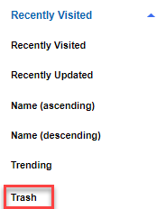

# Deleting unwanted communities {#t_com_delete .concept}

If a community no longer has a purpose or is inactive, you might want to delete it.

Ensure that the community is not in use. When you delete a community, all data that is associated with it is moved to a trash area. Any subcommunities that are part of the community are also deleted.

**Note:** A community and all its associated data and apps are permanently purged from the trash after a period specified by your administrator. The default period is 90 days.

1.  From the navigation bar, click **Communities** and select the community that you want to delete.
2.  In the community menu, click **Community Actions** and select **Delete Community** from the list.
3.  Enter the community name in the **Confirm community name** field, and your name in the **Sign with your name** field. Make sure that you enter the correct case of the characters to match both names.
4.  Click **OK**.

## Change your mind? {#section_wd3_k2y_35b .section}

Provided it is not purged from the trash later, you can restore the community. Go to **My Communities** then select **Trash** from the viewing filter options. Click **Restore** for the community you want to revive.

**Parent topic:**[Managing your community to keep it relevant](../communities/c_com_manage_communities.md)

