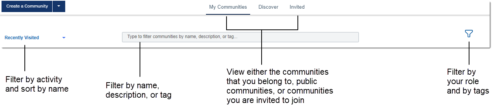

# Searching for and browsing in communities {#t_com_search .concept}

Search or browse for communities that you're interested in. When you find a community, you can search within it for more detailed information.

## Searching for communities {#section_qbm_hsy_g5b .section}

You can search for a community from any page in Connections using the search box, or you can open the Communities app and filter communities to find what you need:

-   **Using Connections search:** Perform a [quick or advanced search](../eucommon/c_eucommon_search.md) for a community and content within a community.
-   **Filtering views in the Communities app:** From the navigation bar, click **Communities** and then select any of the following views:

    -   **My Communities:** Shows the communities that you already belong to.
    -   **Discover:** Shows all public communities that you can follow or join.
    -   **Invited:** Shows all communities that you are invited to join.
    If you don't see the communities that you want, you can filter the previous views in one of these ways:

    -   Enter a community name, keyword, or tag in the filter search box.
    -   Beside the navigation bar, click the dropdown filter and select a different filter or sorting option from the list.
    -   To filter by other options, such as your role in the community or tags, click the **Filter by** icon  and select from the list that appears.
    

## Browsing in a community {#section_np4_gqx_35b .section}

-   To open a community, click its name.
-   You can also search for the following file types in a community:

    |Most Microsoft Office file types|Including Microsoft Word \(.doc\), Microsoft PowerPoint \(.ppt\), Microsoft Excel \(.xls and .xlsx\)|
    |---------------------------|----------|
    |OpenDocument file types|Database \(.odb\), Formula \(.odf\), Graphics \(.odg\), Presentation \(.odp\), Spreadsheet \(.ods\), OpenDocument Text \(.odt\)|
    |Other file types|Adobe Acrobat \(.pdf\), Plain text \(.txt\), Rich Text Format \(.rtf\), HTML \(.html, .htm\), XML \(.xml\)|

## What to do next {#section_ldt_nsy_g5b .section}

Found the community you're looking for? Go ahead and [join the community](c_com_join.md) to start participating.

**Parent topic:**[Getting started](../communities/community_getstart.md)

