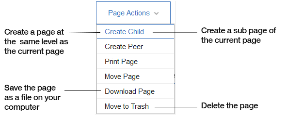

# Working with wiki pages {#t_com_wiki_pages .concept}

After you create some wiki pages, you can work with them in many ways.

## Editing a wiki page {#section_k4q_c4v_h5b .section}

1.  From the navigation bar, click **Communities** and select the community that you want to contribute to.
2.  In the community **Highlights** page, in the **Wiki** area, select the page that you want to work with. Alternatively, click **Wiki** in the community menu.
3.  Only one person at a time can edit a page. To edit:
    1.  Click **Edit**. The page automatically locks while you edit, disabling the Edit button for others. Your changes are autosaved to a draft as you work.

        **Note:** For more details on using the editing features, see [Using the rich text editor](../eucommon/eucommon_ckeditor.md).

    2.  When you are finished editing, click **Save**. This saves your work as an official version, and unlocks the page \(re-enables the **Edit** button\) for future editors.

        **Tip:** If you step away and return to your draft to find that another person is editing the page, it means that the person asked the community or wiki owner to unlock the page for them. Your unsaved draft is intact. However, if the person saved a new version, use version history to decide whether to resolve conflicts by continuing with your draft or by starting again with the new version.

## Managing a wiki page {#section_nmz_d4v_h5b .section}

You can work with pages in lots of other ways:

1.  From the navigation bar, click **Communities** and select the community that you want to contribute to.
2.  In the community **Highlights** page, in the **Wiki** area, select the page that you want to work with. Alternatively, click **Wiki** in the community menu.
3.  Select **Page Actions** and select from the following options:

    

If you deleted a page and you change your mind, you can restore the page provided that the trash is not emptied. In the sidebar, select **Trash** and then the page you deleted, then click **Restore**.

**Parent topic:**[Creating information in a community wiki](../communities/community_wiki_frame.md)

**Related information**  

[Creating a wiki page](../communities/t_com_create_wiki_page.md)

