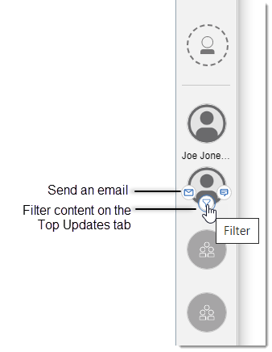

# What's new in Connections? {#r_eucommon_whats_new .reference}

HCL Connections 8.0 transforms the way you connect with content and colleagues with a fresh, new look and enhanced features.

**Note:** Community surveys are no longer supported in Connections 8.0. To replace these, you are now entitled to use HCL Leap to build various applications, such as interactive polls and surveys. For more information, see [Using and integrating HCL Leap applications into Connections](../communities/using_hcl_leap.md).

## Search from anywhere in Connections {#section_g1m_3k4_k5b .section}

Looking for something? With the ever-present search box, you can search for people, communities, and content from any page within Connections.

-   **Saved history.** With just a click in the search box, you can rerun a recent search or quickly return to a page that you recently visited.
-   **Clear results.** With the new search results page, you can search wide or dig deep with a specific app, date, and other simplified filters, thus ensuring relevant results.
-   **Streamlined search.** When you're done with your search, close out the search results page so you're exactly where you left off before.

For more details, see [Searching Connections](c_eucommon_search.md).

## More usable and intuitive navigation {#section_c1r_3w5_k5b .section}

With the redesigned navigation, you can effortlessly find your way around Connections and accomplish your tasks more efficiently. Add your most-used applications so they're always in reach through the side navigation bar.

Easier customization also lets you give your site an in-house feel! Tailor the look of the top navigation by replacing the default name "HCL Connections," logo, and color with your own company branding.

## Increased collaboration with universal upload and share {#section_l1n_lm4_k5b .section}

Easily share the content that you're viewing, such as a blog post, inside Connections or through integrated services like Microsoft Teams. If you want to quickly share a specific file with someone, just click the upload button.

To learn more, see [Sharing in Connections](c_eucommon_share.md).

## Quick access to important contacts {#section_m2r_ws4_k5b .section}

Essential people and communities are never more than a click away with the Important To Me bar, available wherever you are in Connections. Clicking an avatar takes you straight to the community's landing page. Hovering on a person's avatar shows you shortcuts to connect and view the person's content, including their redesigned business card.

To learn more about filtering content for Top Updates, see [Top Updates: Keeping up with what's most relevant to you](../homepage/Tile_homepage_using.md).

## Keep track of important updates { .section}

Decide on the updates that matter to you by [setting your browser and email notification preferences](../profiles/c_pers_getting_notifications.md). To stay on top of the latest, most relevant activities, in the navigation bar click Notifications  whenever it shows updates, and the Notification Center opens as a sidebar.

## Interested in Connections Mobile? {#section_fr5_dlp_k5b .section}

Check out the App Store for iOS or Google Play for Android for the latest information and release.

**Note:** Features might differ depending on your deployment.

