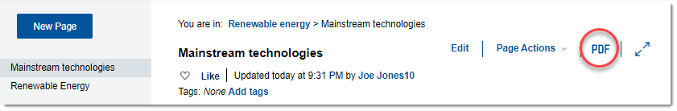

# Exporting app content as a PDF {#task_sp5_pm4_dnb .task}

You can export an HCL Connections activity, blog, forum, or wiki \(or portions of it\) as a .pdf file, and then download or print the contents.

For the specified apps, exporting as PDF is available for both the standalone and community apps. In Communities, the feature is also available for ideation blogs.

1.  From the welcome page of the app or from the particular content that you want to export, click the **Export as PDF** icon on the main window.

    

2.  Make your template and select the content you want to include, and click **Generate PDF**.

3.  From the screen that opens, you can edit, save, and download the PDF. To see the available options, click the **More Options** icon .

    **Note:** If your content is in a community and you cannot download or print, check with the community owner to confirm that these actions are enabled for that community. For more information, see [Enabling your community's PDF export access](../communities/t_com_enable_pdf_export.md).

**Parent topic:**[Shared features](../eucommon/c_eucommon_shared_components.md)

