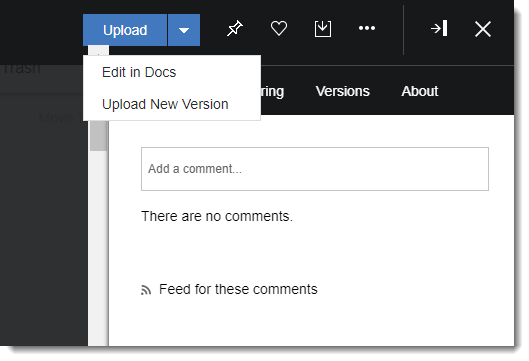

# Editing a Connections file in HCL Docs {#editing_hcl_docs .concept}

If your organization uses HCL Connections Docs and you have Editor access to a file, you can work on it directly from your browser.

You can also create a file, for example a document or spreadsheet, in any of the files views. Just click **New** and select the type of file that you want to create.

To edit a file in HCL Docs:

1.  From the navigation bar, click **Files**.
2.  Find the file that you want to open in HCL Docs, then click its name to open it.
3.  Click the arrow next to **Upload** in the side panel, and then select **Edit in Docs** from the list.

    

    **Note:** The edit option is available only if you have HCL Docs and Editor access to the selected file.

To get the most out of HCL Docs, see [Connections Docs](https://help.hcltechsw.com/connections/welcome/index.html).

**Parent topic:**[Files](../files/fframe.md)

