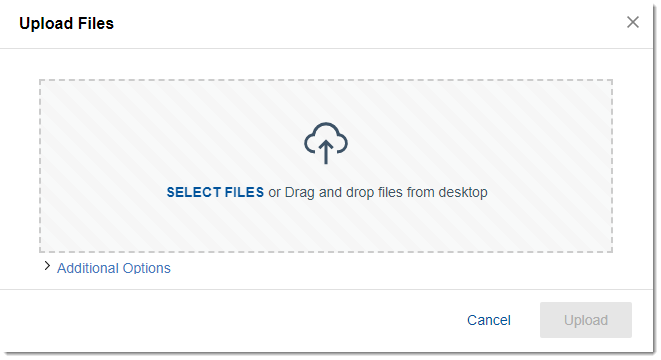

# Uploading a file {#howdoiaddfiles .concept}

Upload files from your device to share them with people or communities or store them for your own use.

1.  From the navigation bar, click **Files**.
2.  Click **New** and then **Upload**.

    **Tip:** You can also drag and drop files from anywhere in the browser window.

3.  Click **Select files**, select one or more files from your computer, and click **Open**.

    

4.  During upload, if you want to tag the file or share it, click **Additional Options**. You can also share it with select people or communities, or with everyone in your organization.

    

5.  Click **Upload**.

    **Note:** If your organization has enabled the sync feature, you can drag and drop or copy, cut, and paste a file from your desktop to your My Drive folder. See [Organizing, syncing, and editing files in My Drive](c_files_sync_refresh.md#).

    If you want, you can also [share files in a status update](../profiles/t_pers_update_status.md).

## Limitations for uploading files { .section}

-   Your administrator limits the size of files you can upload and the amount of space that you have for storing files. The maximum file size applies to everyone in your organization, but the limit for your own storage might differ from others, depending on how it is set by your administrator.
-   Your file storage space is affected by the files that you upload and all versions of those files. If you have exceeded your storage limit, you can delete old file versions to create more storage space.

## What to do next { .section}

After you upload a file, you can always change how it is shared, as long as you have Owner access. For more information, see [Sharing files and folders](t_files_share_files_refresh.md).

**Parent topic:**[Getting started](../files/getting_started.md)

