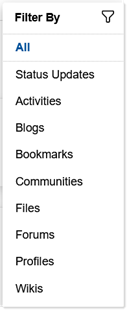

# Discover: What's happening beyond your network? {#discover_beyond_your_network .concept}

With the **Discover** tab of your HCL Connections home page, view updates from people and communities in your organization that aren't in your network.

Here are some ways to manage and enhance your exploration:

-   Filter your view to see only the updates from a particular app. Click the Filter content icon  to choose an app from the list.

    

    **Note:** You might see a different list depending on what apps your organization deploys from Connections and other products.

-   Make use of the To Do List, Events, and Recommendations apps next to the stream. Learn how by clicking the **Actions** icon  next to each app and select **Help**. If you remove one of these apps and want to add it back, click **Customize**.
-   Within an update, click any linked text or graphics to go to its source in Connections.

**Tip:** If your organization deployed Component Pack for Connections, the **Important to Me** bar is displayed at the edge of the screen. Hover over a person's avatar to see action items and their business card, or click an avatar to go to a community's landing page.

