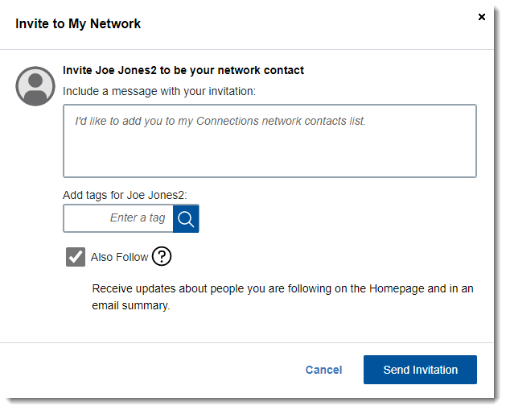

# Inviting a person to your network {#concept_zx5_bdg_2y .task}

Ready to start collaborating? Invite someone to join your network. Once they accept, they'll be added to your Network Contacts and you can view each other's status updates.

To invite a person to your network:

1.  Open the person's profile, and click **Invite to My Network**.
2.  Keep the default message or write a message of your own.
3.  Enter the keywords that define how you are connected in the **Add tags for name** field.
4.  If you want updates from this person to display on both your home page and in an email summary of updates, select the checkbox for **Also Follow**.

    

5.  Click **Send Invitation**.

After the person accepts your invitation, they are added to your network. From there, you can [share a status or file](t_pers_update_status.md) with them.

**Parent topic:**[Getting started](../profiles/c_people_getting_started.md)

**Related information**  

[Following people](t_pers_follow.md)

[Latest Updates: Keeping up with your network](../homepage/latest_updates_homepage.md)

[Getting browser and email notifications](c_pers_getting_notifications.md)

