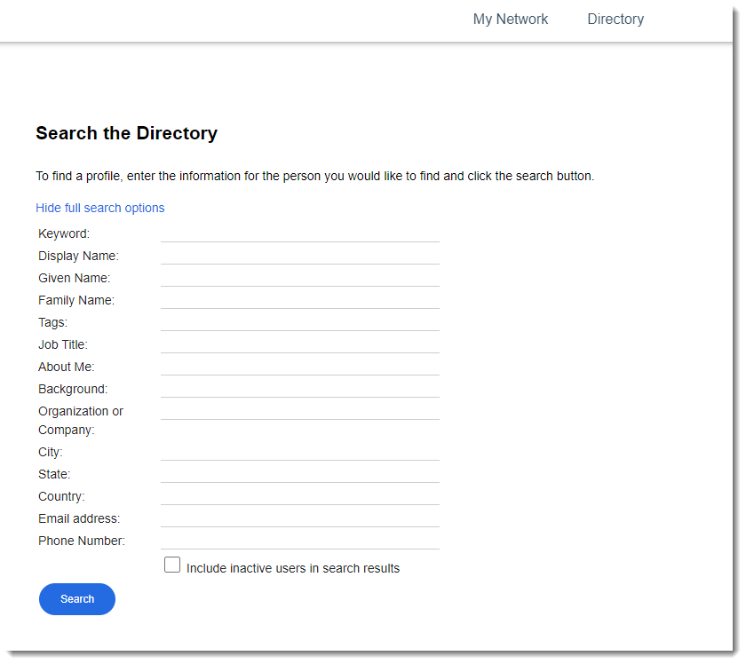

# Searching for people {#concept_mtq_bqk_dy .task}

Looking for people to add? Either search for a person by name, or based on their location, expertise, or tags.

If you already know who you're looking for, simply do a [basic search](../eucommon/t_eucommon_searching_lc.md). If you want to find an expert or someone with specific information, use the directory to perform an advanced search.

To search the directory:

1.  From the navigation bar, click **People** and then **Directory**.

2.  Click **Display full search options** and fill out the pertinent fields.

    

3.  Click **Search** to see a list of results related to your search options.

Once you've found who you're looking for, go ahead and [invite them to your network](t_pers_invite_network.md).

**Parent topic:**[Getting started](../profiles/c_people_getting_started.md)

