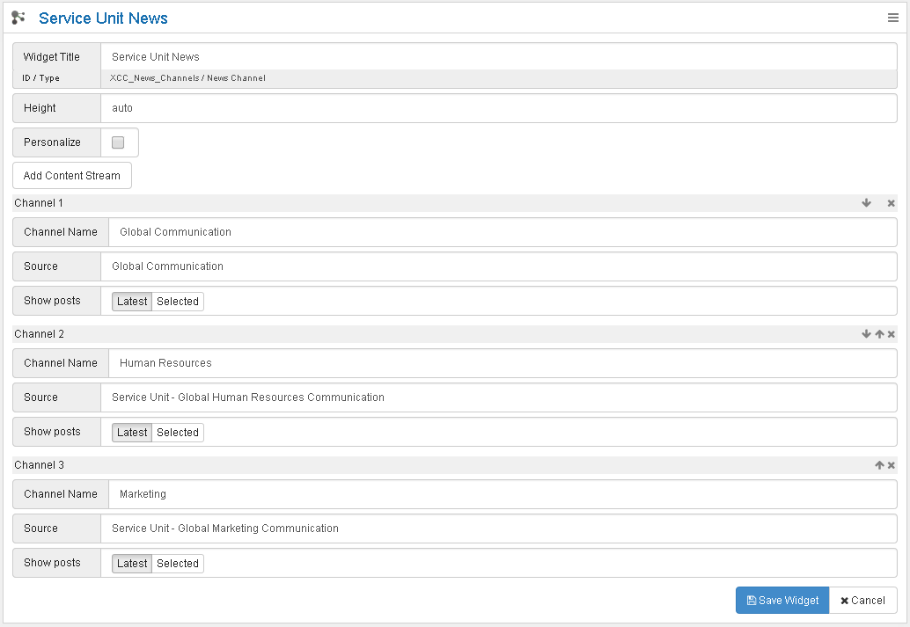
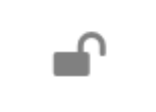
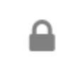
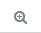
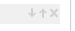

# Functions - fields - buttons {#id_name .reference}

There are different fields and buttons available in the configuration options.

The following table describes the editing functions:

| Reading mode | Action |
|-------------|--------|
|  | Opens options for editing. By holding the **Shift** key and clicking, you can remove this widget. Hold **Ctrl+Shift** and click to remove all widgets. |
|   | Locks the widget for editing by page editors. Only page administrators can drag, drop, and edit this widget. The lock icon indicates whether the widget is locked or unlocked. |
| Widget title | If the widget contains a title in the header, it can be changed here. If you enter **%sourceName%**, the community title is displayed if possible. If you do not enter a title, the widget header is hidden. |
| Height | Specifies the height of the widget. If the height is too small, content may be cut off or hidden. |
| Add content stream | Adds a channel. |
| Personalize | Enables personalization. |
|  | Opens the widget editor in full screen. |
| Style | Choose list or slider view. |
| Attribute | Technical name of the profile field used for filtering (for example, `work_location`). |
| Value | Value expected in the profile field (for example, Munich). |
| Source | Channel for which the predefined value is displayed (for example, Munich cafeteria blog). |
| Show likes and comments | Enables display of likes and comments next to entries. |
| Layout | Selects default view for the events widget: Month, Week, Day, or Day (List). |
| Type | Content source. |
| Channel name | Title of the channel. |
|  | Moves channel up or down or removes the channel. |
| Source | Selection of the source with a link to the selected community or standalone blog. |
| Show posts | Latest: entries are shown in chronological order. Selected: individual entries can be selected and sorted. |
| Search latest additions | The Connections Engagement Center search for posts or wikis uses the Connections Search API. To find newly created content, this API may require up to 15 minutes. To find additions created only a few minutes ago, click **Search latest additions** and try again. |
| # Items | Number of items displayed in the widget. |
| # per page | Number of items displayed per page in the widget. |
| Remove widget | Hold **Ctrl+Shift** and click **Remove widget** to remove all widgets from the page. |
| Save widget | Saves the widget configuration. You can also press **Ctrl+S**. |
| Customize | Opens Connections Engagement Center administration. |

**Parent topic:** [Overview](../../connectors/icec/cec-introduction_top.md)