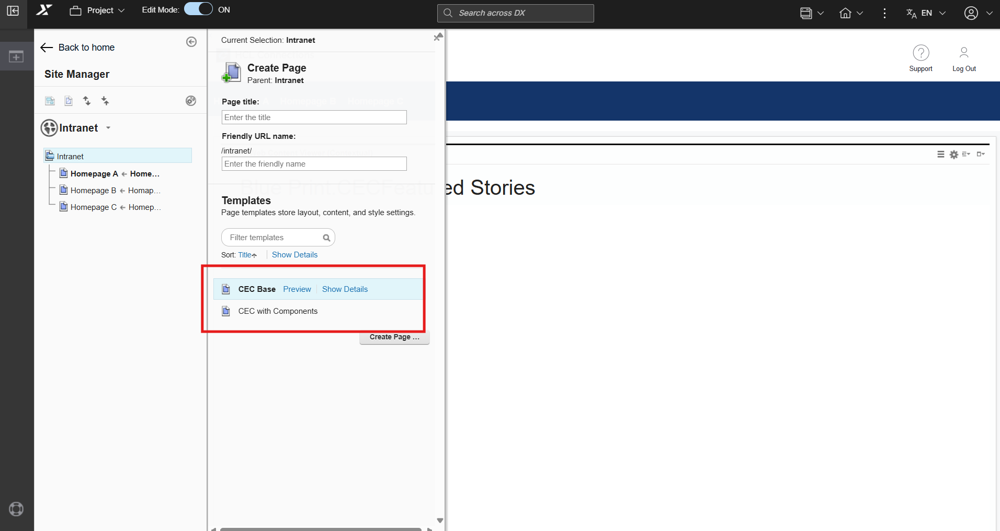
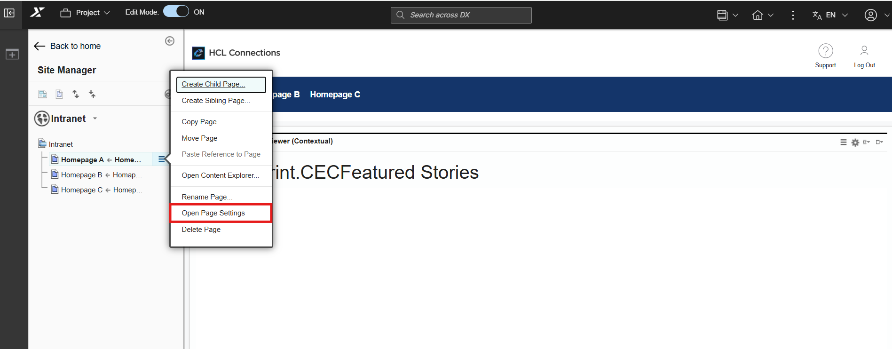
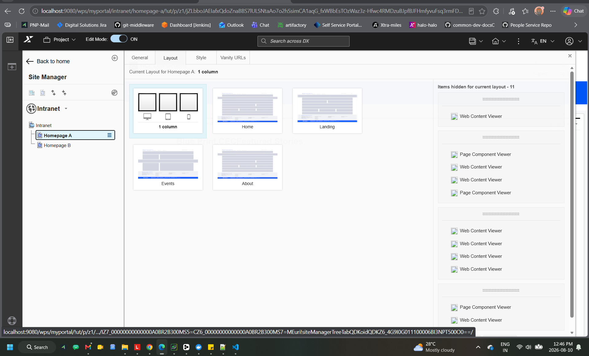
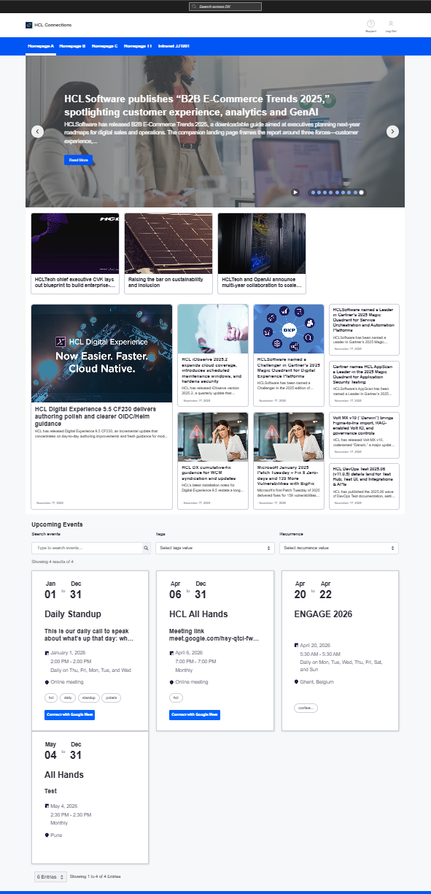
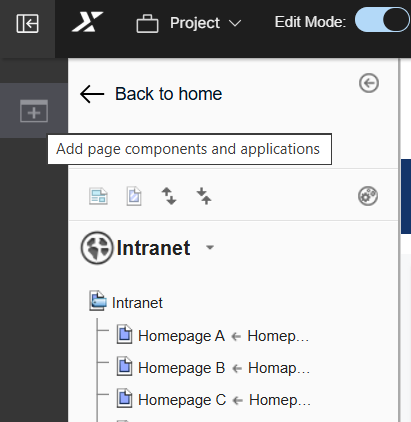
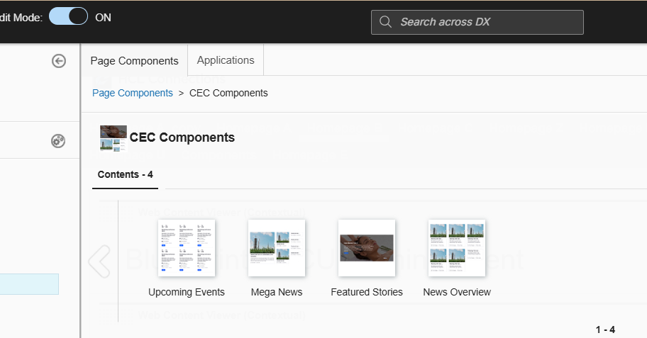

# Page building guide

This guide covers the essentials for building pages in HCL Connections Engagement Center.

## Supported page templates

CEC (WebEngine) supports only the following two page templates:

| Template | Description |
|---|---|
| **CEC Base** | Basic CEC page template without pre-configured components |
| **CEC with Components** | CEC page template with pre-configured CEC components |

When creating a new page, select one of these templates from the template picker.

## Supported layouts guide

For the best experience when building pages with CEC components, use only the following layouts:

| Layout Type | Works With |
|---|---|
| Single-Column (Full-Width) | All CEC components ✅ |
| Home Layout | All CEC components ✅ |
| Full-Row / Horizontal | Featured Stories, Upcoming Events |
| Balanced Rectangular / Single-Square | News Overview, Mega News |

## Available layouts

The following layouts are available in the layout picker:

- Single-Column (Full-Width)
- Home Layout
- Full-Row / Horizontal
- Balanced Rectangular / Single-Square

To view the layouts, go to **Page settings** and then the **Layouts** tab.

Below are the supported CEC layouts shown in the layout picker:

- Single-Column (Full-Width) is recommended for all components.
- The image below shows a Single-Column layout for the CEC Featured Stories component:

## Important notes

- **Avoid narrow multi-column layouts.** Components like Featured Stories and Upcoming Events require maximum available width — placing them in narrow columns will cause the UI to break or distort.

- **Safest default:** When in doubt, always use the Single-Column layout. It works correctly with all CEC components.

- Incompatible layouts are being phased out from the layout picker in an upcoming update.

## Creating a page

1. Turn on **Edit Mode** from the Action Bar
2. In Site Manager, select a parent page
3. Click the context menu → **Create Child Page** or **Create Sibling Page**
4. Enter a **Page Title** and **Friendly URL**
5. Select **CEC Base** or **CEC with Components** template
6. Click **Create Page**

## Adding components

After creating a page:

1. Click **Add page components and applications** in the Site Toolbar

   

2. Drag and drop CEC components onto your page

   

3. Configure each component using the content menu

## Pre-configured default intranet pages

The default Intranet already includes pre-built starter pages: Homepage A, Homepage B, and Homepage C to start quickly. While these pages come pre-added to the project structure, Homepage A, Homepage B and Homepage C are provided as empty baseline templates with components but without active data. Before deploying Homepage A, B, or C as your primary landing page, ensure you configure the component settings and link your desired data sources so content displays correctly to end users.

## Best practices

- **Use supported templates only** — Other templates may not render CEC components correctly
- **Use full-width layouts** — Narrow columns can break component display
- **Preview before publishing** — Check how the page appears to end users

## Related documentation

- [Engagement Center Components](./components/engagement-center-v2-components.md)