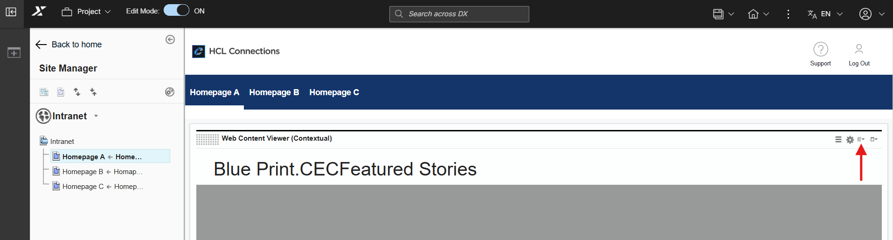
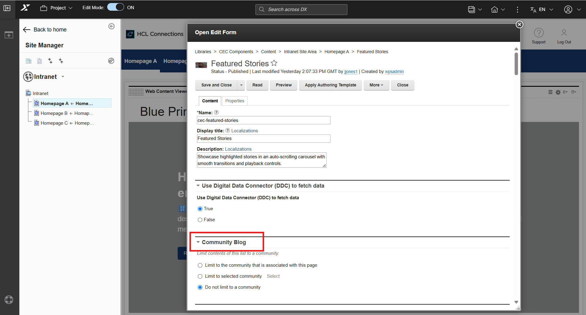

# Configuring community to Components

Follow these steps to link a specific community to a component. Once configured, the component will display blog posts from that selected community.

1. Locate the desired component and click the **Display Content Menu** icon.
  
    

2. Select **Open Edit** Form and scroll to the Community Blog section.

3. Select the **Limit to selected community** checkbox, then click **Select** to view the list of available communities.

    

4. Choose your preferred community from the list. 
5. Click **Save and Close** to apply your changes.

!!! warning
    **Ensure Active Content:** Verify that the selected community contains existing blog entries. If a community has no blog posts, the component will appear empty.    
    **Restricted Community Access:** Data from restricted or private communities will not display for unauthorized users. 

!!! note
    If no community is selected, the component defaults to displaying the most recent blog entries across all public communities.