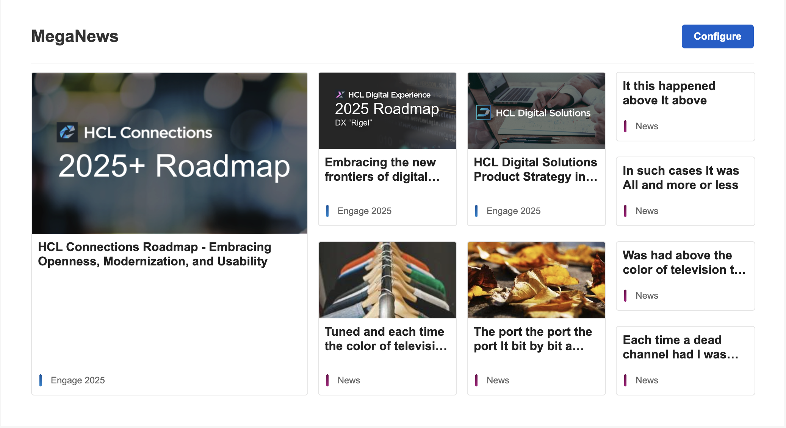
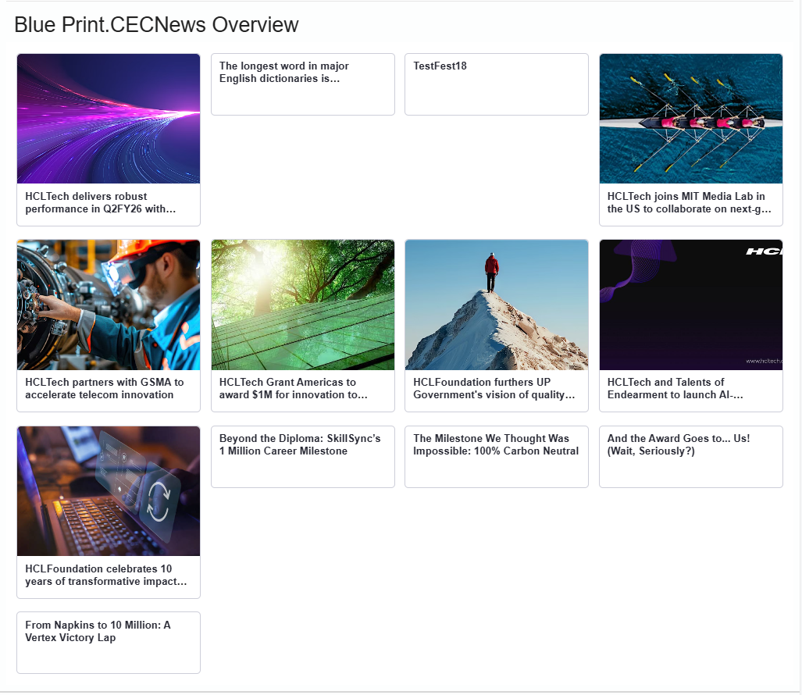
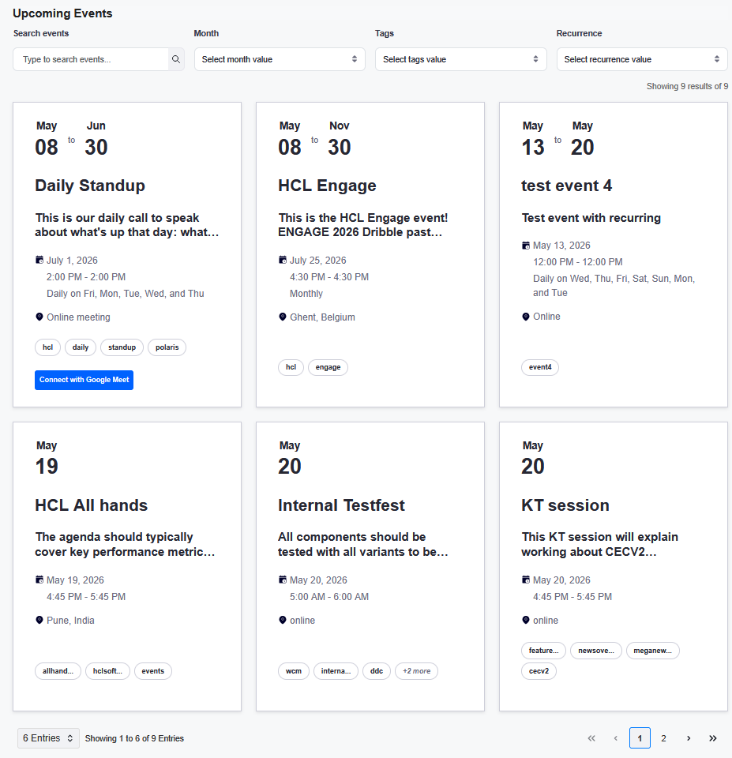

# Component details

| Component | Description | Data Source |
|-----------|-------------|-------------|
| [CECMegaNews](#cecmeganews) | Grid layout displaying news with hero emphasis | Connections Blogs |
| [CECNewsOverview](#cecnewsoverview) | Flexible news list with row/column layouts | Connections Blogs |
| [CECFeaturedStories](#cecfeaturedstories) | Carousel/slider for featured blog entries | Connections Blogs |
| [CECUpcomingEvents](#cecupcomingevents) | Event list with filtering and pagination | Community Events |


## CECMegaNews

The CECMegaNews component displays blog entries in a visually striking grid layout with a prominent hero position for the most important news item.

### Layout options

| Layout Preset | Description |
|---------------|-------------|
| `one-two` | 1 hero + 2 secondary items |
| `one-three` | 1 hero + 3 secondary items |
| `one-four` | 1 hero + 4 secondary items |
| `one-two-two` | 1 hero + 2 medium + 2 small items |
| `one-four-four` | 1 hero + 4 medium + 4 small items (default) |

### Configuration properties

| Property | Type | Default | Description |
|----------|------|---------|-------------|
| `layout` | string | `one-four-four` | Layout preset |
| `heroPosition` | `left` \| `top` \| `right` | `left` | Position of the hero item |
| `imageMode` | `all` \| `auto` \| `none` \| `hero-only` | `auto` | Image display mode |
| `imagePosition` | `left` \| `right` \| `top` | `left` | Image position within cards |
| `imageSize` | `sm` \| `md` \| `lg` \| `xl` | `md` | Image size preset |
| `cardStyle` | `card` \| `divider` | `card` | Visual style of items |
| `showSummary` | boolean | `false` | Show content summary |
| `showCategory` | boolean | `false` | Show category label |
| `showDate` | boolean | `false` | Show publication date |
| `highlightFirst` | boolean | `false` | Emphasize first item |

### Data source

Configure the blog source using the Blog Handle (UUID from the blog URL). Multiple blogs can be specified with comma separation.




## CECNewsOverview

The CECNewsOverview component provides a flexible news list that can display items in row or column layouts with configurable image handling.

### Configuration properties

| Property | Type | Default | Description |
|----------|------|---------|-------------|
| `viewMode` | `row` \| `column` | `column` | Layout direction |
| `imageMode` | `auto` \| `none` | `auto` | Image display mode |
| `imagePosition` | `left` \| `right` \| `top` | `left` | Image position |
| `imageSize` | `sm` \| `md` \| `lg` \| `xl` | `md` | Image size preset |
| `minItemWidth` | string | `260px` | Minimum width per item |
| `maxHeight` | string | - | Maximum container height |
| `reserveGutter` | boolean | `false` | Reserve space for images |
| `displayCount` | number | - | Number of items to show |
| `cardStyle` | `card` \| `divider` | `card` | Visual style |
| `showSummary` | boolean | `false` | Show content summary |
| `showCategory` | boolean | `false` | Show category label |
| `showDate` | boolean | `false` | Show publication date |
| `highlightFirst` | boolean | `false` | Emphasize first item |
| `openMode` | `link` \| `dialog` | `link` | How to open items |

### Image size presets

| Size | Thumbnail Width | Thumbnail Height | Row Height |
|------|-----------------|------------------|------------|
| `sm` | 96px | 72px | 160px |
| `md` | 120px | 84px | 200px |
| `lg` | 160px | 112px | 260px |
| `xl` | 200px | 140px | 320px |




## CECFeaturedStories

The CECFeaturedStories component displays blog entries in a carousel/slider format, ideal for highlighting featured content.

### Configuration properties

| Property | Type | Default | Description |
|----------|------|---------|-------------|
| `items` | array | required | Array of blog card items |
| `summaryLength` | number | - | Maximum summary characters |
| `dateFormat` | string | - | Date format string |
| `animationTime` | number | - | Slide animation duration (ms) |
| `autoScrollTime` | number | - | Auto-scroll interval (ms) |
| `showNavigationArrows` | boolean | - | Show prev/next arrows |
| `bulletsPosition` | `left` \| `center` \| `right` | - | Pagination bullet position |
| `autoPlay` | boolean | - | Enable auto-scrolling |
| `showPagination` | boolean | - | Show pagination bullets |
| `height` | string \| number | - | Component height |
| `imageLeftLayout` | boolean | - | Image on left side |
| `displayCount` | number | - | Number of visible items |
| `textColor` | string | - | Text color override |


## Cecupcomingevents

The CECUpcomingEvents component displays Community Events with filtering, search, and pagination capabilities.

### Variant types

| Variant | Description |
|---------|-------------|
| `featured` | Large featured event cards |
| `river` | Compact list view |
| `featured-compact` | Compact featured cards |

### Configuration properties

| Property | Type | Default | Description |
|----------|------|---------|-------------|
| `items` | array | required | Array of event data |
| `variant` | string | - | Display variant |
| `title` | string | - | Component title |
| `showSearch` | boolean | - | Show search input |
| `showFilters` | boolean | - | Show filter controls |
| `showMonthFilter` | boolean | - | Show month filter |
| `showTagsFilter` | boolean | - | Show tags filter |
| `showRecurrenceFilter` | boolean | - | Show recurrence filter |
| `itemsPerPage` | number | - | Items per page |
| `showPagination` | boolean | - | Show pagination |
| `itemsPerPageOptions` | array | - | Page size options |
| `showItemsPerPageDropdown` | boolean | - | Show page size dropdown |

### Event data structure

```javascript
{
  id: "event-uuid",
  title: "Event Title",
  date: "2026-01-20T07:57:49.000Z",
  description: "<p>Event description HTML</p>",
  location: "Event Location",
  isAllDay: "true",
  category: "event",
  tags: "tag1, tag2, tag3",
  author: {
    id: "user-uuid",
    name: "Author Name",
    email: "author@example.com"
  },
  recurrence: {
    startDate: "Jan 20, 2026, 8:00:00 AM GMT",
    endDate: "Jan 20, 2026, 9:00:00 AM GMT",
    frequency: "daily",
    until: "2027-01-20T08:00:00.000Z",
    byDay: "TU,TH"
  }
}
```


