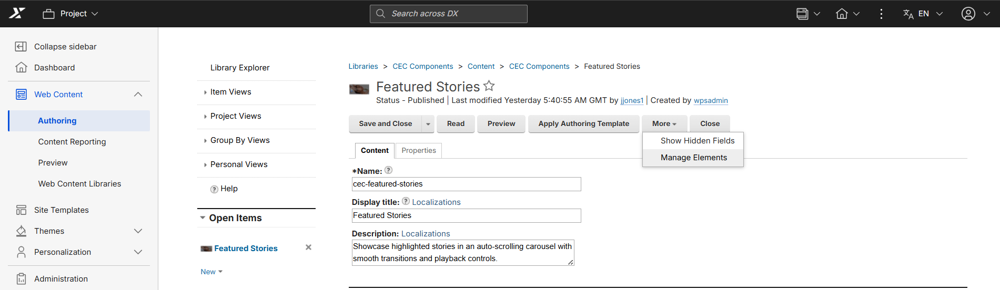
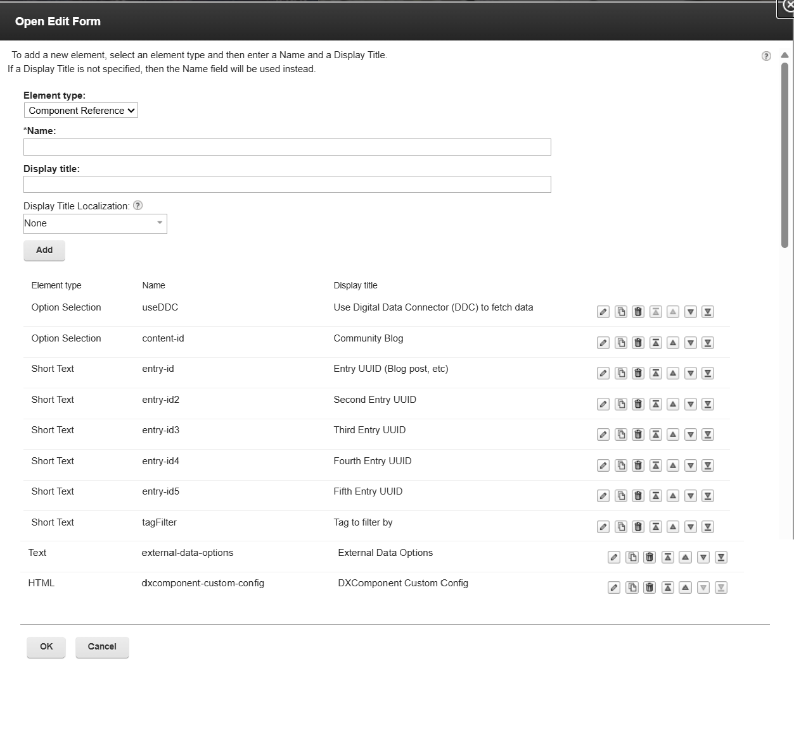
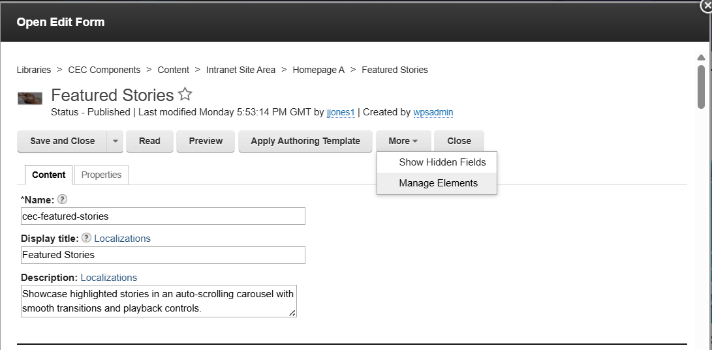

# Hiding unnecessary elements in Component edit and read forms for CEC components

---

This section explains how to hide unnecessary fields from the **Component Edit** and **Component Read** forms in CEC (WebEngine) Practitioner Studio. Removing unused fields simplifies the authoring interface without affecting component behavior. Hiding these fields also helps to:

- Reduce confusion for content authors.
- Prevent accidental modification of unused properties.
- Improve the overall user experience.

---

## Supported components

This process can be applied to any WebEngine component.

The examples in this guide use the **Featured Stories** component.

---

## Recommended fields to hide

The following fields have been identified as unnecessary:

| Display Name | Element Name |
|--------------|--------------|
| Additional Secondary Community Blog | `content-id2` |
| Additional Tertiary Community Blog | `content-id3` |
| DXComponent Config After Initializer | `dxcomponent-config-after-main` |
| External Data Source | `external-data-source` |
| DXComponent Secondary Collection | `dxcomponent-secondary-collection` |

!!! note
    Additional fields can be hidden by following the same procedure if required.
---

## Hiding elements from a specific content instance

Use this method to hide fields for a single component instance.

### Visual reference

### Steps

1. Open **Practitioner Studio**.
2. Go to **Authoring** > **Libraries** > **CEC Components** > **Content** > **Intranet Site Area** > **Homepage A** > **Featured Stories**
3. Click **More**.
4. Select **Manage Elements**.
5. Locate the unnecessary fields.
6. Remove or hide the required elements.
7. Click **Ok**.
8. Save the changes.

---

## Hiding elements from the authoring template (Recommended)

**Why recommended:** Changes made at the authoring template level apply to all future instances, reducing repetitive configuration.

.png)

### Steps

1. Open **Practitioner Studio**.
2. Go to **Authoring** > **Libraries** > **CEC Components** > **Content** > **CEC Components** > **Featured Stories**
3. Open the component for editing.
4. Click **More**.
5. Select **Manage Elements**.
6. Remove or hide the unnecessary fields.
7. Click **Ok**.
8. Save the template.

---

## Hiding elements directly from an open edit form

Use this alternate method to hide fields for a specific component instance.

### Steps

1. Open the component edit form.
2. Click **More**.
3. Select **Manage Elements**.
4. Remove or hide the unnecessary fields.
5. Click **Ok**.
6. Save the changes.

---

## Important notes

- The changes are applied only to the content item or authoring template that is modified.
- For Method 1 only: If a new component instance is created or added to a different page, the element hiding must be repeated for that instance. Method 2 avoids this by applying changes at the template level.
- Hiding elements only affects the authoring interface and does **not** impact component functionality or existing content.

---

## Restoring hidden fields

1. Navigate to the same **Manage Elements** dialog (via content or authoring template).
2. Re-add the previously hidden elements.
3. Save the changes.

The fields will reappear in the Edit and Read forms.

---

## Verification

After completing the configuration:

1. Open the component **Edit Form**.
2. Verify that the following fields are no longer displayed:

    - Additional Secondary Community Blog
    - Additional Tertiary Community Blog
    - Section Title (Component Title)
    - External Data Source

3. Open the **Read Form** and verify that the same fields are hidden.
4. Confirm that the component continues to function as expected.

---

## Expected result

### Before

The Edit and Read forms display all available fields, including fields that are not required by content authors.

### After

The unnecessary fields are hidden, resulting in a cleaner and more user-friendly authoring experience while maintaining full component functionality.

---