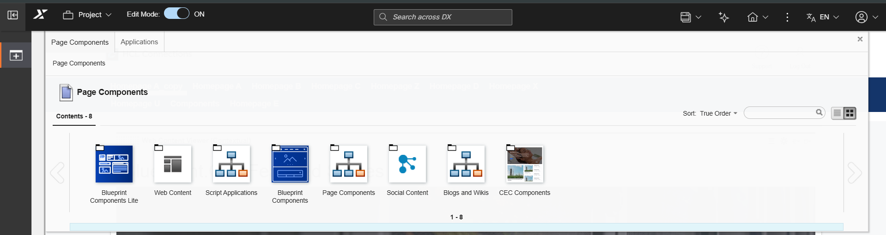
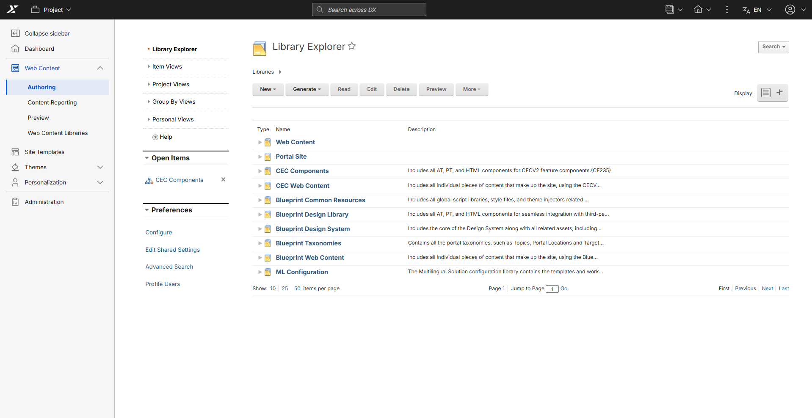
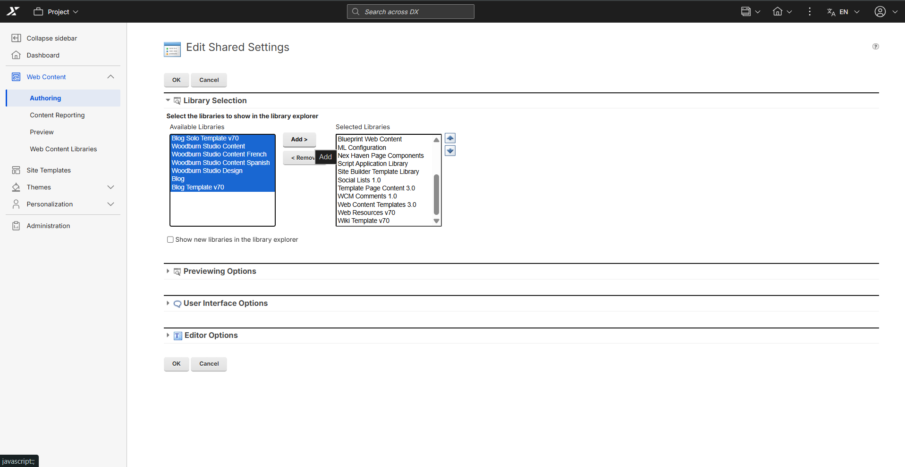
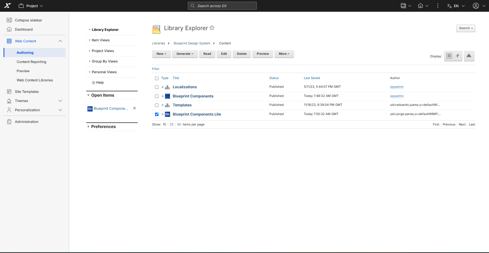
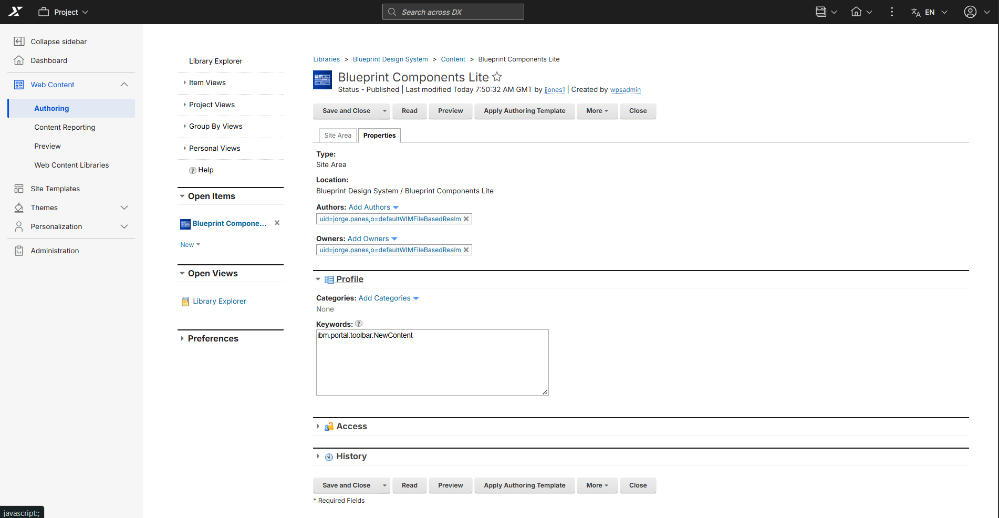
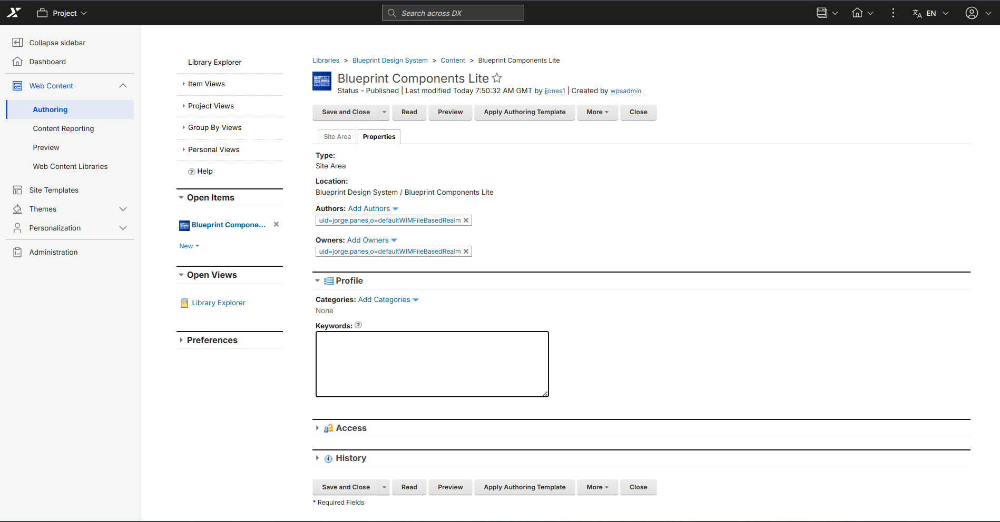

# Hiding page Component categories from the palette

Currently, there is no automatic way to hide page component categories from the user interface. Automated category management will be addressed in a future release. Until then, use the manual steps in this document to hide invalid categories from the **Add page components** and applications palette in CEC (WebEngine) Practitioner Studio.

There are two ways to retire a page component so that it no longer appears in the Page Components palette, either:

- Remove the `ibm.portal.toolbar.NewContent` keyword from an individual content item.
- Move the content item out of the Page Components site area, or any site area tagged with the `ibm.portal.toolbar.NewContent` keyword.

!!! note
    
    Page components already added to a site will remain visible on the site, but content authors will not be able to create a new page component of that type.
    

## Supported components

When you click **"Add page components"** in Edit Mode, the palette displays eight categories. Only specific categories contain components that are functional and valid for CEC (WebEngine).

| Category | Action |
|---|---|
| `CEC Components` | **Keep visible** |
| `Blueprint Components` | **Keep visible** |
| `Blueprint Components Lite` | **Keep visible** |
| `Web Content` | Hide |
| `Script Applications` | Hide |
| `Page Components` | Hide |
| `Social Content` | Hide |
| `Blogs and Wikis` | Hide |

## Technical background

Palette visibility is controlled by a WCM keyword on each component's Site Area item. Any Site Area that includes `ibm.portal.toolbar.NewContent` in its **Profile → Keywords** field appears in the palette.

!!! key rule
    
    To hide a category: remove the `ibm.portal.toolbar.NewContent` keyword from its Site Area item in WCM.**

## Hiding invalid categories

!!! important
    
    Repeat all the steps in this section for all categories in the Supported components section that require hiding.

### Ensuring target libraries are accessible

1. Navigate to **Web Content** > **Authoring** > **Preferences** > **Library Selection**.

2. Add the target library (e.g., *Blueprint Components*, *Web Content*) if it is not already listed.

3. Click **Save**.

### Opening the item in library explorer

1. Go to **Web Content** > **Authoring** > **Library Explorer** > **Libraries**.
2. From the `Libraries > [Target Library] > Content > [Target Library]` node, select the target item.

    

3. Select the checkbox next to the target item and click **Edit**.

### Removing the palette keyword

1. In the editing view, click the **Properties** tab.

    

2. Expand the **Profile** section.
3. In the **Keywords** field, delete the string: `ibm.portal.toolbar.NewContent` 

    !!! note
        If the keyword is not present, the category is already hidden and no further action is required.

        To unhide the component category, add the keyword `ibm.portal.toolbar.NewContent` back to the **Keywords** field.

    

4. Click **Save and Close**.

## Verification

After completing the steps above:

1. Open a page in the Intranet Page with **Edit Mode** enabled.
2. Click **"Add page components and applications"** in the site toolbar.
3. Confirm that only **`CEC Components`** is listed in the palette — all other categories must not appear.

**Expected result:** 
The palette hides all invalid categories, leaving only the valid categories visible.

