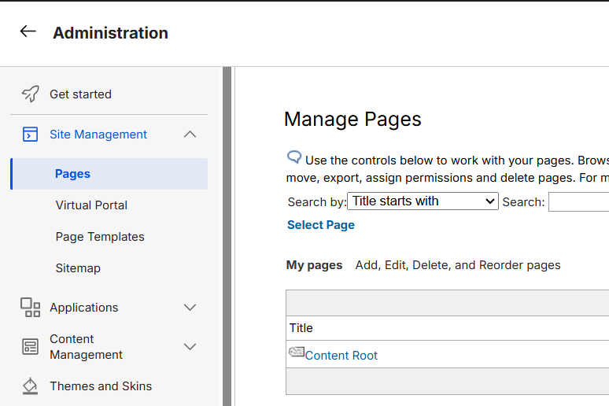
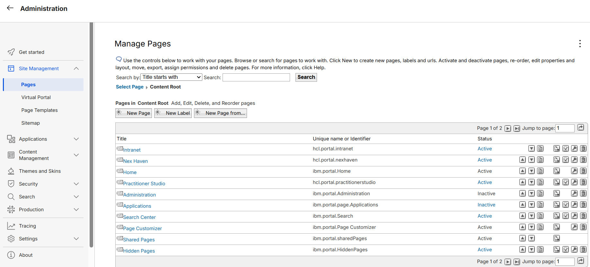
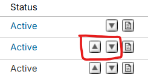
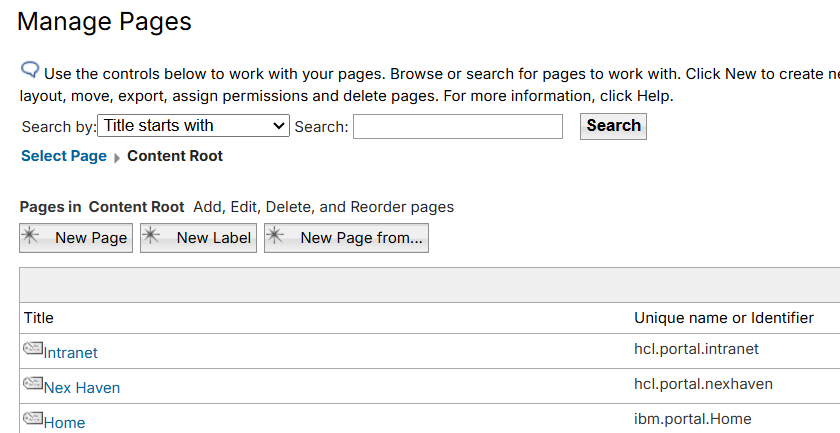

# Managing post-login default page

This document provides detailed steps to set the Intranet page as the default landing page after user authentication

Follow these steps to add Intranet as your default landing page:

1. Sign in using an administrative account.

2. Navigate to **Administration** and select **Pages** from the **Site Management** menu.

    

3. Select the **Content Root** link to open the page hierarchy.

4. Review the available page list, as shown below.

  
    

5. Use the up and down arrow controls to reorder the pages.

   
    

6. Ensure the desired page is positioned at the top of the list. The first page in the hierarchy becomes the default page after login. In this example, **Intranet** is configured as the default landing page.

    
    

## Verifying the configuration

Log out of CEC (WebEngine), then log in as one of the new portal user to test the changes.

