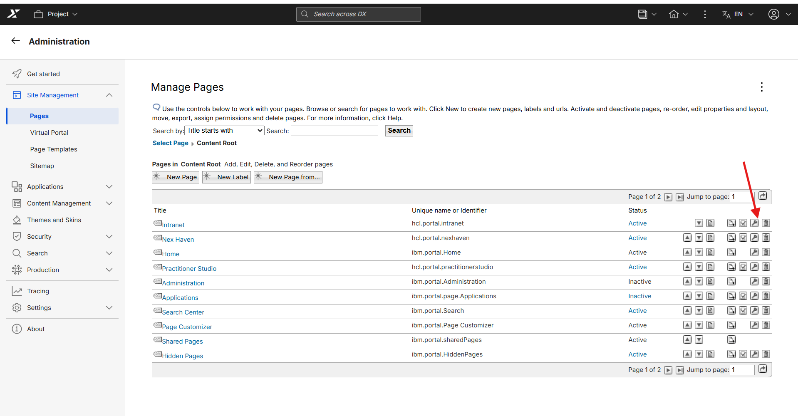
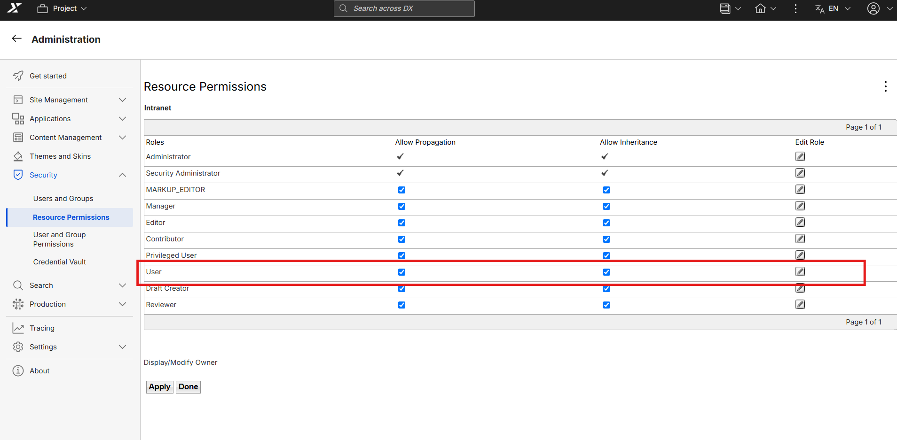
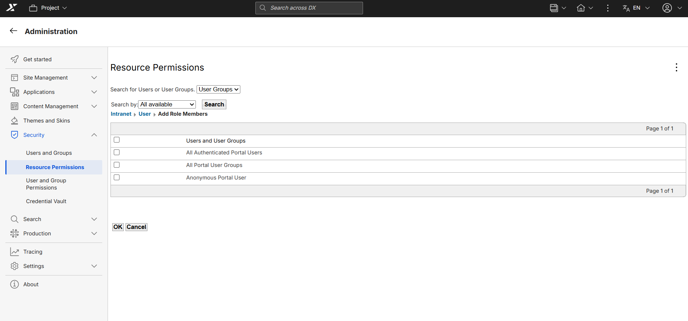
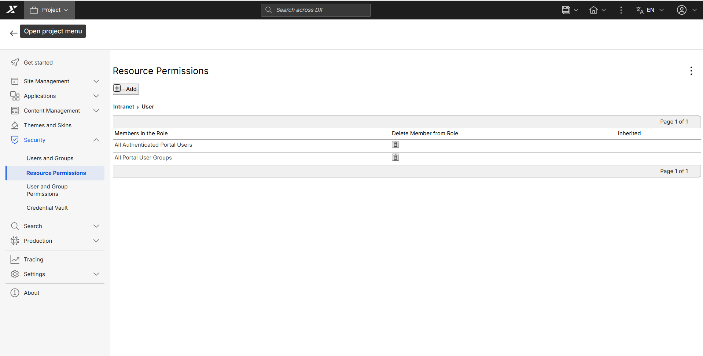

# Managing access to intranet page for non-admin users

This document provides detailed steps to set the access for non-admin users to Intranet page 

Follow these steps to add access for non-admin users to Intranet page.

1. Sign in using an administrative account.

2. Navigate to **Administration** and select **Pages** from the **Site Management** menu.

    

3. Select the **Content Root** link to open the page hierarchy.

4. Review the available page list for Intranet page, as shown below.

  
    

3. Click on **Set page Permission (Key Icon) for Intranet Page**.

   
    

4. You will land on Resource Permissions page for Intranet.
5. Click on Edit role(Pencile Icon) for User

    
    

6. Click on ADD button to add **All Authenticated Portal Users** and **All Portal User Groups** to User permission

    

7. Check in the checkbox for **All Authenticated Portal Users** and **All Portal User Groups**  and Ok
    
    

## Verifying the configuration

Log out of CEC (WebEngine), then log in as one of the new portal user to test the changes.

