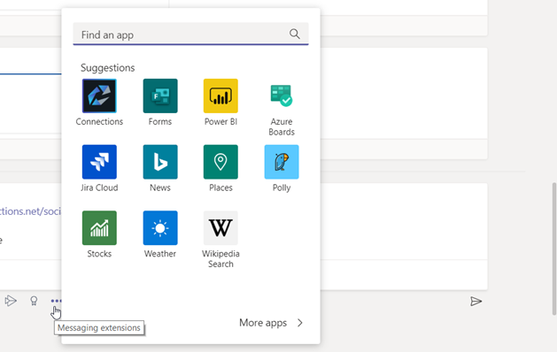
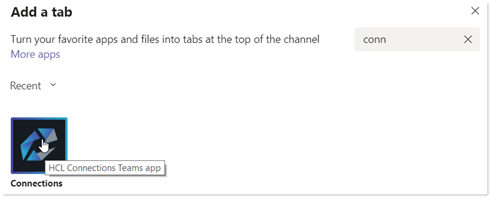
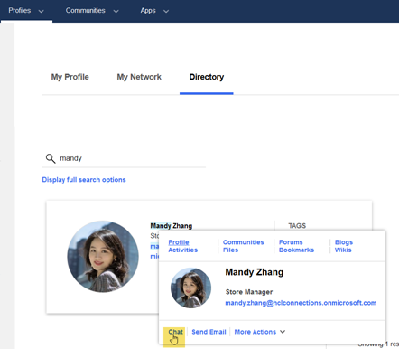
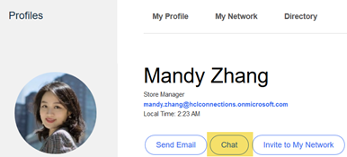

# Using Connections and Microsoft Teams together 

Post links to HCL Connections content in a Microsoft Teams channel, add an app from any of your Connections communities as a tab in a Teams channel, or start a Teams chat from Connections.  

**Note:** These features are available to you only if your organization has customized the environment \(for actions within Connections\) and deployed services for Microsoft Teams \(for actions within Teams\).

## Post links to Connections content in a Teams channel 

Whether you're in Connections or Teams, it's easy to share links to Connections files and other content as posts in your channels.

-   **Share a link to Connections content**
    1.  From the Connections page that you want to share, click on the **Share** button and choose **Share to Microsoft Teams**

        

    2.  Type the name of the persons, communities or groups you want to share files, updates or links with.
    3.  If you want, add more text to the message containing the link.
    4.  Click **Share**.

-   **Find Connections content and post the link from Teams**

    1.  From a Teams channel, click **New conversation**.
    2.  Click the **Messenger extensions** icon in the toolbar, and then click **Connections** 

        
        
    3.  Do one of the following actions:
        -   In **Recent History**, type to filter your recently visited Connections content and select the content that you want to share a link to.
        -   In **Files**, from your files select the content that you want to share a link to.
    4.  Click **Post to Teams**.
    **Note:** Posting links to Connections content from Teams is available only in a team channel, as Microsoft restricts messenger extensions from sharing content in direct chats.

## Add a Connections community app to a Teams tab 

In organizations that have deployed services for Microsoft Teams, you can add any of the following community apps as a channel tab: Files, Wikis, Blogs, Forums, Recent Updates, Activities, or Highlights.

!!! Note

    -   Team Channel members must also be members of the Community in order to see the content in a Connections App tab.
    -   If you are adding the Activities app from a community to a Teams channel, the option to start a new activity will not be available. However, you can still edit and view activities to which you have access.

1.  In Teams, click **Teams** in the navigation, and then click the channel to which you want to add an app from a Connections community that you belong to.

2.  Click **Add a tab** 

    

3.  Find the Connections button and click it.

    

4.  Find and select your Connections community, and then select an app from the list \(you can add only one app per Teams tab\). Unless you customize it, the new tab's name will be in the format "Community name - App name."

5.  To add another app as a tab in the channel, repeat steps 2 to 4.

6.  Click **Save**.

## Start a Teams chat from Connections

You can start a one-to-one chat with a person in Teams from several convenient locations in Connections:

|Connections Location|Steps|
|--------------------|-----|
|The organization directory| From the menu bar, click **Profiles** \> **Directory**. and then start typing the person's name, hover over their name in the business card, and click **Chat**. **Tip:** To chat with a person that you follow, try finding them by clicking **My Network** and then clicking **Following** from the views. |
|The person's profile|On the person's profile page, click **Chat** |
|The Orient Me home page|If your company uses Orient Me, you can chat with people that you've added to the Important to Me bar.   From the menu bar, click **Home**, hover over the person's image, and click the chat icon |

