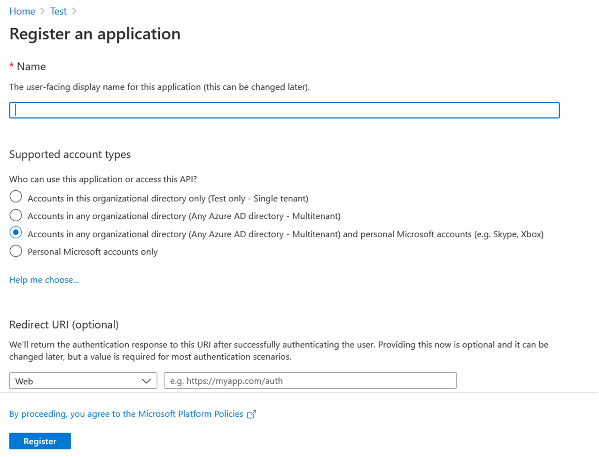
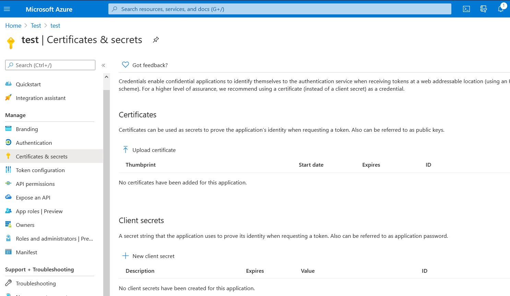
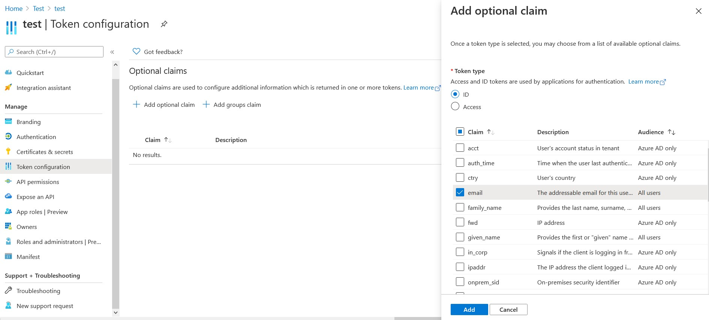
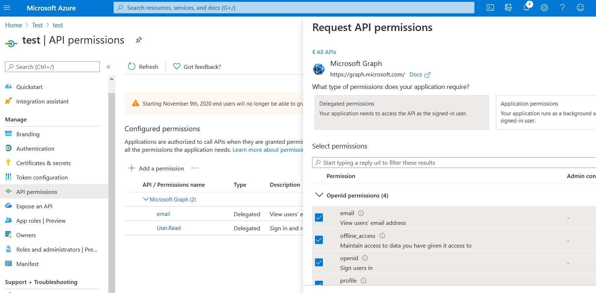
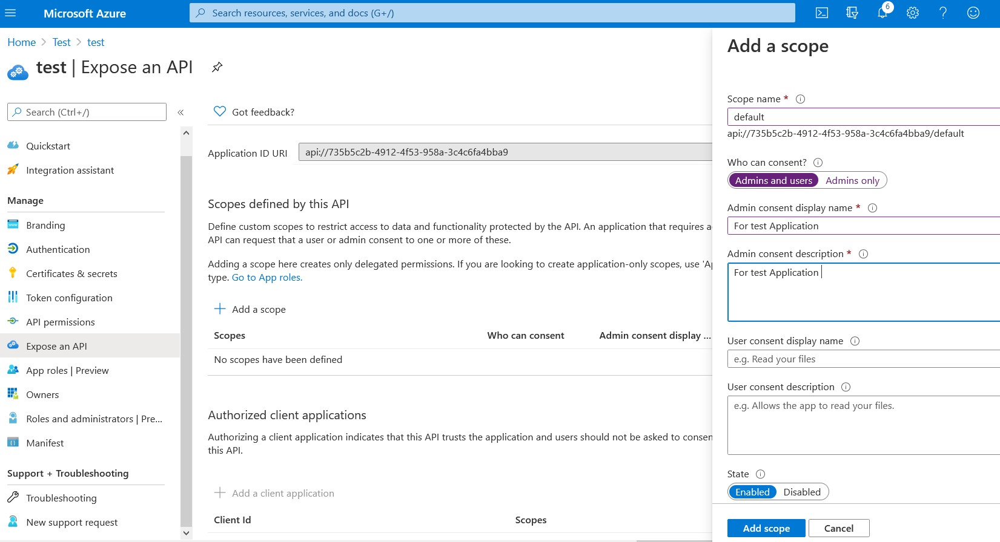
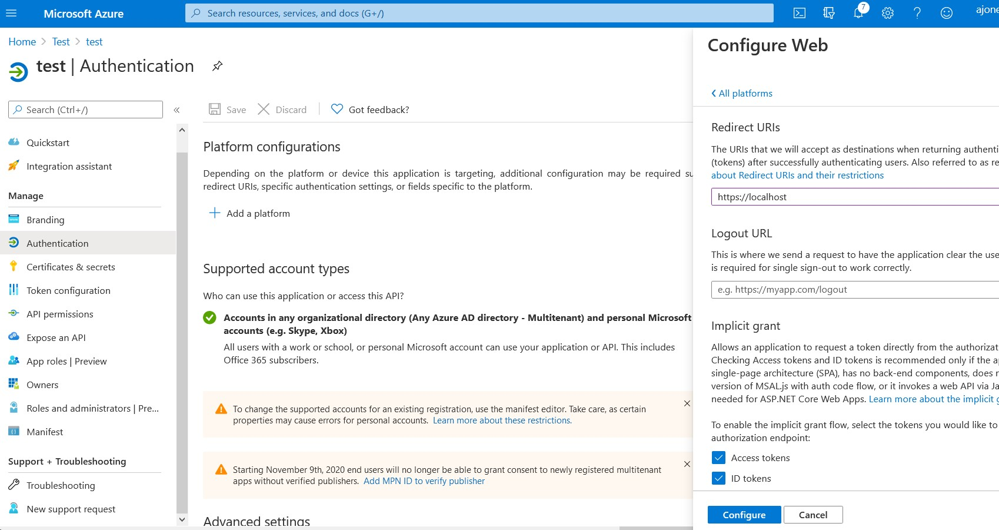

# Adding an application in Azure AD for SSO with Connections {#t_azure_add_app .task}

Part of setting up single sign-on with OIDC involves registering an application in Microsoft Azure Active Directory.

1.  Login to the Azure portal to add the Connections application to Azure, at https://portal.azure.com.

2.  Under Manage, click **App Registrations** and then click **New registration** in the action bar.

    

3.  Provide the following details for the application you are registering:

    -   Name
    -   Supported account type = Multitenant
    -   Redirect URI \(you fill this in after configuring the WebSphere TAI\)
    

    Tips
    :   Provide the name of your application.

    :   For supported account types if you need your application to use Oauth V2.0 endpoints, select the third option, which includes both Multitenant and personal Microsoft accounts.

    :   The **Redirect URI** field is optional for now--you can define it later.

    **Important:**

    Values are generated for the client ID and tenant ID. Copy the values from your screen, along with the client secret that you will generated in step 4, for use later when configuring WebSphere.

    

4.  Create a client secret: Navigate to **Manage** \> **Certificates and secrets** \> **New client secret**.

    

    **Note:** Remember to copy the secret for use later when configuring WebSphere.

5.  Provide information on token configuration:

    -   For the ID token type, navigate to **Manage** \> **Token configuration** \> **Add optional claim**. Select **email** and then click **Add**.
    -   Repeat for the access token: Navigate to **Manage** \> **Token configuration** \> **Add optional claim**, and select **Access**. Now select **email** and click **Add**.
    

6.  Add permissions by navigating to **Manage** \> **API Permissions** and completing the following actions:

    1.  Click **Add a permission** and select **Microsoft Graph APIs** \> **Delegated permissions**.

    2.  Select the check box for each of these Openid permissions:

        -   **email**
        -   **offline\_access**
        -   **openid**
        -   **profile**
    3.  Click **Add permissions**.

    4.  Click **Grant admin consent for your tenant name**.

    

7.  Expose an API by defining a scope to ensure that the correct Oauth access token is used:

    1.  Navigate to **Manage** \> **Expose an API**.

    2.  Click **Add a scope** and fill in these fields:

        -   **Scope name** = default
        -   **Who can consent** = Admins and users
        -   **Admin consent display name**
        -   **Admin consent description**
        -   **State** = Enabled
    3.  Click **Add scope**.

    

8.  Add a redirect URI. \(You'll do this once you've completed the next procedure in this documentation.\)

    `https://<Hostname>/<context_root> /<provider_1.identifier>`

    where

    -   Hostname is the hostname of the server on which HCL Connections is running
    -   `Context_root` is obtained from the table at this \(WebSphere\) location: **All Applications** \> **WebsphereOIDCRP** \> **Context Root for Web Modules**
    -   `provider_1.identifier` is the value of the OIDC TAI property from WebSphere
    

9.  For troubleshooting, you can validate configuration values by navigating to **Manage** \> **Manifest** to view the manifest file.

[Update WebSphere to support Azure AD OIDC authentication for Connections](t_azure_oidc_websphere.md)

**Parent topic:**[Enabling single sign-on with OIDC for Microsoft Azure AD](../secure/c_azure_oidc_container.md)

