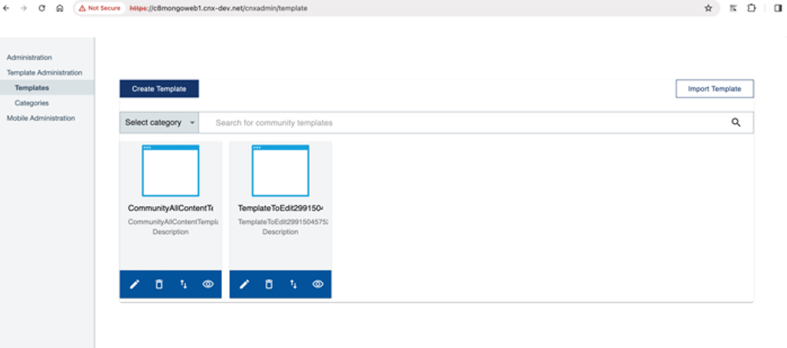
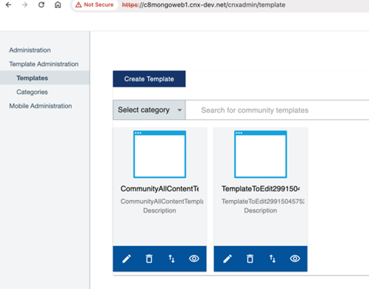

# Migrating large-scale data from MongoDB 3 to 5 

If you have a substantial amount of data in MongoDB 3 that you wish to migrate to MongoDB 5, our tests have indicated that generating a backup may require several days and the restoration process will be as time-consuming. Consequently, the complete migration of MongoDB could span several days, resulting in the Connections environment being offline for an extended period of time. As a suitable alternative, perform the following procedure for large-scale data migration.

This alternative approach is an in-place upgrade, which involves using a Bitnami Docker container. It requires Docker to be installed on the NFS master node where the MongoDB 3 NFS data is located.

If you have a relatively small amount of data to migrate, you can refer to [Migrating data from MongoDB 3 to 5](migrating_data_mongodb_v3_v5.md).

## Before you begin {#prereq_largescale_mongo .section}

Note that 'Mongo' refers to MongoDB 3, and 'Mongo5' to MongoDB 5 in this article.

-   On your Mongo3 environment, note any community templates you previously created. This information will be helpful in later on verifying that migration succeeded, as you will need to check for the same community templates after migrating the database to Mongo5. For example, in an environment using Mongo3 we created two community templates as shown in the following image:

    

    After a successful migration, the same community templates should appear for the Mongo5 environment, as described in the [verification section](#verify_large_mongo_migration).

    If the migration failed, these templates would no longer be visible.

-   Back up your Mongo data on NFS master node.

    ```
    cd /pv-connections
    tar cvf $(date +%Y%m%d)-backup.tar.gz es* mongo* 
    ```

-   Ensure that Mongo5 is already installed on the Kubernetes cluster.
-   Check that the Mongo5 pod is in running state.

    ```
    $ kubectl -n connections get pod | grep mongo5 
    ```

    This gives the following output:

    ```
    |mongo5-0|2/2|Running|0|11h|
    ```

-   Ensure that the user account has the necessary access rights to perform the steps in this task.


!!! note

    To avoid losing new data while migrating the existing data, run this task during a maintenance window.

To migrate the data, it is recommended to scale down the MongoDB 5 statefulset to 0:

```
$  kubectl scale sts mongo5 -n connections --replicas 0
statefulset.apps/mongo5 scaled
```

## Procedure

1.  Move or copy the data folders.

    Go to your NFS master node and run the following commands:

    ```
      cd /pv-connections
    mv mongo-node-0 mongo5-node-0
    mv mongo-node-1 mongo5-node-1
    mv mongo-node-2 mongo5-node-2
    ```

2.  Begin the v3 to v5 migration by running the following shell script on the NFS master node, to make Mongo data compatible with Mongo5.

    ```
    #!/usr/bin/env bash
    # This script expects the MongoDB 3.6 databases in the mongo5 shares
    # I recommend to move mongo-node-x to mongo5-node-x, because copy needs too long

    NFS_ROOT=/pv-connections
    for i in 3.6 4.0 4.2 4.4 5.0; do
    docker pull bitnami/mongodb:${i}
    container=mongo$(echo $i | tr -d .)
    for j in 0 1 2; do
        cd ${NFS_ROOT}/mongo5-node-$j
        docker run -dt --name ${container} -p 27017:27017 -v $(pwd )/data/db:/bitnami/mongodb/data/db:Z bitnami/mongodb:${i}
        sleep 15
        # Update CompatibiltyVersion to next version
        docker exec -it ${container} mongo --host 127.0.0.1 --eval "db.adminCommand( { setFeatureCompatibilityVersion: '${i}' } )"
        if [ "$(echo "$i == 3.6" | bc -l)" -eq 1 ]; then
        # Remove replicaset definition from database local
        docker exec -it ${container} mongo --host 127.0.0.1 --eval "db.getSiblingDB('local').system.replset.remove({})"
        docker exec -it ${container} mongo --host 127.0.0.1  --eval "var conn = new Mongo(); var db = conn.getDB('userprefs-service'); db.dropDatabase();"
        fi
        # Stop mongodb databases
        docker exec -it ${container} mongo --host 127.0.0.1 --eval "db.getSiblingDB('admin').shutdownServer()"
        docker stop ${container}
        docker rm ${container}
    done
    done
    ```

3.  Go to the Kubernetes master node and scale up the Mongo5 statefulset to your desired replicas, for example `1`.

    ```
    $  kubectl scale sts mongo5 -n connections --replicas 1
    statefulset.apps/mongo5 scaled
    ```

    Then wait until Mongo5 pod is in running status.

    ```
    $ kubectl -n connections get pod | grep mongo5
    ```

    Which, if running, gives the following output:

    ```
    |mongo5-0|2/2|Running|0|11h|
    ```

## Verify migration  {#verify_large_mongo_migration .section}

Verify that migration is successful through the following:

-   Get Mongo pod details by running the following command:

    ```
    $  kubectl -n connections get po | grep mongo5
    mongo5-0                                                    2/2     Running
    ```

    Ensure that the mongo pod is up and running before and after migration.

-   Ensure that the previously created community templates are migrated successfully and displayed in the user interface. For instance, the community templates shown in the [earlier example](#prereq_largescale_mongo) are still in the new Mongo5 environment, as shown in the following image:

    


**Parent topic:** [Steps to install or upgrade to Component Pack 8](../install/cp_install_services_tasks.md)

